# NcatBot 架构文档

> **版本**: 5.2.0 &nbsp;|&nbsp; **Python**: ≥ 3.12 &nbsp;|&nbsp; **协议**: OneBot v11 (NapCat) + 跨平台扩展

---

## 目录

- [1. 项目概览](#1-项目概览)
- [2. 目录结构](#2-目录结构)
- [3. 分层架构](#3-分层架构)
- [4. 核心模块详解](#4-核心模块详解)
  - [4.1 Adapter 适配层](#41-adapter-适配层)
  - [4.2 Types 类型模型](#42-types-类型模型)
  - [4.3 Event 事件实体](#43-event-事件实体)
  - [4.4 Core 核心引擎](#44-core-核心引擎)
  - [4.5 API 接口层](#45-api-接口层)
  - [4.6 Plugin 插件系统](#46-plugin-插件系统)
  - [4.7 Service 服务层](#47-service-服务层)
  - [4.8 Utils 工具集](#48-utils-工具集)
  - [4.9 Testing 测试支持](#49-testing-测试支持)
  - [4.10 App 编排层](#410-app-编排层)
  - [4.11 CLI 命令行工具](#411-cli-命令行工具)
- [5. 生命周期](#5-生命周期)
  - [5.1 启动流程](#51-启动流程)
  - [5.2 事件处理流程](#52-事件处理流程)
  - [5.3 关闭流程](#53-关闭流程)
- [6. 插件开发模型](#6-插件开发模型)
  - [6.1 插件结构](#61-插件结构)
  - [6.2 Mixin 体系](#62-mixin-体系)
  - [6.3 插件加载与热重载](#63-插件加载与热重载)
- [7. 关键设计模式](#7-关键设计模式)

---

## 1. 项目概览

NcatBot 是基于 OneBot v11 协议的 Python 跨平台机器人框架，通过可插拔的适配器架构同时支持 QQ（NapCat）、Bilibili 等多个平台。核心设计目标：

- **跨平台** — 适配器注册表 + 平台工厂，单一 BotClient 同时运行多个平台适配器
- **配置驱动** — YAML 配置声明适配器列表，自动创建与连接，支持旧格式自动迁移
- **异步事件驱动** — 基于 asyncio 的纯异步事件流，多适配器并行监听
- **插件化** — 热重载、依赖解析、Mixin 扩展的插件系统
- **服务化** — 内置 RBAC、定时任务、文件监控等可插拔服务

### 核心依赖

| 库 | 用途 |
|---|---|
| pydantic ≥ 2.0 | 事件数据模型校验 |
| websockets | WebSocket 通信 |
| aiofiles | 异步文件 I/O |
| pyyaml / toml | 配置文件解析 |
| schedule | 定时任务调度 |
| rich | 终端输出美化 |

---

## 2. 目录结构

```text
ncatbot/
├── adapter/              # 协议适配器
│   ├── base.py           #   BaseAdapter 抽象接口
│   ├── registry.py       #   AdapterRegistry 注册表（注册 / 发现 / 工厂）
│   ├── napcat/           #   NapCat OneBot v11 适配器（platform="qq"）
│   │   ├── adapter.py    #     NapCatAdapter 主编排器
│   │   ├── parser.py     #     NapCatEventParser（OB11→BaseEventData）
│   │   ├── constants.py  #     协议常量
│   │   ├── api/          #     NapCatBotAPI + Mixin（message / group / account / query / file）
│   │   ├── connection/   #     NapCatWebSocket + OB11Protocol
│   │   ├── setup/        #     Launcher / Installer / Auth / Config
│   │   ├── service/      #     PreUpload 文件流式上传服务
│   │   └── debug/        #     诊断工具（WebSocket / WebUI 检查）
│   ├── bilibili/         #   Bilibili 适配器（platform="bilibili"）
│   │   ├── adapter.py    #     BilibiliAdapter 主编排器
│   │   ├── parser.py     #     Bilibili 事件解析
│   │   ├── config.py     #     Bilibili 配置模型
│   │   ├── api/          #     BiliBotAPI + Mixin（comment / danmu / query / session / room / source）
│   │   └── source/       #     数据源管理器
│   ├── github/           #   GitHub 适配器（platform="github"，实验性）
│   │   ├── adapter.py    #     GitHubAdapter 主编排器
│   │   ├── parser.py     #     GitHub Webhook 事件解析
│   │   ├── config.py     #     GitHub 配置模型
│   │   ├── api/          #     GitHub API 操作
│   │   └── source/       #     数据源管理
│   └── mock/             #   测试用 Mock 适配器（platform 可配置）
├── api/                  # Bot API 封装
│   ├── base.py           #   IAPIClient 抽象接口
│   ├── client.py         #   BotAPIClient 多平台 API 门面
│   ├── proxy.py          #   BaseLoggingProxy 异步日志代理
│   ├── errors.py         #   API 异常定义
│   ├── traits/           #   跨平台 Trait 协议（IMessaging / IGroupManage / IQuery / IFileTransfer）
│   ├── qq/               #   QQ 平台 API
│   │   ├── interface.py  #     IQQAPIClient 接口
│   │   ├── client.py     #     QQAPIClient（4 命名空间 + Sugar）
│   │   ├── sugar.py      #     QQMessageSugarMixin 便捷发送
│   │   ├── messaging.py  #     QQMessaging 消息操作
│   │   ├── manage.py     #     QQManage 群管理
│   │   ├── query.py      #     QQQuery 信息查询
│   │   ├── file.py       #     QQFile 文件操作
│   │   └── proxy.py      #     QQLoggingProxy
│   └── bilibili/         #   Bilibili 平台 API 接口
├── app/                  # 应用编排层（Composition Root）
│   └── client.py         #   BotClient 生命周期管理（多适配器）
├── core/                 # 核心引擎
│   ├── dispatcher/       #   AsyncEventDispatcher 事件广播（event / stream / predicate）
│   └── registry/         #   HandlerDispatcher / Registrar / Hook / CommandHook / Context
├── event/                # 事件实体与工厂
│   ├── common/           #   跨平台基类与路由
│   │   ├── base.py       #     BaseEvent 包装器
│   │   ├── mixins.py     #     事件 Trait（Replyable / Kickable / ...）
│   │   └── factory.py    #     create_entity() + register_platform_factory()
│   ├── qq/               #   QQ 平台事件实体与工厂
│   └── bilibili/         #   Bilibili 平台事件实体与工厂
├── plugin/               # 插件框架
│   ├── base.py           #   BasePlugin 抽象基类
│   ├── ncatbot_plugin.py #   NcatBotPlugin（推荐基类）
│   ├── manifest.py       #   manifest.toml 解析
│   ├── loader/           #   PluginLoader / Indexer / Resolver / Importer / PipHelper
│   └── mixin/            #   Event / TimeTask / RBAC / Config / Data 混入
├── service/              # 服务层
│   ├── base.py           #   BaseService 抽象基类
│   ├── manager.py        #   ServiceManager 注册与生命周期
│   └── builtin/          #   RBAC / Schedule / FileWatcher 内置服务
├── types/                # Pydantic 数据模型
│   ├── common/           #   跨平台通用类型
│   │   ├── base.py       #     BaseEventData（含 platform 字段）
│   │   ├── sender.py     #     BaseSender
│   │   └── segment/      #     通用消息段（PlainText / At / Image / MessageArray 等）
│   ├── qq/               #   QQ 平台专用类型（消息 / 通知 / 请求 / 元事件）
│   ├── bilibili/         #   Bilibili 平台专用类型
│   └── napcat/           #   NapCat API 响应类型
├── testing/              # 测试工具
│   ├── factory.py        #   8 个事件数据工厂函数
│   ├── harness.py        #   TestHarness 测试编排
│   ├── plugin_harness.py #   PluginTestHarness 插件测试编排
│   ├── scenario.py       #   Scenario 链式场景构建器
│   └── discovery.py      #   插件发现与冒烟测试生成
├── utils/                # 公共工具
│   ├── logger/           #   日志配置
│   ├── config/           #   ConfigManager + Config / AdapterEntry 模型
│   ├── network.py        #   HTTP 工具函数
│   ├── error.py          #   异常体系
│   ├── status.py         #   全局状态追踪
│   └── prompt.py         #   交互式 CLI 工具
└── cli/                  # CLI 命令行工具
    ├── main.py           #   Click 入口
    ├── commands/         #   run / dev / config / plugin / napcat / init
    ├── utils/            #   颜色输出 / REPL
    └── templates/        #   插件脚手架模板
```

---

## 3. 分层架构

NcatBot 采用自底向上的分层设计，每层只**逻辑上依赖**其下方的层：

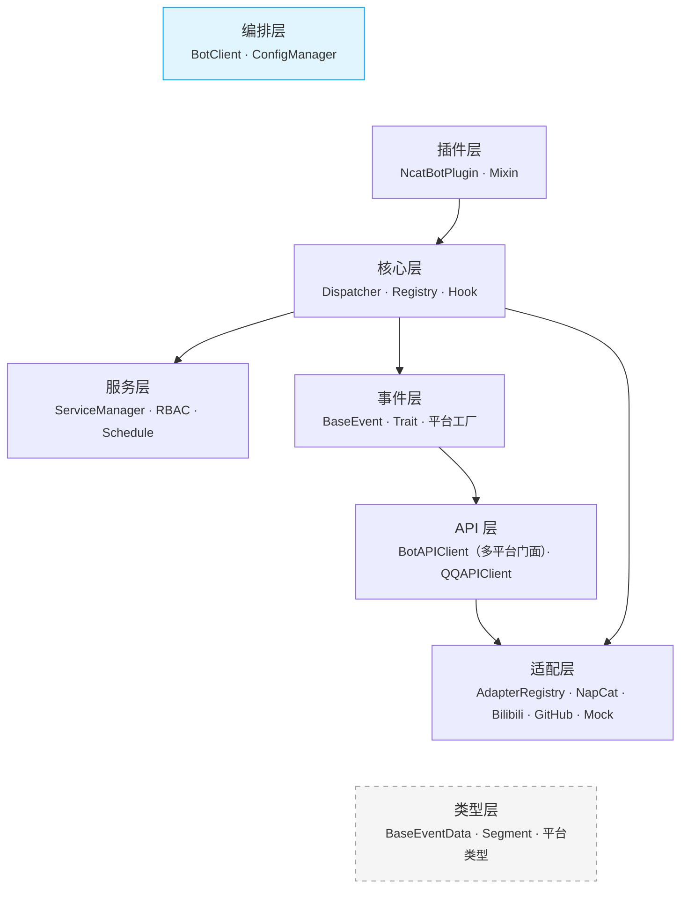

### 模块依赖关系

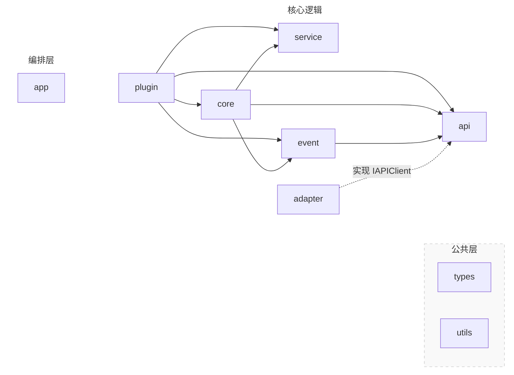

#### 依赖反转

`adapter -.->|实现 IAPIClient| api` 表示**依赖反转**：`IAPIClient` 接口定义在 `api/` 层，`NapCatBotAPI` 等具体实现在 `adapter/` 层。上层代码仅依赖接口，不依赖具体适配器。

---

## 4. 核心模块详解

### 4.1 Adapter 适配层

适配器负责底层协议通信，将平台特定的消息格式转换为框架统一的数据模型。

#### AdapterRegistry

适配器注册表是适配层的核心协调者，管理适配器的注册、发现和工厂创建：

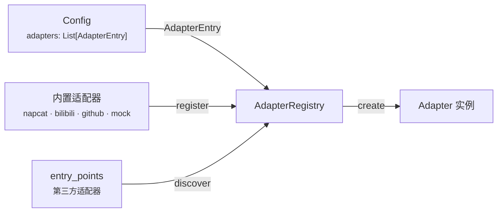

| 方法 | 签名 | 说明 |
|---|---|---|
| `register` | `(name, cls) → None` | 注册内置适配器 |
| `discover` | `() → Dict[str, Type]` | 合并内置 + `entry_points(group="ncatbot.adapters")` 第三方适配器 |
| `list_available` | `() → list[str]` | 列出所有可用适配器类型名 |
| `create` | `(entry, *, bot_uin, websocket_timeout) → BaseAdapter` | 根据 `AdapterEntry` 创建实例，可覆盖 platform |

模块级单例 `adapter_registry` 在 `adapter/__init__.py` 中注册内置适配器。

#### BaseAdapter

所有适配器的抽象基类，定义统一的生命周期接口：

| 属性/方法 | 说明 |
|---|---|
| `name: str` | 适配器名称，如 `"napcat"` |
| `platform: str` | 平台标识，如 `"qq"` / `"bilibili"` |
| `supported_protocols: List[str]` | 支持的协议列表 |
| `pip_dependencies: Dict[str, str]` | Python 包依赖声明 |
| `ensure_deps()` | 检查并安装 pip 依赖，返回是否就绪 |
| `setup()` | 准备平台环境（安装 / 配置 / 启动） |
| `connect()` | 建立连接并初始化 API |
| `disconnect()` | 断开连接，释放资源 |
| `listen()` | 阻塞监听消息，解析事件后调用回调 |
| `get_api() → IAPIClient` | 返回平台 API 实现 |
| `set_event_callback(cb)` | 设置事件数据回调（由 Dispatcher 注入） |
| `connected: bool` | 当前连接状态 |

回调签名为 `Callable[[BaseEventData], Awaitable[None]]`，即适配器只产出纯数据模型，不创建实体。

#### 已注册适配器

| 注册名 | 类 | 默认 platform | 说明 |
|---|---|---|---|
| `napcat` | `NapCatAdapter` | `"qq"` | QQ / OneBot v11（WebSocket + OB11Protocol） |
| `bilibili` | `BilibiliAdapter` | `"bilibili"` | Bilibili 直播 / 私信 / 评论 |
| `github` | `GitHubAdapter` | `"github"` | GitHub Webhook（实验性） |
| `mock` | `MockAdapter` | 可配置 | 测试用，支持 `inject_event()` 注入事件 |

### 4.2 Types 类型模型

所有事件数据的 Pydantic 模型定义，是框架最底层的协议无关数据结构。

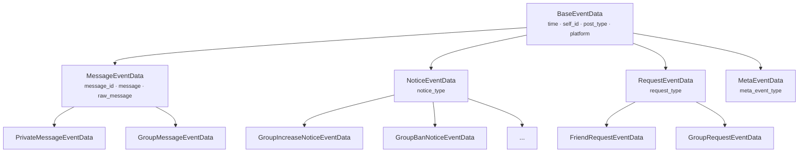

**关键字段**：`BaseEventData.platform` 默认为 `"unknown"`，各平台子类覆盖为具体值（QQ 子类默认 `"qq"`），用于 `create_entity()` 的平台路由。

#### 消息段体系

| 位置 | 内容 |
|---|---|
| `types/common/segment/` | 通用段基类（`base.py`）、文本段（`text.py`）、多媒体段（`media.py`）、`MessageArray` 容器（`array.py`） |
| `types/qq/segment/` | QQ 专用段（Face / Forward / Markdown 等） |

核心段类型：`PlainText` / `At` / `Image` / `Record` / `Video` / `File` / `Reply` / `Forward` / `MessageArray`

#### 平台类型包

| 包 | 说明 |
|---|---|
| `types/qq/` | QQ 消息 / 通知 / 请求 / 元事件数据模型 + 枚举 + 发送者 |
| `types/bilibili/` | Bilibili 平台专用数据类型 |
| `types/napcat/` | NapCat API 响应类型（`SendMessageResult` / `GroupInfo` 等） |

### 4.3 Event 事件实体

在 `BaseEventData`（纯数据）之上封装 API 操作能力，为插件提供富接口。

#### 事件 Trait 体系

通过 Mixin 为事件实体附加操作能力：

| Trait | 方法 | 说明 |
|---|---|---|
| **Replyable** | `reply(**kwargs)` | 回复事件 |
| **Deletable** | `delete()` | 撤回消息 |
| **HasSender** | `user_id` / `sender` | 包含发送者信息 |
| **GroupScoped** | `group_id` | 属于某个群/频道 |
| **Kickable** | `kick(**kwargs)` | 踢出成员 |
| **Bannable** | `ban(duration=1800)` | 禁言成员 |
| **Approvable** | `approve()` / `reject()` | 审批加群/好友请求 |

#### 核心组件

| 组件 | 职责 |
|---|---|
| **BaseEvent** | 包装 `BaseEventData` + `IAPIClient` 引用，`__getattr__` 代理数据字段 |
| **create_entity()** | 工厂函数：按 `data.platform` 路由到平台工厂，fallback 到 `BaseEvent` |
| **register_platform_factory()** | 注册平台专用事件工厂（如 QQ 注册 `create_qq_entity`） |

#### 平台路由机制

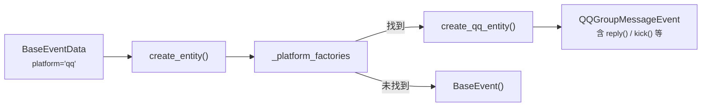

每个平台包（`event/qq/`、`event/bilibili/`）在导入时自动调用 `register_platform_factory()` 注册自己的工厂函数。

### 4.4 Core 核心引擎

#### 4.4.1 Dispatcher 事件分发

`AsyncEventDispatcher` — 纯异步事件广播器，无业务逻辑：

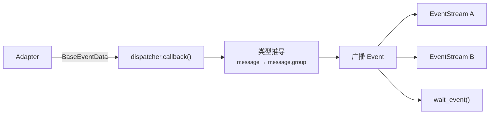

| 组件 | 职责 |
|---|---|
| **AsyncEventDispatcher** | 接收事件、类型推导（`_resolve_type()` 推导 `"message.group"` 等类型）、广播到所有活跃 Stream |
| **Event** | 不可变数据类，包含解析后的事件类型 + 原始数据 |
| **EventStream** | 异步迭代器，支持 `async with` / `async for` |

#### 4.4.2 Registry 处理器注册与路由

`HandlerDispatcher` — 事件到处理器的路由调度：

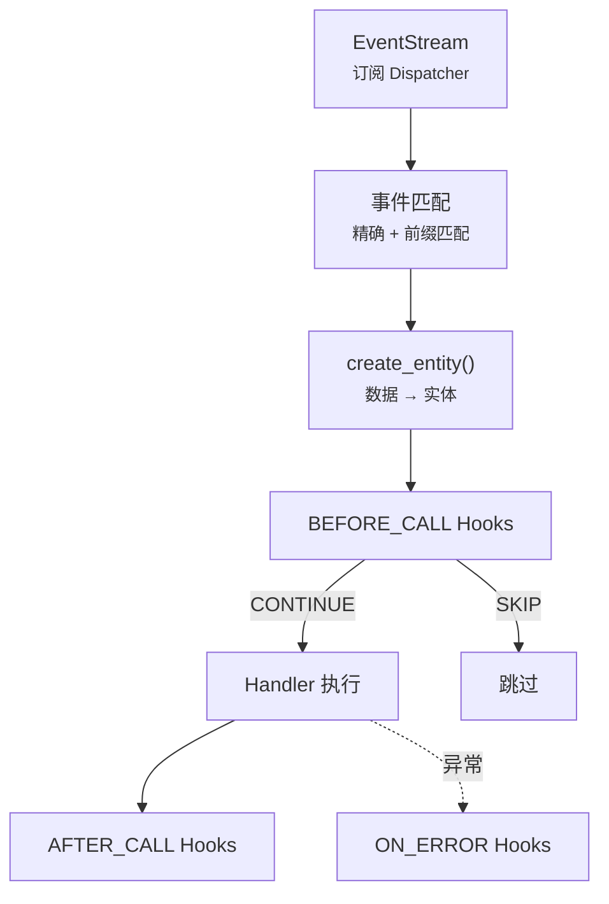

`HandlerDispatcher` 构造时接收 `platform_apis: Dict[str, IAPIClient]`，在 `create_entity()` 时根据 `data.platform` 选择对应的原始 API 注入事件实体。

| 组件 | 职责 |
|---|---|
| **HandlerDispatcher** | 订阅事件流、创建事件实体、匹配处理器、按优先级执行、管理 Hook 链 |
| **Registrar** | 装饰器工厂：`@registrar.on_group_command()` 等收集待注册处理器 |
| **Hook** | 中间件基类，`HookStage`（`BEFORE_CALL` / `AFTER_CALL` / `ON_ERROR`）+ `HookAction`（`CONTINUE` / `SKIP`） |
| **HookContext** | Hook 执行上下文：event / handler / services / kwargs / result / error / api |
| **CommandHook** | 命令匹配：按命令名精确/前缀匹配，类型注解参数绑定（`At` / `int` / `float` / `str`） |
| **内置过滤 Hook** | `MessageTypeFilter` / `PostTypeFilter` / `SubTypeFilter` / `SelfFilter` 等 |
| **内置匹配 Hook** | `StartsWithHook` / `KeywordHook` / `RegexHook` |
| **上下文隔离** | `set_current_plugin()` / `get_current_plugin()` — ContextVar 隔离并发插件注册 |

### 4.5 API 接口层

API 层采用多平台门面模式，`BotAPIClient` 作为统一入口路由到各平台的专用 API 客户端。

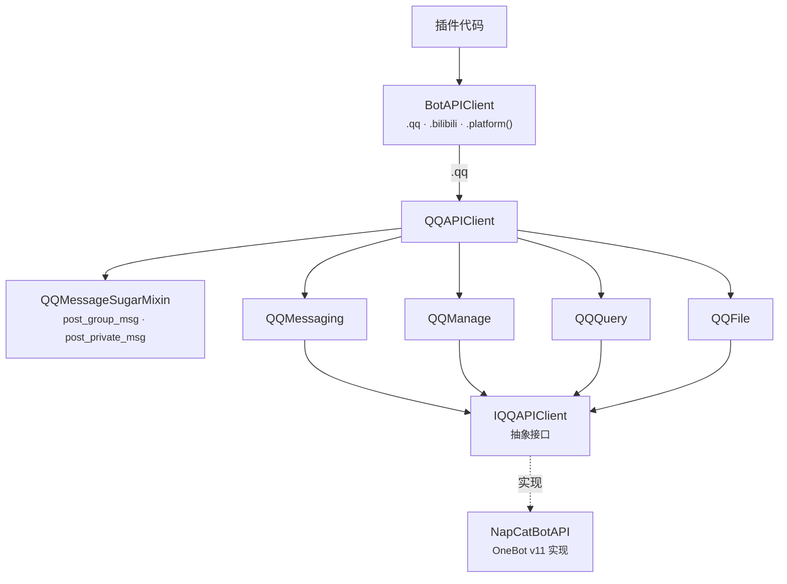

#### BotAPIClient（多平台门面）

| 方法/属性 | 签名 | 说明 |
|---|---|---|
| `register_platform` | `(name, client) → None` | 注册平台 API 客户端 |
| `platform` | `(name) → Any` | 获取指定平台的 API 客户端 |
| `qq` | `→ QQAPIClient` | QQ 平台快捷属性 |
| `bilibili` | `→ Any` | Bilibili 平台快捷属性 |
| `platforms` | `→ Dict[str, Any]` | 所有已注册平台 |

#### QQAPIClient

`QQAPIClient` 将 QQ 平台 API 组织为 4 个命名空间 + Sugar 便捷方法：

| 命名空间 | 说明 | 示例方法 |
|---|---|---|
| `messaging` | 消息操作 | `send_group_msg()` / `send_private_msg()` / `delete_msg()` |
| `manage` | 群管理 | `set_group_kick()` / `set_group_ban()` / `set_group_admin()` |
| `query` | 信息查询 | `get_group_list()` / `get_group_member_info()` / `get_login_info()` |
| `file` | 文件操作 | `upload_group_file()` / `download_file()` |

**Sugar 方法**（QQMessageSugarMixin）：

| 方法 | 说明 |
|---|---|
| `post_group_msg(group_id, text=, at=, reply=, image=, ...)` | 便捷群消息 — 关键字参数自动组装 MessageArray |
| `post_private_msg(user_id, text=, ...)` | 便捷私聊消息 |
| `post_group_array_msg(group_id, msg)` | 发送预构造的 MessageArray |
| `send_group_text()` / `send_group_image()` / ... | 单类型快捷发送 |

所有调用经 `QQLoggingProxy`（继承 `BaseLoggingProxy`）自动记录日志。

### 4.6 Plugin 插件系统

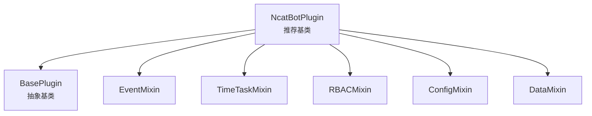

**加载子系统：**

| 组件 | 职责 |
|---|---|
| **PluginLoader** | 主协调器，组合 PluginIndexer + DependencyResolver + ModuleImporter |
| **PluginIndexer** | 扫描 `manifest.toml`，建立插件索引 |
| **DependencyResolver** | 拓扑排序解析依赖顺序 |
| **ModuleImporter** | 动态导入/卸载 Python 模块，查找插件类 |
| **PipHelper** | 校验 pip 依赖、自动安装缺失包（支持 uv / pip 后端） |

### 4.7 Service 服务层

长生命周期的后台服务，与插件系统解耦：

| 组件 | 职责 |
|---|---|
| **BaseService** | 抽象基类：`name` / `on_load()` / `on_close()` / `emit_event` |
| **ServiceManager** | 服务注册、依赖排序加载、统一关闭 |
| **RBACService** | 角色权限管理（`PermissionTrie` 高效查询、`EntityManager`、`PermissionChecker`） |
| **TimeTaskService** | 定时任务执行（`TaskExecutor` 异步执行、`TimeTaskParser` 解析 `'30s'` / `'HH:MM'`） |
| **FileWatcherService** | 文件系统监控，支持插件热重载 |

### 4.8 Utils 工具集

| 模块 | 职责 |
|---|---|
| `logger/` | `BoundLogger` 上下文日志 + `setup_logging()` 初始化（控制台 + 滚动文件） |
| `config/` | `ConfigManager` YAML 配置管理 + `Config` / `AdapterEntry` Pydantic 模型 |
| `network.py` | `post_json()` / `get_json()` / `download_file()` + 代理支持 |
| `error.py` | `NcatBotError` / `NcatBotValueError` / `NcatBotConnectionError` 异常体系 |
| `status.py` | `Status` 全局状态追踪 |
| `prompt.py` | 交互式 CLI 工具：`confirm()` / `ask()` / `select()` + `is_interactive()` 控制模式 |

#### Config 配置模型

配置系统通过 `adapters` 列表声明式定义适配器：

```yaml
# 新格式（推荐）
bot_uin: "999999"
adapters:
  - type: napcat
    platform: qq
    enabled: true
    config:
      ws_uri: ws://localhost:3001
      ws_token: napcat_ws
```

**AdapterEntry**：

| 字段 | 类型 | 说明 |
|---|---|---|
| `type` | `str` | 适配器注册表中的 key（`"napcat"` / `"bilibili"` / `"github"` / `"mock"`） |
| `platform` | `str = ""` | 平台标识，留空则使用适配器默认值 |
| `enabled` | `bool = True` | 是否启用 |
| `config` | `Dict[str, Any] = {}` | 适配器专属配置，透传给构造函数 |

**旧格式自动迁移**：`Config` 模型的 `_migrate_legacy_napcat` 验证器自动将旧版 `napcat:` 顶层配置转换为 `adapters:` 列表格式，并通过 `_migrated` PrivateAttr 标记触发配置文件自动回写。

### 4.9 Testing 测试支持

测试模块提供离线测试全套工具，无需真实连接即可验证框架和插件行为。

| 组件 | 职责 |
|---|---|
| **TestHarness** | 框架级测试编排：BotClient + MockAdapter + 事件注入 + API 断言 |
| **PluginTestHarness** | 插件测试编排：选择性加载指定插件，提供 `get_plugin()` / `reload_plugin()` |
| **Scenario** | 链式 DSL 构建器：`inject()` → `settle()` → `assert_api_called()` → `run()` |
| **factory** | 8 个事件数据工厂：`group_message()` / `private_message()` / `friend_request()` 等 |
| **discovery** | `discover_testable_plugins()` 扫描插件 + `generate_smoke_tests()` 生成测试代码 |

#### TestHarness 核心 API

| 方法 | 说明 |
|---|---|
| `inject(event_data)` | 注入单个事件 |
| `inject_many(events)` | 注入多个事件 |
| `settle(delay)` | 等待 handler 执行完 |
| `api_called(action) → bool` | 是否调用过某 API |
| `api_call_count(action) → int` | API 调用次数 |
| `get_api_calls(action) → list` | 某 API 的所有调用记录 |
| `reset_api()` | 清空调用记录 |

#### PluginTestHarness

继承 `TestHarness`，增加插件管理能力：

| 参数/方法 | 说明 |
|---|---|
| `plugin_names: list[str]` | 要加载的插件名列表 |
| `plugin_dir: Path` | 插件目录 |
| `loaded_plugins → list[str]` | 已加载插件名 |
| `get_plugin(name) → NcatBotPlugin` | 获取插件实例 |
| `plugin_config(name)` / `plugin_data(name)` | 获取插件配置/数据 |
| `reload_plugin(name)` | 热重载插件 |

### 4.10 App 编排层

`BotClient` 是整个 Bot 的入口和生命周期管理器（Composition Root），位于 `ncatbot/app/`，组装所有核心组件。

```python
from ncatbot.app import BotClient

bot = BotClient()

@bot.on("message.group")
async def on_group_msg(event):
    await event.reply("hello")

bot.run()
```

#### 多适配器支持

`BotClient` 支持三种适配器配置方式：

| 方式 | 用法 | 说明 |
|---|---|---|
| 配置驱动（推荐） | `BotClient()` | 从 `config.yaml` 的 `adapters` 列表自动创建 |
| 单适配器 | `BotClient(adapter=...)` | 直接传入适配器实例 |
| 多适配器 | `BotClient(adapters=[...])` | 传入适配器列表 |

**配置驱动创建流程**：

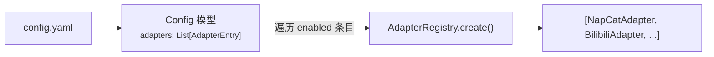

#### 启动编排

`BotClient` 启动时按以下顺序组装各组件：

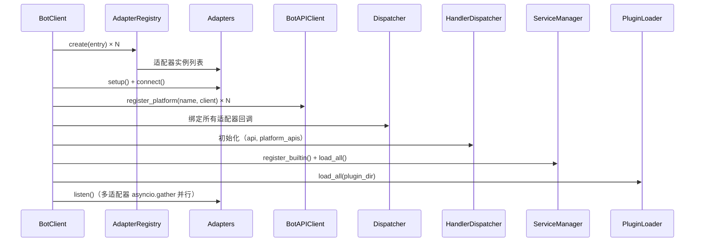

### 4.11 CLI 命令行工具

基于 Click 框架的命令行入口，位于 `ncatbot/cli/`：

| 子命令 | 功能 |
|---|---|
| `run` | 启动 Bot（可选 `--debug` / `--hot-reload`） |
| `dev` | 开发模式启动（默认开启 debug + 热重载） |
| `config` | 配置管理（查看 / 修改） |
| `plugin` | 插件管理（list / create / remove） |
| `napcat` | NapCat 安装与控制 |
| `init` | 初始化项目目录结构 |

---

## 5. 生命周期

### 5.1 启动流程

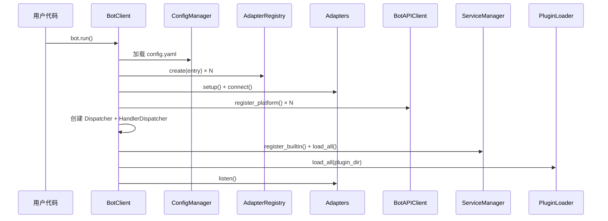

### 5.2 事件处理流程

以 `AsyncEventDispatcher` 为分界，事件处理分为**上游采集**和**下游消费**两阶段。

#### 5.2.1 上游：事件采集与广播

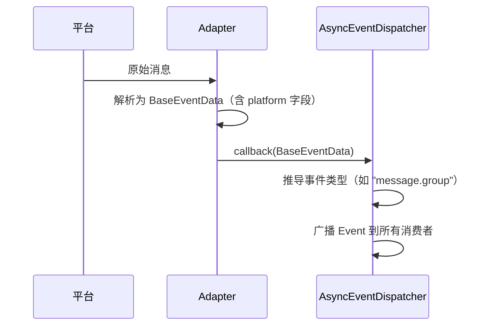

#### 5.2.2 下游：Handler 匹配与执行

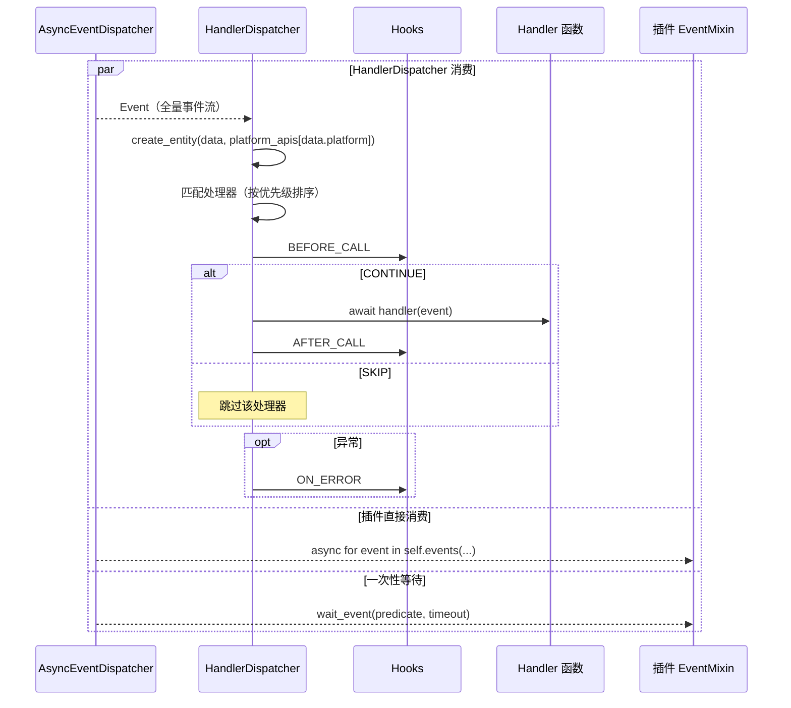

### 5.3 关闭流程

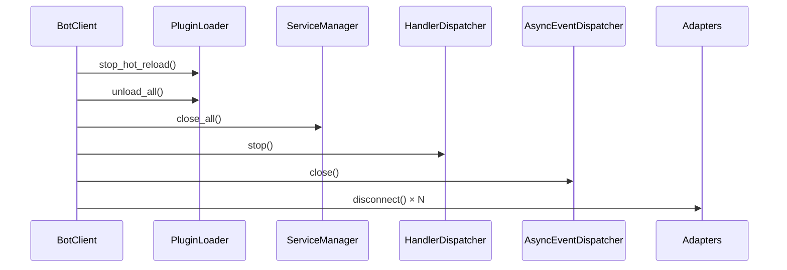

---

## 6. 插件开发模型

### 6.1 插件结构

每个插件是一个独立目录，包含 `manifest.toml` 和入口模块：

```text
plugins/
└── my_plugin/
    ├── manifest.toml    # 插件元信息
    └── main.py          # 入口模块
```

**manifest.toml 示例：**

```toml
name = "my_plugin"
version = "1.0.0"
main = "main.py"
author = "developer"
description = "示例插件"
dependencies = []
pip_dependencies = []
```

**入口模块示例：**

```python
from ncatbot.core import registrar
from ncatbot.event.qq import GroupMessageEvent
from ncatbot.plugin import NcatBotPlugin

class MyPlugin(NcatBotPlugin):
    name = "my_plugin"
    version = "1.0.0"

    async def on_load(self):
        pass

    async def on_close(self):
        pass

    @registrar.on_group_command("hello")
    async def on_hello(self, event: GroupMessageEvent):
        # self.api 是 BotAPIClient，通过 .qq 访问 QQ 平台 API
        await self.api.qq.post_group_msg(event.group_id, text="Hello! 👋")
```

### 6.2 Mixin 体系

`NcatBotPlugin` 通过 Mixin 组合提供丰富能力：

| Mixin | 能力 | 核心方法 |
|---|---|---|
| **EventMixin** | 事件消费 | `events(type)` / `wait_event(predicate, timeout)` |
| **TimeTaskMixin** | 定时任务 | `add_scheduled_task(name, interval)` / `remove_scheduled_task(name)` |
| **RBACMixin** | 权限管理 | `check_permission(user, perm)` / `add_permission()` / `remove_permission()` |
| **ConfigMixin** | 配置持久化 | `get_config(key)` / `set_config(key, value)` |
| **DataMixin** | 数据持久化 | `self.data[key]` — 字典式 JSON 存储 |

Mixin 加载顺序：EventMixin → TimeTaskMixin → RBACMixin → ConfigMixin → DataMixin。加载和卸载时 Mixin Hook 按 MRO 顺序自动执行。

### 6.3 插件加载与热重载

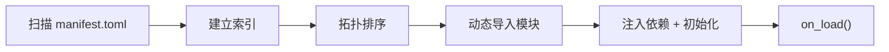

**热重载机制：**
- `FileWatcherService` 监控插件目录文件变更
- 检测到变更后通知 `PluginLoader`
- PluginLoader 执行：`unload_plugin()` → `rescan` → `load_plugin()`
- `HandlerDispatcher.revoke_plugin(name)` 清除旧处理器

---

## 7. 关键设计模式

| 模式 | 应用位置 | 说明 |
|---|---|---|
| **注册表模式** | `adapter/registry.py` | `AdapterRegistry` 管理适配器的注册、发现和工厂创建 |
| **门面模式** | `api/client.py` | `BotAPIClient` 作为多平台 API 的统一入口，路由到各平台专用客户端 |
| **适配器模式** | `adapter/` | `BaseAdapter` 抽象协议差异，支持 NapCat / Bilibili / GitHub / Mock 等多种实现 |
| **观察者模式** | `core/dispatcher/` | `AsyncEventDispatcher` 广播事件到多个 `EventStream` 订阅者 |
| **责任链模式** | `core/registry/` | Hook 链按优先级依次执行，可中断或跳过 |
| **工厂模式** | `event/common/factory.py` | `create_entity()` 根据 `data.platform` 路由到平台工厂创建对应事件实体 |
| **Mixin 模式** | `plugin/mixin/` | 通过多继承组合插件能力，按 MRO 管理生命周期 |
| **依赖注入** | `app/client.py` | `BotClient` 作为 Composition Root 组装并注入 API / Dispatcher / Services 到插件 |
| **ContextVar 隔离** | `core/registry/` | Python ContextVar 隔离并发插件加载的注册上下文 |
| **拓扑排序** | `plugin/loader/resolver.py` | 插件依赖解析，确保加载顺序正确 |
