# NcatBot 架构文档

> **版本**: 5.0.0rc7 &nbsp;|&nbsp; **Python**: ≥ 3.12 &nbsp;|&nbsp; **协议**: OneBot v11 (NapCat)

---

## 目录

- [1. 项目概览](#1-项目概览)
- [2. 目录结构](#2-目录结构)
- [3. 分层架构](#3-分层架构)
- [4. 核心模块详解](#4-核心模块详解)
  - [4.1 Adapter 适配层](#41-adapter-适配层)
  - [4.2 Types 类型模型](#42-types-类型模型)
  - [4.3 Event 事件实体](#43-event-事件实体)
  - [4.4 Core 核心引擎](#44-core-核心引擎)
    - [4.4.1 Client 启动入口](#441-client-启动入口)
    - [4.4.2 Dispatcher 事件分发](#442-dispatcher-事件分发)
    - [4.4.3 Registry 处理器注册与路由](#443-registry-处理器注册与路由)
  - [4.5 API 接口层](#45-api-接口层)
  - [4.6 Plugin 插件系统](#46-plugin-插件系统)
  - [4.7 Service 服务层](#47-service-服务层)
  - [4.8 Utils 工具集](#48-utils-工具集)
  - [4.9 Testing 测试支持](#49-testing-测试支持)
- [5. 生命周期](#5-生命周期)
  - [5.1 启动流程](#51-启动流程)
  - [5.2 事件处理流程](#52-事件处理流程)
  - [5.3 关闭流程](#53-关闭流程)
- [6. 插件开发模型](#6-插件开发模型)
  - [6.1 插件结构](#61-插件结构)
  - [6.2 Mixin 体系](#62-mixin-体系)
  - [6.3 插件加载与热重载](#63-插件加载与热重载)
- [7. 关键设计模式](#7-关键设计模式)

---

## 1. 项目概览

NcatBot 是基于 OneBot v11 协议的 Python QQ 机器人框架，通过 NapCat 实现与 QQ 的通信。核心设计目标：

- **适配器抽象** — 协议实现与业务逻辑解耦，可替换底层通信方案
- **异步事件驱动** — 基于 asyncio 的纯异步事件流
- **插件化** — 热重载、依赖解析、Mixin 扩展的插件系统
- **服务化** — 内置 RBAC、定时任务、文件监控等可插拔服务

### 核心依赖

| 库 | 用途 |
|---|---|
| pydantic ≥ 2.0 | 事件数据模型校验 |
| websockets | WebSocket 通信 |
| aiofiles | 异步文件 I/O |
| pyyaml / toml | 配置文件解析 |
| schedule | 定时任务调度 |
| rich | 终端输出美化 |

---

## 2. 目录结构

```
ncatbot/
├── adapter/          # 协议适配器（NapCat、Mock）
│   ├── base.py       #   BaseAdapter 抽象接口
│   ├── napcat/       #   NapCat OneBot v11 实现
│   └── mock/         #   测试用 Mock 适配器
├── api/              # Bot API 封装
│   ├── interface.py  #   IBotAPI 抽象接口
│   ├── client.py     #   BotAPIClient（插件使用的高层客户端）
│   ├── _sugar.py     #   消息构造语法糖
│   └── extensions/   #   manage / info / support 扩展
├── core/             # 核心引擎
│   ├── client/       #   BotClient 生命周期管理
│   ├── dispatcher/   #   AsyncEventDispatcher 事件分发
│   └── registry/     #   HandlerDispatcher / Registrar / Hook
├── event/            # 事件实体与工厂
│   ├── base.py       #   BaseEvent 包装器
│   ├── message.py    #   MessageEvent / GroupMessageEvent / PrivateMessageEvent
│   ├── notice.py     #   NoticeEvent 系列
│   ├── request.py    #   RequestEvent 系列
│   ├── meta.py       #   MetaEvent
│   ├── factory.py    #   create_entity() 工厂
│   └── parser.py     #   事件类型解析
├── plugin/           # 插件框架
│   ├── base.py       #   BasePlugin 抽象基类
│   ├── ncatbot_plugin.py  # NcatBotPlugin（推荐基类）
│   ├── manifest.py   #   manifest.toml 解析
│   ├── loader/       #   PluginLoader / Indexer / Resolver / Importer
│   └── mixin/        #   Event / TimeTask / RBAC / Config / Data 混入
├── service/          # 服务层
│   ├── base.py       #   BaseService 抽象基类
│   ├── manager.py    #   ServiceManager 注册与生命周期
│   └── builtin/      #   RBAC / Schedule / FileWatcher 内置服务
├── types/            # Pydantic 数据模型
│   ├── base.py       #   BaseEventData
│   ├── enums.py      #   PostType / MessageType / NoticeType 等枚举
│   ├── message.py    #   消息事件数据模型
│   ├── notice.py     #   通知事件数据模型
│   ├── request.py    #   请求事件数据模型
│   ├── meta.py       #   元事件数据模型
│   └── segment/      #   消息段类型（text/media/rich/forward/array）
├── testing/          # 测试工具
│   ├── factory.py    #   测试数据工厂
│   └── harness.py    #   TestHarness 测试框架
├── utils/            # 公共工具
│   ├── logger/       #   日志配置
│   ├── config/       #   ConfigManager / Config 模型
│   └── network.py    #   HTTP 工具函数
└── cli/              # CLI 工具（规划中）
```

---

## 3. 分层架构

NcatBot 采用自底向上的分层设计，每层只依赖其下方的层：

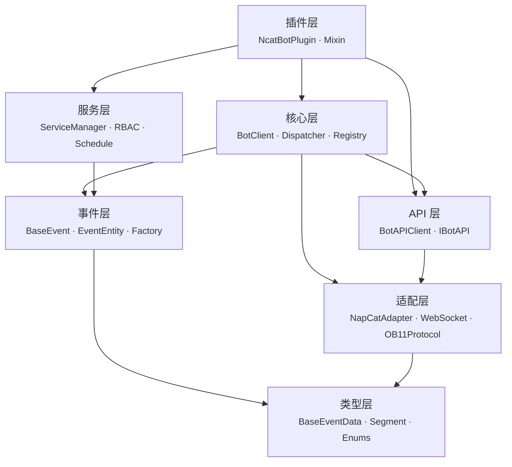

### 模块依赖关系

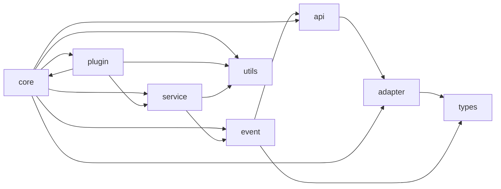

---

## 4. 核心模块详解

### 4.1 Adapter 适配层

适配器负责底层协议通信，将平台特定的消息格式转换为框架统一的数据模型。

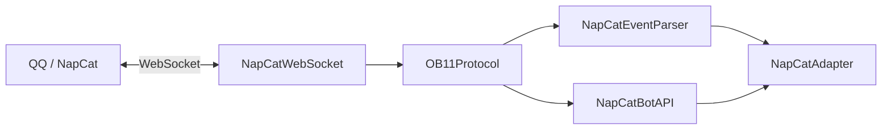

| 组件 | 职责 |
|---|---|
| **BaseAdapter** | 抽象接口：`setup()` / `connect()` / `listen()` / `disconnect()` / `get_api()` / `set_event_callback()` |
| **NapCatAdapter** | 组合 Launcher + WebSocket + Protocol + BotAPI + Parser |
| **NapCatWebSocket** | OneBot v11 WebSocket 客户端 |
| **OB11Protocol** | 协议编解码，请求/响应通过序列号匹配 |
| **NapCatBotAPI** | 实现 `IBotAPI` 接口，将调用转为 OneBot v11 action |
| **NapCatEventParser** | 原始 JSON → `BaseEventData` Pydantic 模型 |
| **NapCatLauncher** | NapCat 进程的启动与关闭 |
| **MockAdapter** | 测试用适配器，支持 `inject_event()` 注入事件 |

### 4.2 Types 类型模型

所有事件数据的 Pydantic 模型定义，是框架最底层的协议无关数据结构。

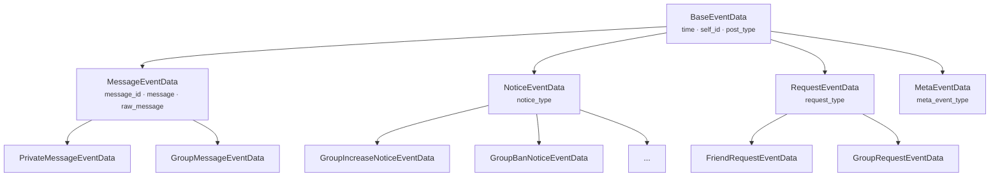

**消息段体系 (`types/segment/`)：**

| 类型 | 说明 |
|---|---|
| `MessageSegment` | 抽象基类，类型注册机制 |
| `TextSegment` | 纯文本 |
| `ImageSegment` / `RecordSegment` / `VideoSegment` / `FileSegment` | 多媒体 |
| `AtSegment` / `FaceSegment` / `ReplySegment` / `ForwardSegment` | 富文本 |
| `MessageArray` | 消息段容器，支持链式构造 |

### 4.3 Event 事件实体

在 `BaseEventData`（纯数据）之上封装 API 操作能力，为插件提供富接口。

| 组件 | 职责 |
|---|---|
| **BaseEvent** | 包装 `BaseEventData` + `IBotAPI` 引用，`__getattr__` 代理数据字段 |
| **MessageEvent** | 增加 `reply()` / `delete()` 便捷方法 |
| **GroupMessageEvent** | 增加 `kick()` / `ban()` 等群操作 |
| **PrivateMessageEvent** | 私聊消息实体 |
| **NoticeEvent / RequestEvent / MetaEvent** | 各类事件实体 |
| **create_entity()** | 工厂函数：`BaseEventData` → 对应 EventEntity |
| **_resolve_type()** | 事件类型解析：`"message.group"`, `"notice.group_increase"` 等 |

### 4.4 Core 核心引擎

#### 4.4.1 Client 启动入口

`BotClient` 是整个 Bot 的入口和生命周期管理器：

```python
bot = BotClient()

@bot.on("message.group")
async def on_group_msg(event):
    await event.reply("hello")

bot.run()
```

职责：
- 组装所有核心组件（Adapter / API / Dispatcher / Handler / Service / Plugin）
- 提供 `run()`（同步阻塞）和 `run_async()`（异步非阻塞）两种启动模式
- 统一 `shutdown()` 释放资源

#### 4.4.2 Dispatcher 事件分发

`AsyncEventDispatcher` — 纯异步事件广播器，无业务逻辑：

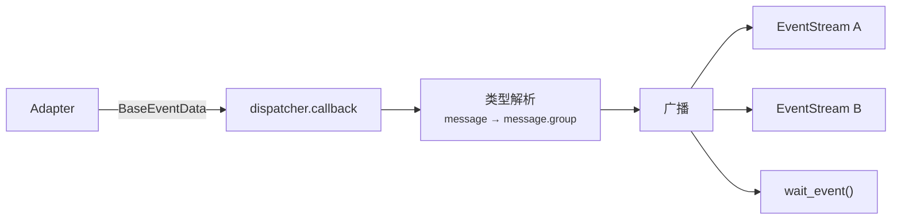

| 组件 | 职责 |
|---|---|
| **AsyncEventDispatcher** | 接收事件、类型解析、广播到所有活跃 Stream |
| **Event** | 不可变数据类，包含解析后的事件类型 + 原始数据 |
| **EventStream** | 异步迭代器，支持 `async with` / `async for` |

#### 4.4.3 Registry 处理器注册与路由

`HandlerDispatcher` — 事件到处理器的路由调度：

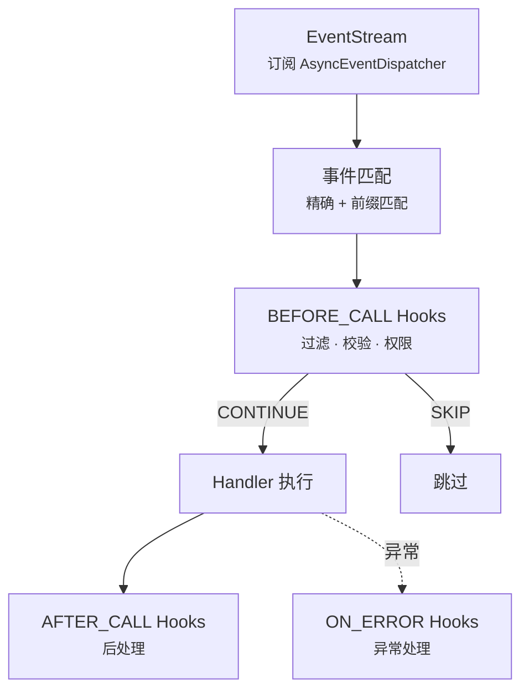

| 组件 | 职责 |
|---|---|
| **HandlerDispatcher** | 订阅事件流、匹配处理器、按优先级执行、管理 Hook 链 |
| **Registrar** | 装饰器工厂：`@bot.on()` / `@bot.on_group_message()` 等收集待注册处理器 |
| **Hook** | 中间件抽象基类，分三个阶段执行：`BEFORE_CALL` / `AFTER_CALL` / `ON_ERROR` |
| **HookContext** | Hook 执行上下文：event / handler / services / kwargs / result / error |
| **内置 Hook** | `MessageTypeFilter` / `PostTypeFilter` / `SubTypeFilter` / `SelfFilter` |

### 4.5 API 接口层

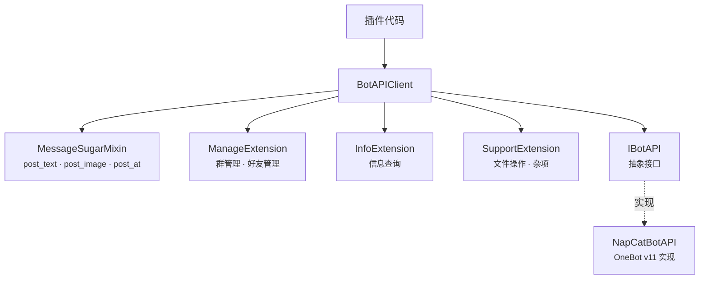

**BotAPIClient 命名空间：**

| 命名空间 | 高频方法 |
|---|---|
| *(顶层)* | `send_group_msg()` / `send_private_msg()` / `delete_msg()` |
| `manage.*` | `set_group_kick()` / `set_group_ban()` / `set_group_admin()` / `set_group_card()` |
| `info.*` | `get_login_info()` / `get_group_list()` / `get_group_member_info()` |
| `support.*` | `upload_file()` / `delete_file()` / `get_file_url()` |

所有调用经 `_LoggingAPIProxy` 自动记录日志。

### 4.6 Plugin 插件系统

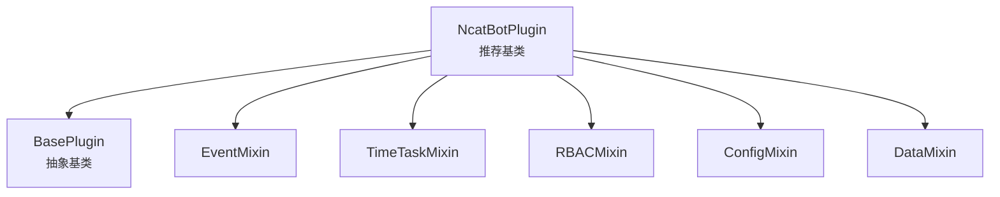

**加载子系统：**

| 组件 | 职责 |
|---|---|
| **PluginLoader** | 主协调器，组合 Indexer + Resolver + Importer |
| **PluginIndexer** | 扫描 `manifest.toml`，建立插件索引 |
| **DependencyResolver** | 拓扑排序解析依赖顺序 |
| **ModuleImporter** | 动态导入/卸载 Python 模块，查找插件类 |

### 4.7 Service 服务层

长生命周期的后台服务，与插件系统解耦：

| 组件 | 职责 |
|---|---|
| **BaseService** | 抽象基类：`name` / `on_load()` / `on_close()` / `emit_event` |
| **ServiceManager** | 服务注册、依赖排序加载、统一关闭 |
| **RBACService** | 角色权限管理，数据存储于 `data/rbac.json` |
| **TimeTaskService** | 定时任务执行 |
| **FileWatcherService** | 文件系统监控，支持插件热重载 |

### 4.8 Utils 工具集

| 模块 | 职责 |
|---|---|
| `logger/` | `BoundLogger` 上下文日志 + `setup_logging()` 初始化（控制台 + 滚动文件） |
| `config/` | `ConfigManager` YAML 配置管理 + `Config` Pydantic 模型（单例） |
| `network.py` | `post_json()` / `get_json()` / `download_file()` + 代理支持 |

### 4.9 Testing 测试支持

| 组件 | 职责 |
|---|---|
| **factory.py** | 测试数据工厂：`group_message()` / `private_message()` / `friend_request()` 等 |
| **TestHarness** | 测试编排：Bot + MockAdapter + 事件注入 + 响应断言 |

---

## 5. 生命周期

### 5.1 启动流程

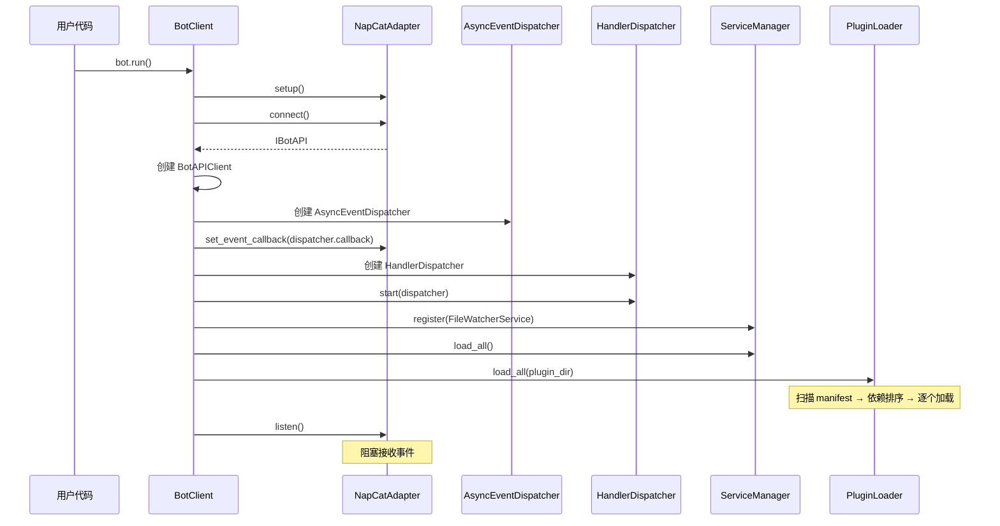

### 5.2 事件处理流程

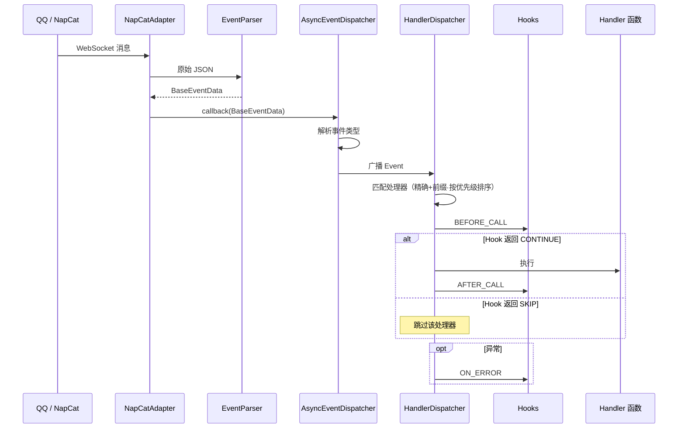

### 5.3 关闭流程

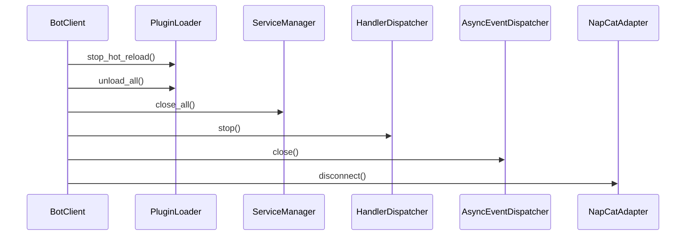

---

## 6. 插件开发模型

### 6.1 插件结构

每个插件是一个独立目录，包含 `manifest.toml` 和入口模块：

```
plugins/
└── my_plugin/
    ├── manifest.toml    # 插件元信息
    └── main.py          # 入口模块
```

**manifest.toml 示例：**

```toml
name = "my_plugin"
version = "1.0.0"
main = "main.py"
author = "developer"
description = "示例插件"
dependencies = []          # 依赖的其他插件
pip_dependencies = []      # pip 依赖
```

**入口模块示例：**

```python
from ncatbot.plugin import NcatBotPlugin

class MyPlugin(NcatBotPlugin):
    name = "my_plugin"
    version = "1.0.0"
    author = "developer"
    description = "示例插件"

    async def on_load(self):
        # 注册事件处理器等初始化逻辑
        pass

    async def on_close(self):
        # 清理资源
        pass
```

### 6.2 Mixin 体系

`NcatBotPlugin` 通过 Mixin 组合提供丰富能力：

| Mixin | 能力 | 核心方法 |
|---|---|---|
| **EventMixin** | 事件消费 | `events(type)` / `wait_event(predicate, timeout)` |
| **TimeTaskMixin** | 定时任务 | `add_scheduled_task(name, interval)` / `remove_scheduled_task(name)` |
| **RBACMixin** | 权限管理 | `check_permission(user, perm)` / `add_permission()` / `remove_permission()` |
| **ConfigMixin** | 配置持久化 | `get_config(key)` / `set_config(key, value)` — 存储于 `workspace/config.yaml` |
| **DataMixin** | 数据持久化 | `get_data(key)` / `set_data(key, value)` — 存储于 `workspace/data.json` |

Mixin 加载顺序：EventMixin → TimeTaskMixin → RBACMixin → ConfigMixin → DataMixin

加载和卸载时，Mixin Hook 按 MRO 顺序自动执行。

### 6.3 插件加载与热重载

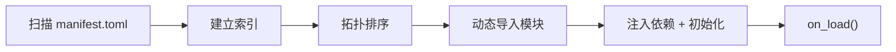

**热重载机制：**
- `FileWatcherService` 监控插件目录文件变更
- 检测到变更后通知 `PluginLoader`
- PluginLoader 执行：`unload_plugin()` → `rescan` → `load_plugin()`
- `HandlerDispatcher.revoke_plugin(name)` 清除旧处理器

---

## 7. 关键设计模式

| 模式 | 应用位置 | 说明 |
|---|---|---|
| **适配器模式** | `adapter/` | `BaseAdapter` 抽象协议差异，支持 NapCat / Mock 等多种实现 |
| **观察者模式** | `core/dispatcher/` | `AsyncEventDispatcher` 广播事件到多个 `EventStream` 订阅者 |
| **责任链模式** | `core/registry/` | Hook 链按优先级依次执行，可中断或跳过 |
| **工厂模式** | `event/factory.py` | `create_entity()` 根据数据类型创建对应事件实体 |
| **Mixin 模式** | `plugin/mixin/` | 通过多继承组合插件能力，按 MRO 管理生命周期 |
| **依赖注入** | `core/client/` | `BotClient` 组装并注入 API / Dispatcher / Services 到插件 |
| **ContextVar 隔离** | `core/registry/context.py` | 利用 Python ContextVar 隔离并发插件加载的注册上下文 |
| **命名空间分层** | `api/client.py` | BotAPIClient 将高频 / 低频 API 分层为顶层方法 + `manage` / `info` / `support` 子空间 |
| **拓扑排序** | `plugin/loader/resolver.py` | 插件依赖解析，确保加载顺序正确 |
