# NcatBot 架构文档

> **版本**: 5.0.0rc7 &nbsp;|&nbsp; **Python**: ≥ 3.12 &nbsp;|&nbsp; **协议**: OneBot v11 (NapCat)

---

## 目录

- [1. 项目概览](#1-项目概览)
- [2. 目录结构](#2-目录结构)
- [3. 分层架构](#3-分层架构)
- [4. 核心模块详解](#4-核心模块详解)
  - [4.1 Adapter 适配层](#41-adapter-适配层)
  - [4.2 Types 类型模型](#42-types-类型模型)
  - [4.3 Event 事件实体](#43-event-事件实体)
  - [4.4 Core 核心引擎](#44-core-核心引擎)
    - [4.4.1 Dispatcher 事件分发](#441-dispatcher-事件分发)
    - [4.4.2 Registry 处理器注册与路由](#442-registry-处理器注册与路由)
  - [4.5 API 接口层](#45-api-接口层)
  - [4.6 Plugin 插件系统](#46-plugin-插件系统)
  - [4.7 Service 服务层](#47-service-服务层)
  - [4.8 Utils 工具集](#48-utils-工具集)
  - [4.9 Testing 测试支持](#49-testing-测试支持)
  - [4.10 App 编排层](#410-app-编排层)
  - [4.11 CLI 命令行工具](#411-cli-命令行工具)
- [5. 生命周期](#5-生命周期)
  - [5.1 启动流程](#51-启动流程)
  - [5.2 事件处理流程](#52-事件处理流程)
    - [5.2.1 上游：事件采集与广播](#521-上游事件采集与广播)
    - [5.2.2 下游：Handler 匹配与执行](#522-下游handler-匹配与执行)
  - [5.3 关闭流程](#53-关闭流程)
- [6. 插件开发模型](#6-插件开发模型)
  - [6.1 插件结构](#61-插件结构)
  - [6.2 Mixin 体系](#62-mixin-体系)
  - [6.3 插件加载与热重载](#63-插件加载与热重载)
- [7. 关键设计模式](#7-关键设计模式)

---

## 1. 项目概览

NcatBot 是基于 OneBot v11 协议的 Python QQ 机器人框架，通过 NapCat 实现与 QQ 的通信。核心设计目标：

- **适配器抽象** — 协议实现与业务逻辑解耦，可替换底层通信方案
- **异步事件驱动** — 基于 asyncio 的纯异步事件流
- **插件化** — 热重载、依赖解析、Mixin 扩展的插件系统
- **服务化** — 内置 RBAC、定时任务、文件监控等可插拔服务

### 核心依赖

| 库 | 用途 |
|---|---|
| pydantic ≥ 2.0 | 事件数据模型校验 |
| websockets | WebSocket 通信 |
| aiofiles | 异步文件 I/O |
| pyyaml / toml | 配置文件解析 |
| schedule | 定时任务调度 |
| rich | 终端输出美化 |

---

## 2. 目录结构

```text
ncatbot/
├── adapter/          # 协议适配器（NapCat、Mock）
│   ├── base.py       #   BaseAdapter 抽象接口
│   ├── napcat/       #   NapCat OneBot v11 实现
│   │   ├── adapter.py    #   NapCatAdapter 主类
│   │   ├── connection/   #   WebSocket + OB11Protocol
│   │   ├── api/          #   NapCatBotAPI + 分模块实现
│   │   ├── parser.py     #   NapCatEventParser
│   │   ├── setup/        #   Launcher / 安装 / 认证 / 平台
│   │   ├── service/      #   预上传等适配器级服务
│   │   └── debug/        #   WebSocket / WebUI 诊断工具
│   └── mock/         #   测试用 Mock 适配器（MockAdapter + MockBotAPI）
├── api/              # Bot API 封装
│   ├── interface.py  #   IBotAPI 抽象接口
│   ├── client.py     #   BotAPIClient（插件使用的高层客户端）
│   ├── _sugar.py     #   消息构造语法糖
│   └── extensions/   #   manage / info / support 扩展
├── app/              # 应用编排层（Composition Root）
│   └── client.py     #   BotClient 生命周期管理
├── core/             # 核心引擎
│   ├── dispatcher/   #   AsyncEventDispatcher 事件分发
│   └── registry/     #   HandlerDispatcher / Registrar / Hook
├── event/            # 事件实体与工厂
│   ├── base.py       #   BaseEvent 包装器
│   ├── message.py    #   MessageEvent / GroupMessageEvent / PrivateMessageEvent
│   ├── notice.py     #   NoticeEvent 系列
│   ├── request.py    #   RequestEvent 系列
│   ├── meta.py       #   MetaEvent
│   └── factory.py    #   create_entity() 工厂
├── plugin/           # 插件框架
│   ├── base.py       #   BasePlugin 抽象基类
│   ├── ncatbot_plugin.py  # NcatBotPlugin（推荐基类）
│   ├── manifest.py   #   manifest.toml 解析
│   ├── loader/       #   PluginLoader / PluginIndexer / DependencyResolver / ModuleImporter / PipHelper
│   └── mixin/        #   Event / TimeTask / RBAC / Config / Data 混入
├── service/          # 服务层
│   ├── base.py       #   BaseService 抽象基类
│   ├── manager.py    #   ServiceManager 注册与生命周期
│   └── builtin/      #   RBAC / Schedule / FileWatcher 内置服务
├── types/            # Pydantic 数据模型
│   ├── base.py       #   BaseEventData
│   ├── enums.py      #   PostType / MessageType / NoticeType 等枚举
│   ├── message.py    #   消息事件数据模型
│   ├── notice.py     #   通知事件数据模型
│   ├── request.py    #   请求事件数据模型
│   ├── meta.py       #   元事件数据模型
│   ├── sender.py     #   BaseSender / GroupSender
│   ├── misc.py       #   Anonymous / FileInfo / Status
│   ├── helper/       #   ForwardConstructor 等辅助类
│   └── segment/      #   消息段类型（text/media/rich/forward/array）
├── testing/          # 测试工具
│   ├── factory.py    #   测试数据工厂
│   └── harness.py    #   TestHarness 测试框架
├── utils/            # 公共工具
│   ├── logger/       #   日志配置
│   ├── config/       #   ConfigManager / Config 模型
│   ├── network.py    #   HTTP 工具函数
│   ├── error.py      #   NcatBotError / NcatBotValueError / NcatBotConnectionError
│   ├── status.py     #   Status 状态追踪
│   └── prompt.py     #   交互式 CLI 工具（confirm / ask / select）
└── cli/              # CLI 命令行工具
    ├── main.py       #   Click 入口，注册子命令
    ├── commands/     #   run / dev / config / plugin / napcat / init
    ├── utils/        #   颜色输出 / REPL
    └── templates/    #   插件脚手架模板
```

---

## 3. 分层架构

NcatBot 采用自底向上的分层设计，每层只**逻辑上依赖**其下方的层：

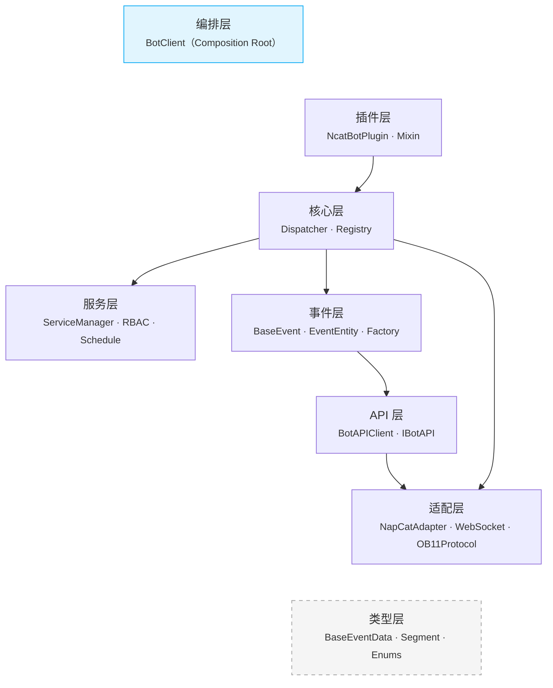

### 模块依赖关系

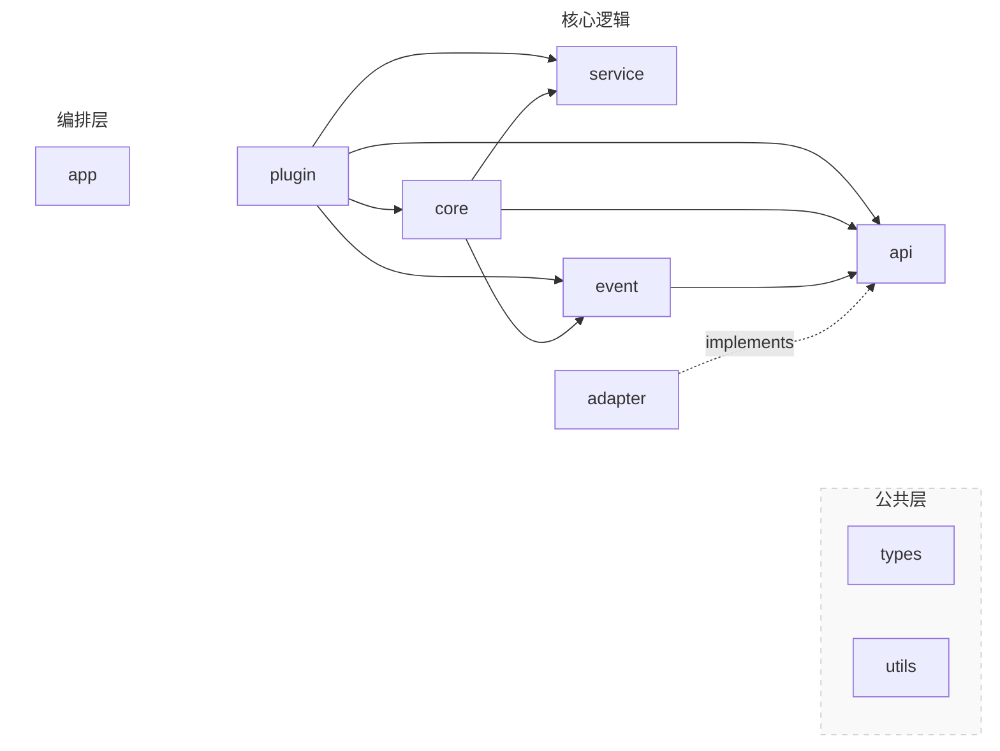

#### 依赖反转说明

上图中 `adapter -.->|implements| api` 使用了虚线表示 **依赖反转（DIP）** 关系：

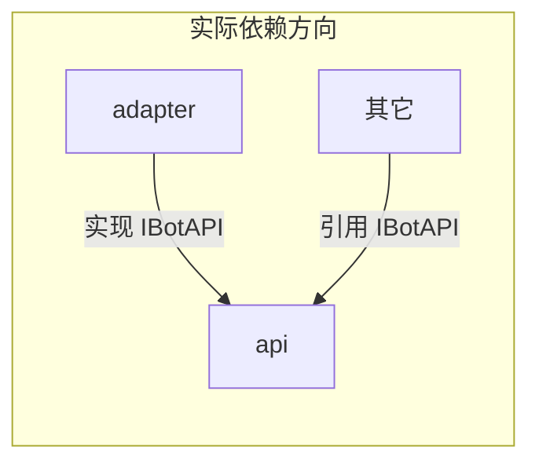

- `IBotAPI` 抽象接口定义在 `api/interface.py`
- `NapCatBotAPI` 在 `adapter/napcat/` 中实现该接口
- 从分层角度看，API 层位于 Adapter 上方，但实际代码中 Adapter 向上引用 API 层的接口

### 补充说明

- Core 没有显式依赖 Adapter，但实际上编排层会将 Adapter 上报的事件移交给 Dispatcher，并进一步交给 Registry，认为逻辑上 Core 依赖 Adapter
- 插件层在逻辑图上没有显式依赖 API、Service，这是为了画图方便，实际上参考代码依赖图

---


## 4. 核心模块详解

### 4.1 Adapter 适配层

适配器负责底层协议通信，将平台特定的消息格式转换为框架统一的数据模型。

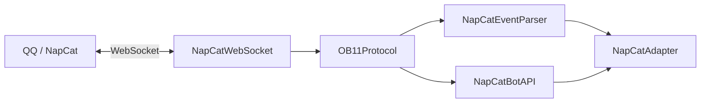

| 组件 | 职责 |
|---|---|
| **BaseAdapter** | 抽象接口：`setup()` / `connect()` / `listen()` / `disconnect()` / `get_api()` / `set_event_callback()` |
| **NapCatAdapter** | 组合 Launcher + WebSocket + Protocol + BotAPI + Parser |
| **NapCatWebSocket** | OneBot v11 WebSocket 客户端 |
| **OB11Protocol** | 协议编解码，请求/响应通过序列号匹配 |
| **NapCatBotAPI** | 实现 `IBotAPI` 接口，将调用转为 OneBot v11 action |
| **NapCatEventParser** | 原始 JSON → `BaseEventData` Pydantic 模型 |
| **NapCatLauncher** | NapCat 进程的启动与关闭 |
| **MockAdapter** | 测试用适配器，支持 `inject_event()` 注入事件 |
| **MockBotAPI** | 测试用 API 实现，记录所有调用，支持 `set_response()` / `called()` / `call_count()` |

**NapCat 适配器内部子模块：**

| 子目录 | 内容 |
|---|---|
| `connection/` | `NapCatWebSocket` + `OB11Protocol` |
| `api/` | `NapCatBotAPI` + 分模块实现（account / group / message / file / query） |
| `setup/` | `NapCatLauncher` + 安装器 / 认证 / 配置 / 平台检测 |
| `service/` | 预上传等适配器级服务 |
| `debug/` | WebSocket / WebUI 连通性诊断工具 |

### 4.2 Types 类型模型

所有事件数据的 Pydantic 模型定义，是框架最底层的协议无关数据结构。

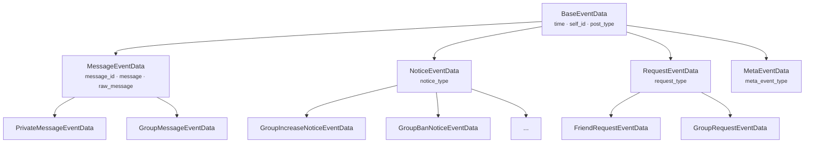

**消息段体系 (`types/segment/`)：**

| 类型 | 说明 |
|---|---|
| `MessageSegment` | 抽象基类，类型注册机制 |
| `PlainText` | 纯文本 |
| `DownloadableSegment` | 可下载段基类 |
| `Image` / `Record` / `Video` / `File` | 多媒体 |
| `At` / `Face` / `Reply` | 富文本 |
| `Share` / `Location` / `Music` / `Json` / `Markdown` | 扩展富文本 |
| `Forward` / `ForwardNode` | 合并转发 |
| `MessageArray` | 消息段容器，支持链式构造 |

### 4.3 Event 事件实体

在 `BaseEventData`（纯数据）之上封装 API 操作能力，为插件提供富接口。

| 组件 | 职责 |
|---|---|
| **BaseEvent** | 包装 `BaseEventData` + `IBotAPI` 引用，`__getattr__` 代理数据字段 |
| **MessageEvent** | 增加 `reply()` / `delete()` 便捷方法 |
| **GroupMessageEvent** | 增加 `kick()` / `ban()` 等群操作 |
| **PrivateMessageEvent** | 私聊消息实体 |
| **NoticeEvent / RequestEvent / MetaEvent** | 各类事件实体 |
| **create_entity()** | 工厂函数：`BaseEventData` → 对应 EventEntity |

### 4.4 Core 核心引擎

> **注意**：`BotClient` 已从 `core/` 迁移至独立的 `app/` 模块（编排层），
> 详见 [4.10 App 编排层](#410-app-编排层)。`core/` 现在仅包含 Dispatcher 和 Registry。

#### 4.4.1 Dispatcher 事件分发

`AsyncEventDispatcher` — 纯异步事件广播器，无业务逻辑：

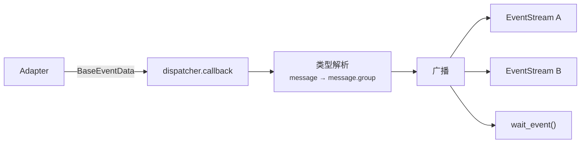

| 组件 | 职责 |
|---|---|
| **AsyncEventDispatcher** | 接收事件、类型解析（内置 `_resolve_type()` 静态方法推导 `"message.group"` 等类型）、广播到所有活跃 Stream |
| **Event** | 不可变数据类，包含解析后的事件类型 + 原始数据 |
| **EventStream** | 异步迭代器，支持 `async with` / `async for` |

#### 4.4.2 Registry 处理器注册与路由

`HandlerDispatcher` — 事件到处理器的路由调度：

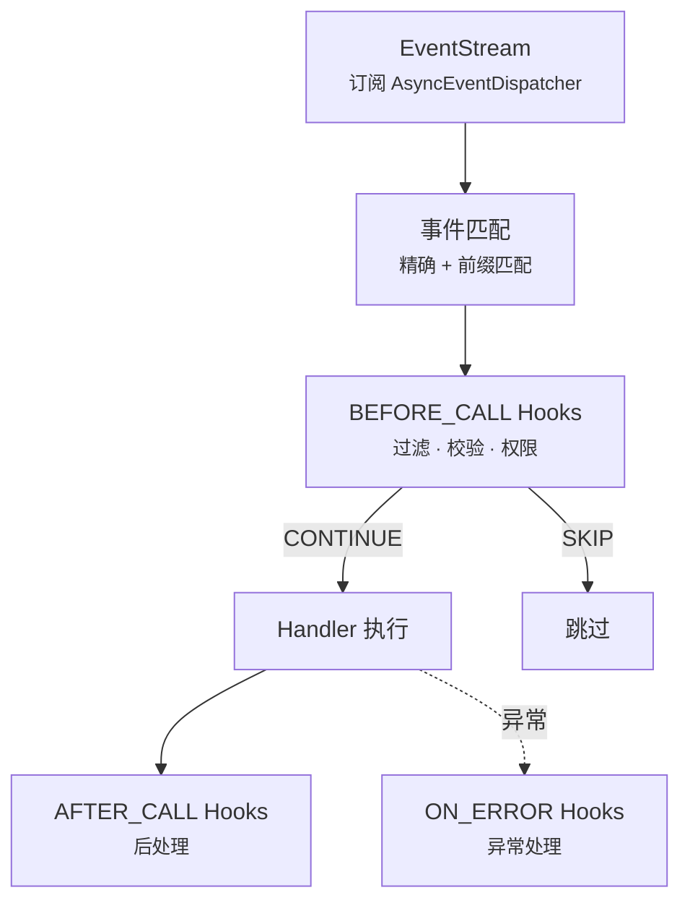

| 组件 | 职责 |
|---|---|
| **HandlerDispatcher** | 订阅事件流、通过 `create_entity()` 将数据模型包装为事件实体、匹配处理器、按优先级执行、管理 Hook 链 |
| **Registrar** | 装饰器工厂：`@bot.on()` / `@bot.on_group_message()` 等收集待注册处理器 |
| **Hook** | 中间件抽象基类，通过 `HookStage` 枚举区分三个阶段：`BEFORE_CALL` / `AFTER_CALL` / `ON_ERROR`；返回 `HookAction`（`CONTINUE` / `SKIP`）控制流程 |
| **HookContext** | Hook 执行上下文：event / handler / services / kwargs / result / error |
| **CommandHook** | 命令匹配 Hook：按命令名精确/前缀匹配，支持类型注解参数绑定（`At` / `int` / `float` / `str`），自动从 `MessageArray` 提取并注入 `ctx.kwargs` |
| **内置过滤 Hook** | `MessageTypeFilter` / `PostTypeFilter` / `SubTypeFilter` / `SelfFilter` / `NoticeTypeFilter` / `RequestTypeFilter` |
| **内置匹配 Hook** | `StartsWithHook`（前缀匹配）/ `KeywordHook`（关键词匹配）/ `RegexHook`（正则匹配） |
| **预置实例** | `group_only` / `private_only`（`MessageTypeFilter` 实例）/ `non_self`（`SelfFilter` 实例） |
| **工厂函数** | `startswith(prefix)` / `keyword(*words)` / `regex(pattern)` — 快速创建对应 Hook |
| **上下文隔离** | `set_current_plugin()` / `get_current_plugin()` — 利用 ContextVar 隔离并发插件加载的注册上下文 |

### 4.5 API 接口层

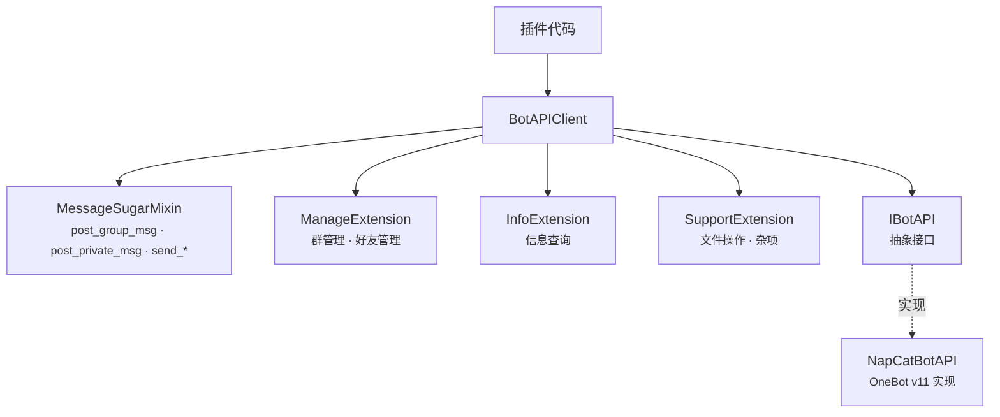

**BotAPIClient 命名空间：**

| 命名空间 | 高频方法 |
|---|---|
| *(顶层)* | `send_group_msg()` / `send_private_msg()` / `delete_msg()` |
| *(Sugar)* | `post_group_msg(text=, at=, image=, ...)` / `post_private_msg(...)` / `send_group_text()` / `send_group_image()` 等 20+ 便捷方法 |
| `manage.*` | `set_group_kick()` / `set_group_ban()` / `set_group_admin()` / `set_group_card()` |
| `info.*` | `get_login_info()` / `get_group_list()` / `get_group_member_info()` |
| `support.*` | `upload_file()` / `delete_file()` / `get_file_url()` |

所有调用经 `_LoggingAPIProxy` 自动记录日志。

### 4.6 Plugin 插件系统

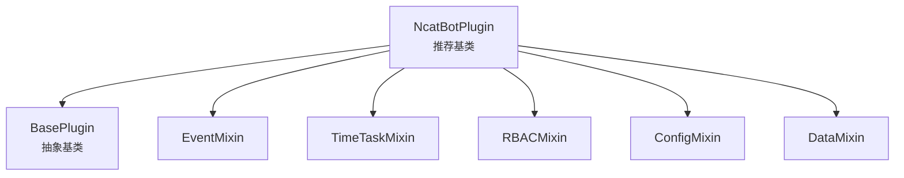

**加载子系统：**

| 组件 | 职责 |
|---|---|
| **PluginLoader** | 主协调器，组合 PluginIndexer + DependencyResolver + ModuleImporter |
| **PluginIndexer** | 扫描 `manifest.toml`，建立插件索引 |
| **DependencyResolver** | 拓扑排序解析依赖顺序（异常：`PluginCircularDependencyError` / `PluginMissingDependencyError` / `PluginVersionError`） |
| **ModuleImporter** | 动态导入/卸载 Python 模块，查找插件类 |
| **pip_helper** | `check_requirements()` 校验 pip 依赖、`install_packages()` 自动安装缺失包（支持 uv / pip 后端） |

### 4.7 Service 服务层

长生命周期的后台服务，与插件系统解耦：

| 组件 | 职责 |
|---|---|
| **BaseService** | 抽象基类：`name` / `on_load()` / `on_close()` / `emit_event` |
| **ServiceManager** | 服务注册、依赖排序加载、统一关闭 |
| **RBACService** | 角色权限管理，数据存储于 `data/rbac.json`；内部组件：`PermissionPath` / `PermissionTrie`（高效权限查询）/ `EntityManager` / `PermissionChecker` / `PermissionAssigner` |
| **TimeTaskService** | 定时任务执行；内部组件：`TaskExecutor`（异步执行）/ `TimeTaskParser`（解析 `'30s'` / `'HH:MM'` 等时间表达式） |
| **FileWatcherService** | 文件系统监控，支持插件热重载 |

### 4.8 Utils 工具集

| 模块 | 职责 |
|---|---|
| `logger/` | `BoundLogger` 上下文日志 + `setup_logging()` 初始化（控制台 + 滚动文件） |
| `config/` | `ConfigManager` YAML 配置管理 + `Config` Pydantic 模型（单例） |
| `network.py` | `post_json()` / `get_json()` / `download_file()` + 代理支持 |
| `error.py` | `NcatBotError` / `NcatBotValueError` / `NcatBotConnectionError` 异常体系 |
| `status.py` | `Status` 全局状态追踪 |
| `prompt.py` | 交互式 CLI 工具：`confirm()` / `ask()` / `select()` + 异步变体；`is_interactive()` / `set_non_interactive()` 控制模式 |

### 4.9 Testing 测试支持

| 组件 | 职责 |
|---|---|
| **factory.py** | 测试数据工厂：`group_message()` / `private_message()` / `friend_request()` 等 |
| **TestHarness** | 测试编排：Bot + MockAdapter + 事件注入 + 响应断言 |

### 4.10 App 编排层

`BotClient` 是整个 Bot 的入口和生命周期管理器（Composition Root），
位于 `ncatbot/app/` 模块，允许依赖所有其他层：

```python
from ncatbot.app import BotClient

bot = BotClient()

@bot.on("message.group")
async def on_group_msg(event):
    await event.reply("hello")

bot.run()
```

职责：
- 组装所有核心组件（Adapter / API / Dispatcher / Handler / Service / Plugin）
- 提供 `run()`（同步阻塞）和 `run_async()`（异步非阻塞）两种启动模式
- 统一 `shutdown()` 释放资源
- 作为编排层而非核心层，避免 core → plugin 的反向依赖

### 4.11 CLI 命令行工具

基于 Click 框架的命令行入口，位于 `ncatbot/cli/`：

| 子命令 | 功能 |
|---|---|
| `run` | 启动 Bot（可选 `--debug` / `--hot-reload`） |
| `dev` | 开发模式启动（默认开启 debug + 热重载） |
| `config` | 配置管理（查看 / 修改） |
| `plugin` | 插件管理（list / create / remove） |
| `napcat` | NapCat 安装与控制 |
| `init` | 初始化项目目录结构 |

**内部结构：**

| 模块 | 职责 |
|---|---|
| `main.py` | Click 入口 + `cli()` 根命令组 |
| `commands/` | 各子命令实现模块 |
| `utils/` | 颜色输出 + REPL 交互模式 |
| `templates/` | `plugin create` 使用的插件脚手架模板 |

---

## 5. 生命周期

### 5.1 启动流程

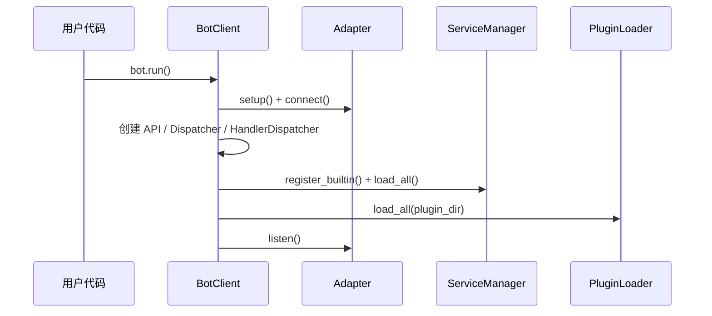

### 5.2 事件处理流程

以 `AsyncEventDispatcher` 为分界，事件处理分为 **上游采集** 和 **下游消费** 两阶段。

#### 5.2.1 上游：事件采集与广播

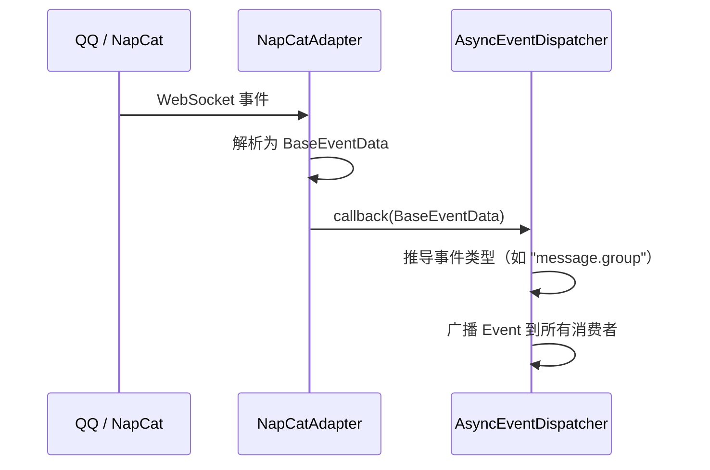

> `AsyncEventDispatcher` 是纯广播器，不含业务逻辑。
> 它将 `Event` 同时投递给所有活跃的 `EventStream`（多消费者）和一次性 `wait_event()` waiter。

#### 5.2.2 下游：Handler 匹配与执行

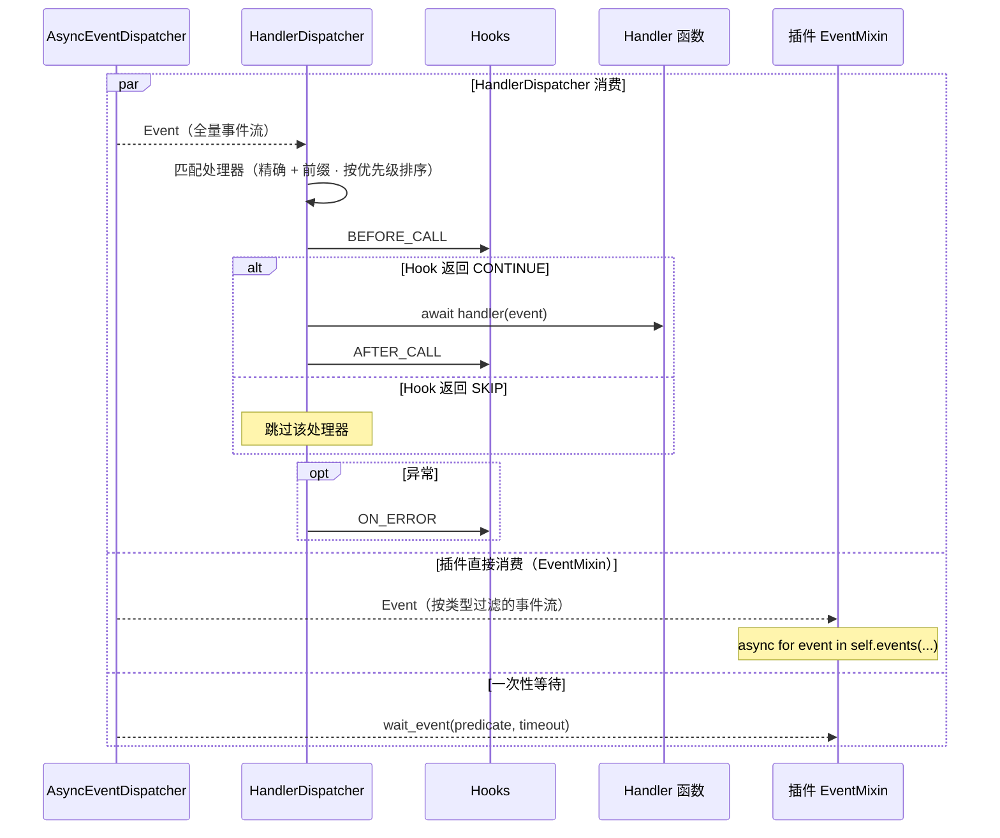

> `AsyncEventDispatcher` 的消费者有三类：
> 1. **HandlerDispatcher** — 订阅全量事件流，负责 Hook 链 + Handler 路由
> 2. **插件 EventMixin** — 通过 `self.events()` 创建独立过滤流，自行 `async for`
> 3. **wait_event()** — 一次性 Future，匹配或超时后自动移除

### 5.3 关闭流程

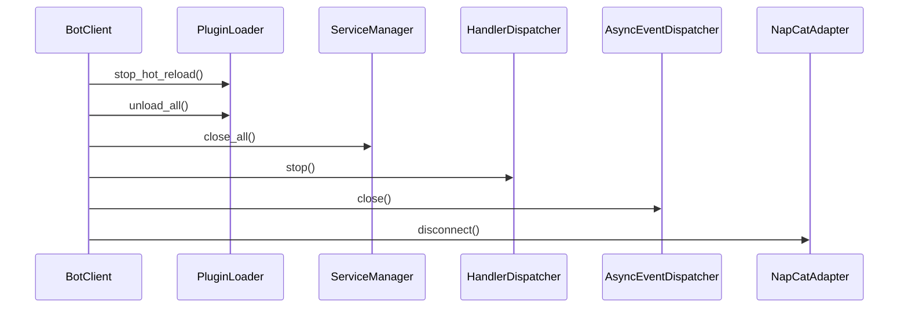

---

## 6. 插件开发模型

### 6.1 插件结构

每个插件是一个独立目录，包含 `manifest.toml` 和入口模块：

```text
plugins/
└── my_plugin/
    ├── manifest.toml    # 插件元信息
    └── main.py          # 入口模块
```

**manifest.toml 示例：**

```toml
name = "my_plugin"
version = "1.0.0"
main = "main.py"
author = "developer"
description = "示例插件"
dependencies = []          # 依赖的其他插件
pip_dependencies = []      # pip 依赖
```

**入口模块示例：**

```python
from ncatbot.plugin import NcatBotPlugin

class MyPlugin(NcatBotPlugin):
    name = "my_plugin"
    version = "1.0.0"
    author = "developer"
    description = "示例插件"

    async def on_load(self):
        # 注册事件处理器等初始化逻辑
        pass

    async def on_close(self):
        # 清理资源
        pass
```

### 6.2 Mixin 体系

`NcatBotPlugin` 通过 Mixin 组合提供丰富能力：

| Mixin | 能力 | 核心方法 |
|---|---|---|
| **EventMixin** | 事件消费 | `events(type)` / `wait_event(predicate, timeout)` |
| **TimeTaskMixin** | 定时任务 | `add_scheduled_task(name, interval)` / `remove_scheduled_task(name)` |
| **RBACMixin** | 权限管理 | `check_permission(user, perm)` / `add_permission()` / `remove_permission()` |
| **ConfigMixin** | 配置持久化 | `get_config(key)` / `set_config(key, value)` — 存储于 `workspace/config.yaml` |
| **DataMixin** | 数据持久化 | `get_data(key)` / `set_data(key, value)` — 存储于 `workspace/data.json` |

Mixin 加载顺序：EventMixin → TimeTaskMixin → RBACMixin → ConfigMixin → DataMixin

加载和卸载时，Mixin Hook 按 MRO 顺序自动执行。

### 6.3 插件加载与热重载

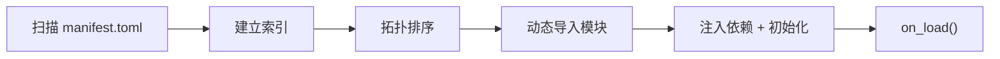

**热重载机制：**
- `FileWatcherService` 监控插件目录文件变更
- 检测到变更后通知 `PluginLoader`
- PluginLoader 执行：`unload_plugin()` → `rescan` → `load_plugin()`
- `HandlerDispatcher.revoke_plugin(name)` 清除旧处理器

---

## 7. 关键设计模式

| 模式 | 应用位置 | 说明 |
|---|---|---|
| **适配器模式** | `adapter/` | `BaseAdapter` 抽象协议差异，支持 NapCat / Mock 等多种实现 |
| **观察者模式** | `core/dispatcher/` | `AsyncEventDispatcher` 广播事件到多个 `EventStream` 订阅者 |
| **责任链模式** | `core/registry/` | Hook 链按优先级依次执行，可中断或跳过 |
| **工厂模式** | `event/factory.py` | `create_entity()` 根据数据类型创建对应事件实体 |
| **Mixin 模式** | `plugin/mixin/` | 通过多继承组合插件能力，按 MRO 管理生命周期 |
| **依赖注入** | `app/client.py` | `BotClient` 作为 Composition Root 组装并注入 API / Dispatcher / Services 到插件 |
| **ContextVar 隔离** | `core/registry/context.py` | 利用 Python ContextVar 隔离并发插件加载的注册上下文 |
| **命名空间分层** | `api/client.py` | BotAPIClient 将高频 / 低频 API 分层为顶层方法 + `manage` / `info` / `support` 子空间 |
| **拓扑排序** | `plugin/loader/resolver.py` | 插件依赖解析，确保加载顺序正确 |
