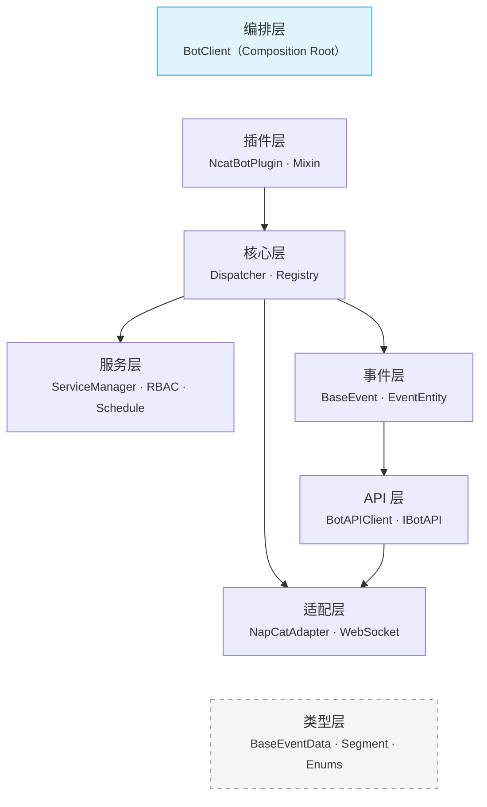
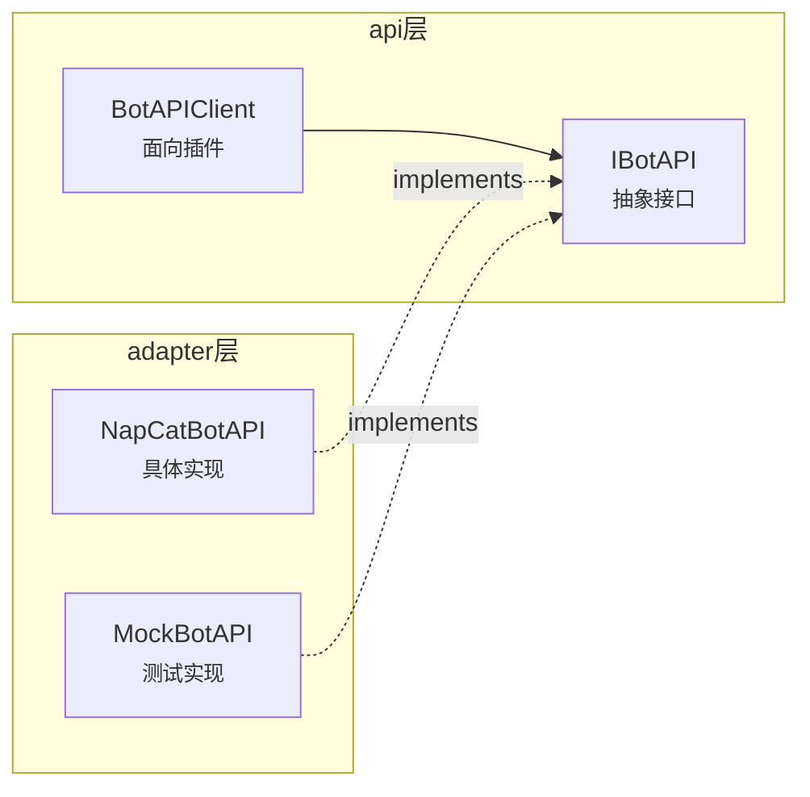
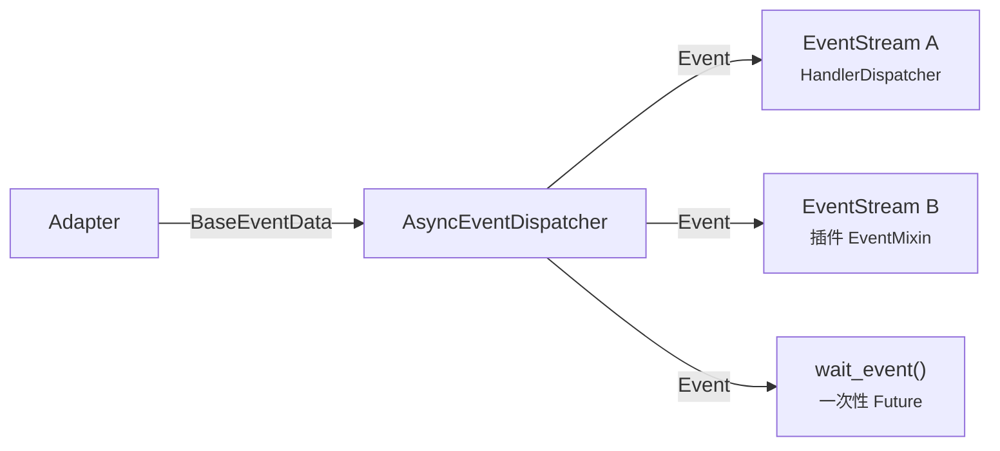

# 架构级决策

> ADR-001 ~ ADR-004：定义系统整体结构、层次划分与核心模式选型。

---

## ADR-001：分层架构

### 背景

NcatBot 需要同时满足三类用户的需求：

1. **插件开发者** — 只关心事件处理和 API 调用
2. **框架扩展者** — 需要替换适配器或添加新服务
3. **核心贡献者** — 需要修改分发引擎或注册机制

单层或两层设计会导致上述三类需求耦合在同一抽象层次，难以独立演化。

### 决策

采用 7 层分层架构，自底向上为：

```text
Types → Adapter → Event → API → Core → Service → Plugin
                                                    ↑
                                            App（编排层，游离）
```



### 理由

| 原则 | 体现 |
|---|---|
| **单一职责** | 每层只解决一个维度的问题（通信 / 数据 / 路由 / 业务） |
| **依赖规则** | 上层可依赖下层，下层不得引用上层；`Types` 和 `Utils` 是公共层，任何层均可引用 |
| **可替换性** | 替换 Adapter 不影响 Core 以上的层；替换 Core 不影响 Plugin 的 API |
| **可测试性** | 每层可通过 Mock 其下层进行隔离测试（如 `MockAdapter` / `MockBotAPI`） |

**层间依赖规则：**

```text
        可依赖 →
Plugin ─────── Core ─────── Event ─────── Adapter
   │             │             │
   └── Service   └── API      └── Types
```

- **禁止**跨层依赖（如 Plugin 直接依赖 Adapter）
- **禁止**反向依赖（如 Adapter 引用 Core）
- 唯一例外：`App`（编排层）可依赖所有层，因为它是 **Composition Root**

### 替代方案

| 方案 | 否决理由 |
|---|---|
| 三层（Adapter / Core / Plugin） | Core 承担过多职责，事件与注册逻辑纠缠 |
| 微内核 + 全插件化 | 实现成本高，QQ 机器人场景不需要如此极端的可扩展性 |
| 洋葱模型（类 Express） | 不适合事件驱动 + 多消费者的场景 |

### 后果

- (+) 新贡献者可快速定位应在哪一层修改代码
- (+) 各层可独立测试，CI 可按层并行
- (-) 层数较多，跨层调用链较长（已通过编排层的依赖注入缓解）
- (-) 新增横切关注点（如日志、指标）需考虑在哪一层落地

---

## ADR-002：适配器模式与依赖反转

### 背景

NcatBot 通过 NapCat 与 QQ 通信，但不排除未来接入其他 OneBot 实现或完全不同的协议。API 调用需要一个稳定接口，不能让上层直接依赖 NapCat 的具体实现。

### 决策

1. 在 `api/interface.py` 定义 `IBotAPI` 抽象接口
2. `NapCatBotAPI`（位于 `adapter/napcat/api/`）**实现** `IBotAPI`
3. `BotAPIClient`（位于 `api/client.py`）持有 `IBotAPI` 引用，对插件暴露高层接口



关键代码（`api/interface.py`）：

```python
class IBotAPI(ABC):
    @abstractmethod
    async def send_group_msg(self, group_id, message, **kwargs) -> dict: ...
    @abstractmethod
    async def send_private_msg(self, user_id, message, **kwargs) -> dict: ...
    @abstractmethod
    async def delete_msg(self, message_id) -> None: ...
    # ... 群管理 / 信息查询等方法
```

### 理由

**为何 Adapter 实现 API 层的接口，而非 API 层依赖 Adapter？**

| 如果反过来 | 问题 |
|---|---|
| API 层 `import adapter` | API 层被锁定在具体协议实现上，引入 Types → Adapter → API 的循环 |
| 替换 Adapter 需要改 API 层 | 违反开闭原则 |

采用依赖反转后：

- `IBotAPI` 定义在高层（API 层），是稳定的契约
- `NapCatBotAPI` 在低层（Adapter 层）去"适应"这个契约
- 新增 Adapter 只需在新包中实现 `IBotAPI`，零修改已有代码

### 替代方案

| 方案 | 否决理由 |
|---|---|
| 直接暴露 HTTP/WS 方法 | 插件代码与协议强耦合 |
| 在 Adapter 层定义接口 | 依赖方向错误，上层被迫引用下层的抽象 |
| Protocol（结构子类型） | Python Protocol 的运行时检查能力有限，不如 ABC 明确 |

### 后果

- (+) `MockBotAPI` 使测试完全不需要真实 QQ 连接
- (+) 未来接入 Lagrange 等其他 OneBot 实现只需新增 Adapter
- (-) 接口变更需同步修改所有实现类
- (-) `IBotAPI` 方法数量较多，维护成本随协议扩展而增长

---

## ADR-003：AsyncEventDispatcher 纯广播设计

### 背景

事件分发器需要解决两个矛盾需求：

1. `HandlerDispatcher` 需要消费全量事件做路由匹配
2. 插件的 `EventMixin.events()` 需要独立、按类型过滤的事件流
3. `wait_event()` 需要一次性 Future 语义

如果分发器内置业务逻辑（如 Handler 匹配），上述三类消费者将难以共存。

### 决策

`AsyncEventDispatcher` 是 **纯广播器**，不含任何业务逻辑：



核心实现（`core/dispatcher/dispatcher.py`）：

```python
class AsyncEventDispatcher:
    def __init__(self, stream_queue_size=500):
        self._stream_queues: Set[asyncio.Queue] = set()
        self._waiters: list[_Waiter] = []

    async def _on_event(self, data: BaseEventData) -> None:
        event_type = self._resolve_type(data)
        event = Event(type=event_type, data=data)
        self._broadcast(event)        # 广播到所有 Stream
        self._resolve_waiters(event)   # resolve 匹配的 waiter

    def events(self, event_type=None) -> EventStream:
        queue = asyncio.Queue(maxsize=self._stream_queue_size)
        self._stream_queues.add(queue)
        return EventStream(self, queue, event_type)
```

### 理由

| 多消费者模型选择 | 说明 |
|---|---|
| **广播 + Queue per consumer** ✅ | 每个消费者独立队列，互不阻塞，天然支持背压 |
| 单一事件回调 | 不支持多消费者 |
| 发布-订阅 + 主题过滤 | 过重，过滤逻辑应在消费端而非分发端 |

**为什么分发器不包含业务逻辑？**

- Handler 匹配、Hook 执行等逻辑属于 Registry 层（`HandlerDispatcher`）
- 如果放在分发器中，插件的 `EventMixin` 就无法绕过 Handler 机制直接消费事件
- 纯广播设计使分发器可被任意数量的消费者订阅，职责边界清晰

### 替代方案

| 方案 | 否决理由 |
|---|---|
| asyncio.Event 通知 | 无法携带数据，需要额外共享状态 |
| Callback 列表 | 消费者间共享执行上下文，不利于隔离 |
| aiohttp-style Signal | 信号量缺少背压机制，可能 OOM |

### 后果

- (+) 三类消费者（Handler / EventMixin / wait_event）共存互不干扰
- (+) 队列满时自动丢弃最旧事件，不会阻塞生产端
- (-) 每个消费者一个 Queue，内存随消费者数量线性增长
- (-) 丢弃事件可能导致消费者遗漏（生产环境需合理设置 `stream_queue_size`）

---

## ADR-004：ContextVar 隔离注册上下文

### 背景

插件加载时，装饰器（如 `@bot.on("message")`）需要知道"当前正在加载的是哪个插件"，以便将 Handler 绑定到正确的插件。

并发或串行加载多个插件时，如何让装饰器在 **模块执行期间** 读取到正确的插件名？

### 决策

使用 Python 标准库 `contextvars.ContextVar` 隔离注册上下文：

```python
# core/registry/context.py
from contextvars import ContextVar, Token

_current_plugin_ctx: ContextVar[Optional[str]] = ContextVar(
    "_current_plugin_ctx", default=None
)

def set_current_plugin(name: str) -> Token:
    return _current_plugin_ctx.set(name)

def get_current_plugin() -> Optional[str]:
    return _current_plugin_ctx.get()
```

加载流程中，`PluginLoader` 在导入模块前设置、导入后重置：

```python
# 伪代码
token = set_current_plugin("my_plugin")
try:
    importlib.import_module(plugin_module)
finally:
    _current_plugin_ctx.reset(token)
```

`Registrar` 在装饰器内读取当前插件名：

```python
# core/registry/registrar.py
plugin_name = get_current_plugin() or "__global__"
```

### 理由

| 方案 | 线程安全 | asyncio 安全 | 侵入性 | 选择 |
|---|---|---|---|---|
| **ContextVar** | ✅ | ✅ | 低 | ✅ 采用 |
| 全局变量 + 锁 | ✅ | ❌ 死锁风险 | 低 | ❌ |
| 将 plugin_name 作为参数传递给装饰器 | ✅ | ✅ | 高 | ❌ |

- **全局锁**：在 asyncio 中，`asyncio.Lock` 无法阻止同一 Task 内的重入，且串行加载不需要锁，并发加载需要的是隔离而非互斥。
- **传参方式**：`@bot.on("message", plugin="xxx")` 需要插件开发者显式声明，违反"约定优于配置"原则。
- **ContextVar**：天然支持 asyncio Task 隔离，`Token` 机制确保精确 reset，零侵入插件代码。

### 替代方案

| 方案 | 否决理由 |
|---|---|
| `threading.local()` | asyncio 中无效，多个协程共享同一线程 |
| 栈式全局变量 | 手动 push/pop 容易遗漏，异常时状态泄露 |
| 将装饰器替换为显式注册 API | 破坏装饰器的声明式风格，影响开发者体验 |

### 后果

- (+) 插件开发者无需任何额外操作，装饰器自动绑定插件
- (+) 支持未来并发加载插件（每个 Task 有独立上下文）
- (-) ContextVar 在 `asyncio.to_thread()` 等线程跨越场景中需要手动 `copy_context()`
- (-) 调试时 ContextVar 的值不如全局变量直观
