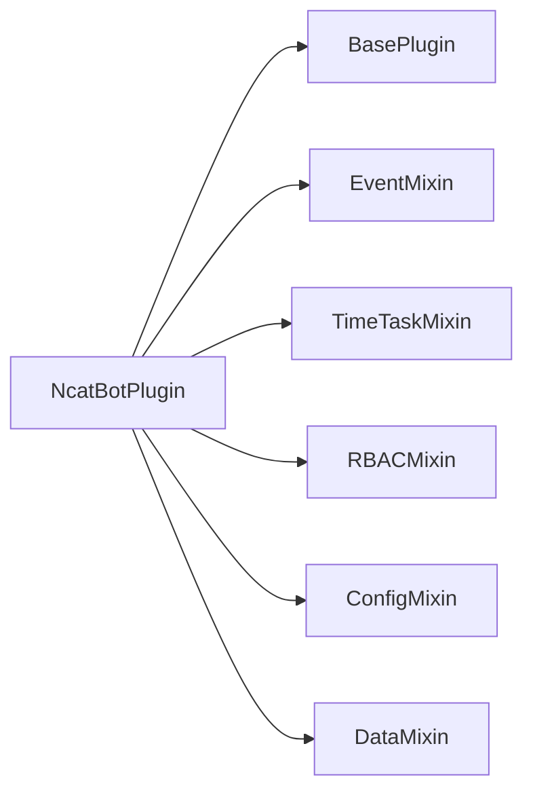
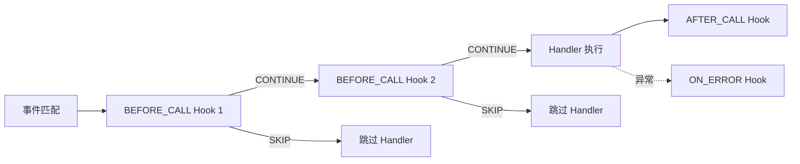

# 实现级决策

> ADR-005 ~ ADR-009：确定具体模式、数据结构与 API 设计方案。

---

## ADR-005：Mixin 多继承 vs 组合

### 背景

`NcatBotPlugin` 需要提供事件消费、定时任务、RBAC、配置持久化、数据持久化等能力。这些能力需要：

1. 各自独立的 `load` / `unload` 钩子
2. 在插件生命周期中按顺序执行
3. 插件开发者可选择性使用

### 决策

采用 **Mixin 多继承** 模式：

```python
# plugin/ncatbot_plugin.py
class NcatBotPlugin(
    BasePlugin, EventMixin, TimeTaskMixin, RBACMixin, ConfigMixin, DataMixin
):
    """继承此类即获得全部 Mixin 能力"""
```

MRO（方法解析顺序）决定钩子执行顺序：

```text
load  顺序: EventMixin → TimeTaskMixin → RBACMixin → ConfigMixin → DataMixin
unload 顺序: EventMixin → TimeTaskMixin → RBACMixin → ConfigMixin → DataMixin
```



`BasePlugin.__onload__()` 自动发现并调用所有 Mixin 的 `_mixin_load()` 方法，`__unload__()` 调用 `_mixin_unload()`。

### 理由

**为什么选择 Mixin 而非纯组合？**

| 维度 | Mixin | 组合（持有独立对象） |
|---|---|---|
| 使用体验 | `self.events()` 直接调用 | `self.event_helper.events()` |
| 钩子编排 | MRO 自动排序 | 需手动维护调用顺序列表 |
| 类型提示 | IDE 直接提示所有方法 | 需要额外的类型 stub 或 `__getattr__` |
| 命名冲突 | MRO 规则解决 | 不存在 |
| 扩展性 | 继承链固定 | 可运行时动态组合 |

在 QQ 机器人插件场景中，**使用体验** 和 **钩子自动编排** 的优先级高于运行时动态组合：

- 插件的 Mixin 组成在编写时确定，无需动态增减
- `self.events()` 比 `self.event_helper.events()` 更符合插件开发者的直觉
- MRO 的确定性保证了 load/unload 顺序的可预测性

### MRO 生命周期管理

`BasePlugin` 利用 Python MRO 自动发现 Mixin 钩子：

```python
# BasePlugin.__onload__() 伪代码
for cls in type(self).__mro__:
    if hasattr(cls, '_mixin_load') and '_mixin_load' in cls.__dict__:
        await cls._mixin_load(self)
```

这确保了：
- 每个 Mixin 的钩子只执行一次（通过检查 `cls.__dict__`）
- 执行顺序由继承声明顺序决定
- 新增 Mixin 只需在 `NcatBotPlugin` 的继承列表中添加

### 替代方案

| 方案 | 否决理由 |
|---|---|
| 纯组合 + 接口 | API 代理层太多，`self.xxx_helper.method()` 冗长 |
| 装饰器增强 | 无法提供有状态的 load/unload 生命周期 |
| 元类魔法 | 过于隐式，调试困难，贡献者学习曲线陡 |

### 后果

- (+) 插件开发者继承 `NcatBotPlugin` 即获得全部能力，零配置
- (+) IDE 自动补全覆盖所有 Mixin 方法
- (-) 多继承的 MRO 对 Python 新手不够直观
- (-) Mixin 间如果出现方法名冲突需依赖 MRO 规则解决

---

## ADR-006：Hook 责任链

### 背景

Handler 执行前后需要可扩展的中间件能力：权限校验、消息过滤、命令解析、错误处理等。这些逻辑不应硬编码在 Handler 内部或分发器中。

### 决策

设计三阶段 Hook 责任链，Hook 绑定在 handler 函数上：



**三阶段设计：**

| 阶段 | `HookStage` | 时机 | 典型用途 |
|---|---|---|---|
| 前置 | `BEFORE_CALL` | Handler 执行前 | 权限校验 / 消息过滤 / 命令解析 / 参数注入 |
| 后置 | `AFTER_CALL` | Handler 执行后 | 日志记录 / 结果处理 |
| 错误 | `ON_ERROR` | Handler 异常时 | 错误上报 / 降级处理 |

**HookAction 语义：**

| Action | 含义 | 适用阶段 |
|---|---|---|
| `CONTINUE` | 继续执行后续 Hook 和 Handler | `BEFORE_CALL` |
| `SKIP` | 跳过当前 Handler，继续下一个匹配的 Handler | `BEFORE_CALL` |

核心代码（`core/registry/hook.py`）：

```python
class Hook(ABC):
    stage: HookStage = HookStage.BEFORE_CALL
    priority: int = 0  # 同 stage 内越大越先执行

    def __call__(self, func):
        """装饰器模式：将自身绑定到 func.__hooks__"""
        ...

    @abstractmethod
    async def execute(self, ctx: HookContext) -> HookAction: ...
```

### 理由

**SKIP vs STOP 语义：**

`SKIP` 表示"跳过当前 Handler"而非"终止所有 Handler"。这一设计是因为：

- 不同 Handler 可能注册了不同的 Hook，一个 Handler 被 SKIP 不应影响其他 Handler
- 真正需要终止事件传播时，通过 `event.data._propagation_stopped` 标志实现
- 这样 Hook 的职责被限定为"为绑定的 handler 做前置检查"，不越权干扰其他 handler

**Hook 绑定在函数上（`func.__hooks__`）而非全局注册：**

- 不同 Handler 可以有不同的 Hook 组合
- 热重载时随 Handler 一起清理，无需单独追踪
- 装饰器语法自然：`@command("help") @group_only`

### 替代方案

| 方案 | 否决理由 |
|---|---|
| 全局中间件栈（Express 风格） | 所有 handler 共享同一中间件链，无法按 handler 定制 |
| AOP 切面 | Python 中实现复杂，调试不友好 |
| Handler 内部 if-else | 重复代码，不可复用 |

### 后果

- (+) 可组合：`@command("ban") @group_only @non_self` 声明式叠加
- (+) 可复用：内置 `group_only` / `private_only` / `non_self` 等预置实例
- (+) 热重载友好：Hook 随 handler 函数一起注册和清理
- (-) hook 过多时调试链路较长
- (-) `func.__hooks__` 依赖函数属性注入，不够类型安全

---

## ADR-007：HandlerDispatcher 单 Handler 执行模型

### 背景

当同一事件匹配到多个 Handler 时，执行策略有两种极端：

1. **全部执行** — 所有匹配的 handler 都运行
2. **仅执行一个** — 只运行最高优先级的 handler

### 决策

`HandlerDispatcher` 采用 **遍历执行** 模型，但精确 + 前缀匹配 + 优先级排序的设计使得高优先级 Handler 天然处于主导地位：

```python
# core/registry/dispatcher.py
def _collect_handlers(self, event_type: str) -> List[HandlerEntry]:
    result = list(self._handlers.get(event_type, []))   # 精确匹配
    parts = event_type.split(".")
    for i in range(len(parts) - 1, 0, -1):              # 前缀匹配
        prefix = ".".join(parts[:i])
        result.extend(self._handlers.get(prefix, []))
    result.sort(key=lambda e: -e.priority)               # 优先级降序
    return result
```

分发循环按优先级遍历，每个 handler 独立经过 Hook 链；`_propagation_stopped` 标志可显式终止传播。

**匹配规则总结：**

| 注册类型 | 事件 `message.group` | 匹配？ |
|---|---|---|
| `"message.group"` | 精确匹配 | ✅ |
| `"message"` | 前缀匹配 | ✅ |
| `"message.private"` | 不匹配 | ❌ |
| `"notice"` | 不匹配 | ❌ |

### 理由

- **同事件多 handler** 是合理场景：日志插件监听 `"message"` 记录所有消息，业务插件监听 `"message.group"` 处理命令。两者应共存。
- **优先级 + Hook 过滤** 已足够控制执行：高优先级 handler 可通过 `_propagation_stopped` 阻止后续 handler 执行。
- **SKIP 停的是当前 handler，不是全局**：`BEFORE_CALL` Hook 返回 `SKIP` 只跳过该 handler，不影响其他。

### 替代方案

| 方案 | 否决理由 |
|---|---|
| 仅最高优先级执行 | 日志监听等跨插件需求无法满足 |
| 按插件隔离分发 | 破坏了跨插件协作（如 RBAC 插件为其他插件提供权限检查） |
| 异步并发执行所有 handler | handler 间顺序依赖和副作用难以管理 |

### 后果

- (+) 多插件可监听同一事件类型，互不干扰
- (+) 前缀匹配让通用监听（如 `"message"`）和精确处理（如 `"message.group"`）自然共存
- (-) handler 数量多时按优先级排序有一定开销（实际场景中 handler 数量有限，可忽略）
- (-) `_propagation_stopped` 是侵入式设计，可能在未来重构中改为 HookAction

---

## ADR-008：命名空间分层 API

### 背景

OneBot v11 协议定义了 60+ 个 API。将它们全部平铺在 `BotAPIClient` 上会导致：

- IDE 自动补全列表过长
- 高频操作（发消息）和低频操作（设群名）混杂
- 难以按职责查找方法

### 决策

将 API 分为 **顶层高频** + **命名空间低频** 两层：

```python
# api/client.py
class BotAPIClient(MessageSugarMixin):
    def __init__(self, adapter_api: IBotAPI):
        self._base = _LoggingAPIProxy(adapter_api)
        self.manage = ManageExtension(self._base)  # 群管理
        self.info = InfoExtension(self._base)       # 信息查询
        self.support = SupportExtension(self._base)  # 文件·杂项
```

| 层级 | 方法示例 | 使用频率 |
|---|---|---|
| **顶层** | `api.send_group_msg()` / `api.send_private_msg()` / `api.delete_msg()` | 每个插件都用 |
| **Sugar** | `api.post_group_msg(text=, image=)` / `api.send_group_text()` | 高频便捷 |
| `api.manage.*` | `api.manage.set_group_ban()` / `api.manage.set_group_kick()` | 管理类插件 |
| `api.info.*` | `api.info.get_group_list()` / `api.info.get_login_info()` | 按需 |
| `api.support.*` | `api.support.upload_group_file()` | 低频 |

**兜底机制：**

```python
def __getattr__(self, name: str) -> Any:
    return getattr(self._base, name)
```

未在 `BotAPIClient` 显式定义的方法自动代理到底层 `IBotAPI`，确保不遗漏任何 API。

### 理由

| 策略 | 说明 |
|---|---|
| 高频平铺 | 发消息是最常用操作，减少嵌套层次 |
| 低频分组 | 群管理 / 查询 / 文件操作按职责归类，降低认知负载 |
| Sugar 语法 | `post_group_msg(text="hi", at=user_id)` 比手动构造 `MessageArray` 更简洁 |
| 日志代理 | `_LoggingAPIProxy` 自动为所有异步调用记录 INFO 日志，无需在每个方法中手动打日志 |

### 替代方案

| 方案 | 否决理由 |
|---|---|
| 全部平铺 | 50+ 方法的自动补全列表影响开发体验 |
| 全部分组 | `api.message.send_group_msg()` 增加无意义层次 |
| 动态生成方法 | 丧失 IDE 类型提示和自动补全 |

### 后果

- (+) IDE 自动补全清晰分层，高频方法即打即用
- (+) 日志自动覆盖所有 API 调用
- (+) `__getattr__` 兜底确保 API 覆盖完整性
- (-) 命名空间的分类标准有一定主观性
- (-) Sugar 方法增加了 API 表面积

---

## ADR-009：RBAC Trie 权限路径

### 背景

插件需要权限控制（如"只有管理员能执行 ban 命令"）。权限路径需要支持：

- 层级结构：`plugin.admin.kick`、`plugin.admin.ban`
- 通配符匹配：`plugin.admin.*` 匹配所有 admin 子权限
- 高效查询：热路径上不能全量遍历

### 决策

使用 **Trie（前缀树）** 存储权限路径，支持 `*`（单层）和 `**`（多层）通配符：

```python
# service/builtin/rbac/trie.py
class PermissionTrie:
    def __init__(self, case_sensitive: bool = True):
        self.root: Dict = {}

    def add(self, path: str) -> None: ...    # 添加权限路径
    def exists(self, path: str, exact: bool = False) -> bool: ...  # 支持通配符查询
```

**权限路径格式：**

```text
plugin.admin.kick       # 具体权限
plugin.admin.*          # admin 下的所有直接子权限
plugin.**               # plugin 下任意深度的权限
```

`PermissionPath` 负责路径解析，将 `"a.b.c"` 拆分为 `("a", "b", "c")` 元组。

**通配符匹配规则：**

| 查询 | 含义 |
|---|---|
| `plugin.admin.kick` | 精确匹配 |
| `plugin.admin.*` | 匹配 `admin` 下一级的任意节点 |
| `plugin.**` | 匹配 `plugin` 下任意深度的所有路径 |

### 理由

**树形权限 vs 平面权限：**

| 维度 | Trie（树形） | Set（平面） |
|---|---|---|
| 前缀查询 | $O(k)$，$k$ 为路径深度 | $O(n)$，需全量遍历 |
| 通配符匹配 | 递归下降，天然支持 | 需正则或手动实现 |
| 层级语义 | `plugin.admin.*` 直接表达"admin 的所有子权限" | 需额外约定 |
| 序列化 | `to_dict()` / `from_dict()` 直接映射 JSON | `set` → `list` |
| 内存 | 共享前缀节省空间 | 重复存储公共前缀 |

QQ 机器人的权限通常具有自然层级（插件 → 功能 → 操作），Trie 完美匹配这一结构。

### 替代方案

| 方案 | 否决理由 |
|---|---|
| 平面 Set + 正则匹配 | 正则编译和匹配开销大，通配符语义不直观 |
| 数据库存储 | 引入外部依赖，QQ 机器人场景中数据量不足以需要 |
| 位图权限 | 不支持动态增减权限路径，扩展性差 |

### 后果

- (+) 查询效率高，通配符匹配由树结构天然支持
- (+) `to_dict()` / `from_dict()` 方便持久化到 JSON 文件（`data/rbac.json`）
- (+) 路径格式 `a.b.c` 对开发者直观，与事件类型格式一致
- (-) 纯 dict 嵌套实现较简单，高并发写入时需额外加锁（当前场景写入频率极低，可接受）
- (-) 通配符仅支持 `*` 和 `**`，不支持正则等复杂模式（覆盖当前需求已足够）
