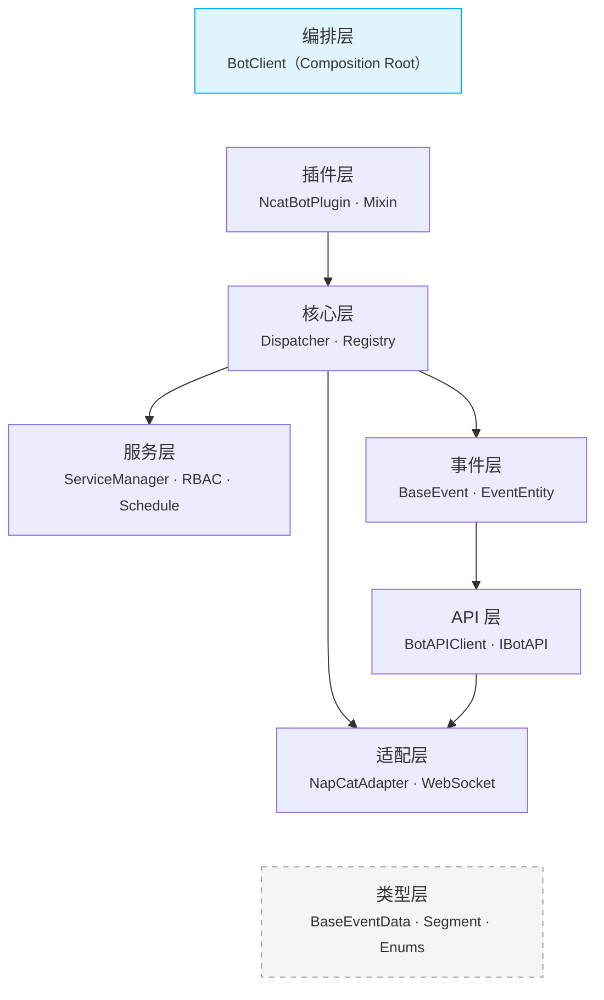

# 设计决策

> 架构选型与设计理由记录 — 以 ADR（Architecture Decision Record）风格记录 NcatBot 的关键架构决策，帮助核心贡献者理解框架设计的 **为什么**。

---

## Quick Start

NcatBot 采用 7 层分层架构，自底向上为：

```text
Types → Adapter → Event → API → Core → Service → Plugin
                                                    ↑
                                            App（编排层，游离）
```



每一层只解决一个维度的问题，上层可依赖下层，下层不得引用上层。`App`（编排层）作为 Composition Root 是唯一可依赖所有层的例外。

**关键设计模式：**

- **依赖反转** — `IBotAPI` 接口定义在 API 层，Adapter 层去实现它（而非 API 层依赖 Adapter）
- **纯广播事件分发** — `AsyncEventDispatcher` 不含业务逻辑，每个消费者独立 Queue
- **ContextVar 注册隔离** — 插件加载时装饰器自动绑定正确的插件上下文
- **Mixin 能力组合** — `NcatBotPlugin` 通过多继承获得事件、定时、RBAC、配置等能力
- **Hook 责任链** — 三阶段 Hook（前置/后置/错误）绑定在 handler 函数上，装饰器叠加

### 决策记录格式

每条 ADR 遵循以下标准模板：

| 章节 | 内容 |
|---|---|
| **背景** | 问题场景与约束条件 |
| **决策** | 最终选择的方案与关键实现 |
| **理由** | 为什么选择该方案（含对比分析） |
| **替代方案** | 被否决的方案及否决理由 |
| **后果** | 正面 (+) 与负面 (-) 影响 |

### 决策状态定义

| 状态 | 含义 |
|---|---|
| ✅ 已采纳 | 当前生效的决策 |
| 🔄 已修订 | 被后续 ADR 修订或部分替代 |
| ❌ 已废弃 | 不再适用 |

---

## 决策索引

### 架构级决策

架构级决策定义了系统的整体结构、层次划分和核心模式选型。

| 编号 | 标题 | 状态 | 结论 |
|---|---|---|---|
| ADR-001 | [分层架构](1_architecture.md#adr-001分层架构) | ✅ 已采纳 | 采用 7 层分层架构，各层单一职责、禁止跨层和反向依赖 |
| ADR-002 | [适配器模式与依赖反转](1_architecture.md#adr-002适配器模式与依赖反转) | ✅ 已采纳 | API 层定义 `IBotAPI` 抽象接口，Adapter 层实现；依赖方向由上至下 |
| ADR-003 | [AsyncEventDispatcher 纯广播设计](1_architecture.md#adr-003asynceventdispatcher-纯广播设计) | ✅ 已采纳 | 分发器是纯广播器，不含业务逻辑；每个消费者独立 Queue，互不阻塞 |
| ADR-004 | [ContextVar 隔离注册上下文](1_architecture.md#adr-004contextvar-隔离注册上下文) | ✅ 已采纳 | 使用 `ContextVar` 在模块加载期隔离插件注册上下文，零侵入插件代码 |

**ADR-001 分层架构** — NcatBot 需同时满足插件开发者（事件处理 + API 调用）、框架扩展者（替换适配器）与核心贡献者（修改分发引擎）三类用户。7 层架构通过严格的依赖规则，使各层可独立演化和测试。

**ADR-002 适配器模式** — `IBotAPI` 定义在 API 层而非 Adapter 层，确保依赖方向正确。新增协议适配器只需实现接口，零修改已有代码。`MockBotAPI` 使测试完全脱离真实 QQ 连接。

**ADR-003 纯广播设计** — `AsyncEventDispatcher` 只做事件广播（Queue per consumer），不含 Handler 匹配等业务逻辑。三类消费者（HandlerDispatcher / EventMixin / wait_event）共存互不干扰。

**ADR-004 ContextVar** — 插件加载时装饰器需要知道当前插件名。`ContextVar` 天然支持 asyncio Task 隔离，`Token` 确保精确 reset，对比全局锁和传参方案侵入性最低。

### 实现级决策

实现级决策确定了具体模式、数据结构和 API 设计方案。

| 编号 | 标题 | 状态 | 结论 |
|---|---|---|---|
| ADR-005 | [Mixin 多继承 vs 组合](2_implementation.md#adr-005mixin-多继承-vs-组合) | ✅ 已采纳 | 采用 Mixin 多继承，MRO 自动排序 load/unload 钩子，插件继承即获全部能力 |
| ADR-006 | [Hook 责任链](2_implementation.md#adr-006hook-责任链) | ✅ 已采纳 | 三阶段 Hook（BEFORE_CALL / AFTER_CALL / ON_ERROR）绑定在 handler 函数上，装饰器叠加 |
| ADR-007 | [HandlerDispatcher 单 Handler 执行模型](2_implementation.md#adr-007handlerdispatcher-单-handler-执行模型) | ✅ 已采纳 | 遍历执行所有匹配 handler（精确+前缀），按优先级排序，`_propagation_stopped` 控制传播 |
| ADR-008 | [命名空间分层 API](2_implementation.md#adr-008命名空间分层-api) | ✅ 已采纳 | 高频 API 顶层平铺，低频 API 按命名空间分组，`__getattr__` 兜底代理 |
| ADR-009 | [RBAC Trie 权限路径](2_implementation.md#adr-009rbac-trie-权限路径) | ✅ 已采纳 | Trie 前缀树存储权限路径，支持 `*`/`**` 通配符，$O(k)$ 查询效率 |

**ADR-005 Mixin** — `NcatBotPlugin` 通过多继承组合 EventMixin、TimeTaskMixin、RBACMixin 等能力。MRO 自动排序 load/unload 钩子，`self.events()` 直接调用比组合模式的 `self.event_helper.events()` 更直观。

**ADR-006 Hook 链** — 三阶段 Hook 绑定在 handler 函数上（`func.__hooks__`），`SKIP` 只跳过当前 handler 不影响其他。装饰器语法 `@command("ban") @group_only @non_self` 可声明式叠加。

**ADR-007 遍历执行** — 同事件可匹配多个 handler（精确 + 前缀），按优先级降序遍历。日志插件监听 `"message"` 和业务插件监听 `"message.group"` 自然共存。

**ADR-008 命名空间 API** — 60+ OneBot API 分为顶层高频（`api.send_group_msg()`）和命名空间低频（`api.manage.*`），`__getattr__` 兜底代理确保覆盖完整。

**ADR-009 RBAC Trie** — 权限路径 `plugin.admin.kick` 用 Trie 前缀树存储，$O(k)$ 查询，支持 `*`/`**` 通配符。QQ 机器人权限天然具有层级结构（插件 → 功能 → 操作）。

---

## 核心架构原则

以下原则贯穿所有设计决策，是评审新提案时的基本准则：

### 1. 分层隔离与依赖规则

```text
        可依赖 →
Plugin ─────── Core ─────── Event ─────── Adapter
   │             │             │
   └── Service   └── API      └── Types
```

- 上层可依赖下层，**禁止**反向依赖和跨层依赖
- `Types` 和 `Utils` 是公共层，任何层均可引用
- `App` 作为 Composition Root 是唯一的例外

> **实践指导：** 新增模块时先确定它属于哪一层，再检查其依赖是否符合规则。

### 2. 依赖反转

稳定的抽象接口定义在高层（如 `IBotAPI` 在 API 层），具体实现在低层（如 `NapCatBotAPI` 在 Adapter 层）。替换具体实现不影响上层代码。

> **实践指导：** 当需要引入外部依赖或可替换组件时，先在目标层定义接口，再在实现层编写具体代码。

### 3. 纯广播 + 消费端逻辑

事件分发器（`AsyncEventDispatcher`）只负责广播事件到所有消费者的独立队列，不包含业务逻辑。匹配、过滤、路由等逻辑由消费者自行处理。

> **实践指导：** 新增事件处理需求时，创建新的消费者订阅分发器，而非修改分发器本身。

### 4. 约定优于配置

通过 `ContextVar`、MRO、装饰器等机制自动完成注册、排序、绑定，减少插件开发者的显式配置。

> **实践指导：** 新增功能时优先考虑自动发现/自动注入，只在明确需要用户自定义时才暴露配置项。

### 5. 可测试性优先

每层可通过 Mock 其下层进行隔离测试。`MockBotAPI` 使测试不依赖真实 QQ 连接，`ContextVar` 支持测试上下文隔离。

> **实践指导：** 新增模块必须能在不启动完整框架的情况下通过单元测试验证。

---

## 深入阅读

| 文档 | 内容 |
|---|---|
| [架构级决策](1_architecture.md) | ADR-001 ~ ADR-004：分层架构、适配器模式、纯广播设计、ContextVar |
| [实现级决策](2_implementation.md) | ADR-005 ~ ADR-009：Mixin、Hook 链、Handler 分发、命名空间 API、RBAC Trie |
| [架构文档](../../architecture.md) | 完整的分层架构与模块详解 |
| [插件快速入门](../../guide/plugin/1.quick-start.md) | 插件开发入门指南 |
