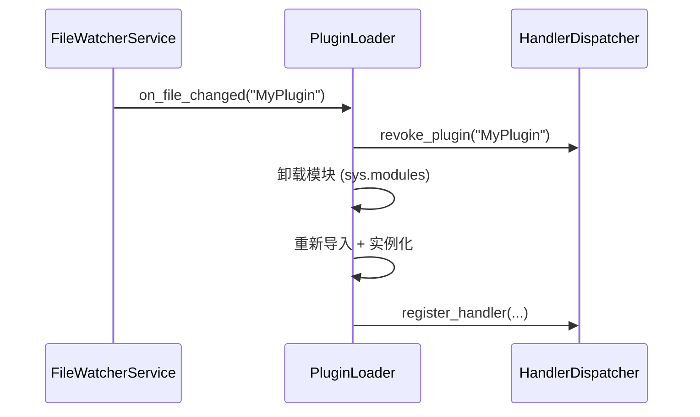

# 插件加载、权限树与热重载

> 插件拓扑排序依赖解析、RBAC Trie 前缀树实现、FileWatcher 热重载机制。

---

## 目录

- [1. 插件加载拓扑排序](#1-插件加载拓扑排序)
- [2. RBAC Trie 实现](#2-rbac-trie-实现)
- [3. 热重载 FileWatcher 实现](#3-热重载-filewatcher-实现)

---

## 1. 插件加载拓扑排序

> 源码：`ncatbot/plugin/loader/resolver.py`

`DependencyResolver` 基于 Kahn 算法实现拓扑排序，确保插件按依赖顺序加载。

### 1.1 依赖图构建

依赖来自 `manifest.toml` 的 `dependencies` 字段。`resolve()` 构建邻接图并检测缺失依赖。

### 1.2 Kahn 算法

- 无依赖插件（入度为 0）先入队
- 依次出队并减少依赖方的入度
- 排序结果数量不等于节点数量 → 存在循环依赖

**版本约束验证**：使用 `packaging.specifiers.SpecifierSet` 检查版本。

**异常类型**：`PluginMissingDependencyError`、`PluginCircularDependencyError`、`PluginVersionError`。

---

## 2. RBAC Trie 实现

> 源码：`ncatbot/service/builtin/rbac/trie.py`、`ncatbot/service/builtin/rbac/path.py`

`PermissionTrie` 使用嵌套字典实现前缀树，按 `.` 分隔路径段。

**示例**：`plugin.admin.kick` 和 `plugin.admin.ban` → `root → "plugin" → "admin" → {"kick": {}, "ban": {}}`

支持通配符匹配：`*`（单段）和 `**`（多段）。

---

## 3. 热重载 FileWatcher 实现

> 源码：`ncatbot/service/builtin/file_watcher/service.py`

`FileWatcherService` 基于轮询扫描实现文件变化检测。

### 3.1 监控机制

使用后台线程定时轮询 `os.path.getmtime()` 检测变化（非 inotify）。

| 参数 | 默认值 | 测试模式 |
|------|--------|----------|
| `_watch_interval` | 1.0s | 0.02s |
| `_debounce_delay` | 1.0s | 0.02s |

### 3.2 变更检测 → 通知流程

1. **目录聚合**：`plugins/MyPlugin/utils/helper.py` → `MyPlugin`
2. **防抖**：同一插件的多个文件变更合并为一次通知
3. 首次扫描只建立缓存，不触发通知

### 3.3 模块卸载 → 重新导入

> 热重载仅在 `debug_mode` 开启时生效。

---

## 延伸阅读

- [插件结构](../../guide/plugin/2.structure.md) — manifest.toml 与插件目录
- [RBAC 服务参考](../../reference/services/1_rbac_service.md) — 完整 API
- [生命周期](../../guide/plugin/3.lifecycle.md) — 加载/卸载流程
