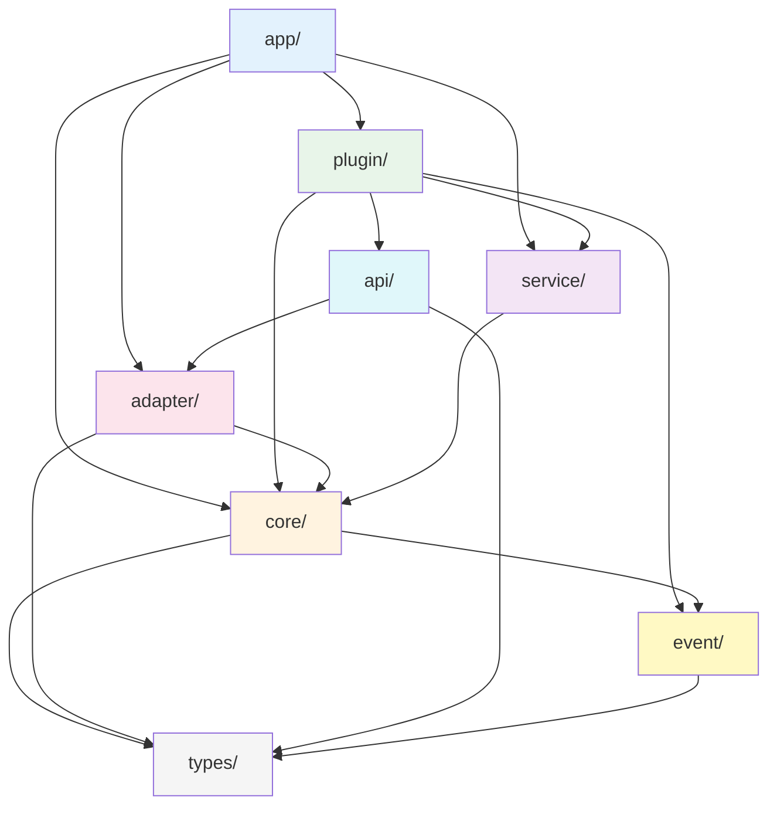

# 模块内部实现

> 各核心模块的内部架构与实现细节，面向核心贡献者的实现级讲解。

---

## Quick Start

NcatBot 源码位于 `ncatbot/`，按职责分为以下层级。推荐从 **数据入口** 开始阅读：

1. **WebSocket 连接**：从 `ncatbot/adapter/napcat/connection/websocket.py` 开始——这是所有数据的入口，负责与 NapCat 的 WebSocket 通信
2. **协议匹配**：`ncatbot/adapter/napcat/connection/protocol.py`——理解请求-响应如何通过 UUID echo 配对
3. **事件分发**：`ncatbot/core/dispatcher/dispatcher.py`——事件如何从 Adapter 广播到多个消费者
4. **Handler 匹配**：`ncatbot/core/registry/dispatcher.py`——事件如何路由到具体的 handler 函数
5. **插件加载**：`ncatbot/plugin/loader/resolver.py`——Kahn 拓扑排序确保依赖顺序
6. **服务层**：`ncatbot/service/builtin/` 下的 RBAC、FileWatcher、PreUpload 等

> **提示**：建议先阅读 [架构总览](../../architecture.md) 理解全局分层，再按上述顺序深入各模块。

---

## 模块一览

### 通信层（adapter/）

| 模块 | 源码路径 | 职责 | 关键类 |
|------|---------|------|--------|
| WebSocket 连接 | `adapter/napcat/connection/websocket.py` | WS 连接建立、数据收发、断线重连 | `NapCatWebSocket` |
| OB11 协议 | `adapter/napcat/connection/protocol.py` | 请求-响应 UUID 匹配 | `OB11Protocol` |
| NapCat 适配器 | `adapter/napcat/adapter.py` | 整合连接与协议，对接核心层 | `NapCatAdapter` |
| Mock 适配器 | `adapter/mock/` | 测试用模拟适配器 | `MockAdapter` |
| 预上传服务 | `adapter/napcat/service/preupload/` | 消息文件分片上传 | `PreUploadService`, `StreamUploadClient` |
| 适配器基类 | `adapter/base.py` | 适配器抽象接口 | `BaseAdapter` |

### 核心层（core/）

| 模块 | 源码路径 | 职责 | 关键类 |
|------|---------|------|--------|
| 事件分发器 | `core/dispatcher/dispatcher.py` | 一对多事件广播 | `AsyncEventDispatcher` |
| 事件流 | `core/dispatcher/stream.py` | 异步迭代事件消费 | `EventStream` |
| Handler 分发器 | `core/registry/dispatcher.py` | 事件→handler 匹配与执行 | `HandlerDispatcher` |
| Handler 注册 | `core/registry/` | handler 注册、优先级管理 | `HandlerEntry` |

### 应用层（app/）

| 模块 | 源码路径 | 职责 | 关键类 |
|------|---------|------|--------|
| Bot 客户端 | `app/client.py` | 启动编排、生命周期管理 | `BotClient` |

### 插件系统（plugin/）

| 模块 | 源码路径 | 职责 | 关键类 |
|------|---------|------|--------|
| 插件基类 | `plugin/base.py` | 插件抽象接口 | `BasePlugin` |
| NcatBot 插件 | `plugin/ncatbot_plugin.py` | 带 Mixin 的插件基类 | `NcatBotPlugin` |
| 清单解析 | `plugin/manifest.py` | manifest.toml 解析 | `PluginManifest` |
| 依赖解析 | `plugin/loader/resolver.py` | Kahn 拓扑排序 + 版本校验 | `DependencyResolver` |
| 插件加载器 | `plugin/loader/` | 模块导入、实例化 | `PluginLoader` |
| Mixin 能力 | `plugin/mixin/` | 配置、数据、权限、定时任务 | `ConfigMixin`, `DataMixin` 等 |
| 内建插件 | `plugin/builtin/` | 框架自带插件 | — |

### 服务层（service/）

| 模块 | 源码路径 | 职责 | 关键类 |
|------|---------|------|--------|
| 服务管理器 | `service/manager.py` | 服务生命周期管理 | `ServiceManager` |
| 服务基类 | `service/base.py` | 服务抽象接口 | `BaseService` |
| RBAC 权限 | `service/builtin/rbac/` | Trie 权限树、角色管理 | `PermissionTrie`, `RBACService` |
| 文件监听 | `service/builtin/file_watcher/` | 轮询扫描、热重载触发 | `FileWatcherService` |
| 定时任务 | `service/builtin/` | 周期性任务调度 | `TimeTaskService` |

### API 层（api/）

| 模块 | 源码路径 | 职责 | 关键类 |
|------|---------|------|--------|
| API 客户端 | `api/client.py` | Bot API 方法实现 | `BotAPIClient` |
| API 接口 | `api/interface.py` | API 抽象接口 | `IBotAPI` |
| Sugar 快捷方法 | `api/_sugar.py` | 便捷消息发送 | `MessageSugarMixin` |
| API 扩展 | `api/extensions/` | 扩展 API | — |

### 事件层（event/）

| 模块 | 源码路径 | 职责 | 关键类 |
|------|---------|------|--------|
| 事件基类 | `event/base.py` | 事件实体抽象 | `BaseEvent` |
| 事件工厂 | `event/factory.py` | 数据模型 → 实体转换 | `create_entity()` |
| 消息事件 | `event/message.py` | 消息事件实体 | `MessageEvent`, `GroupMessageEvent` |
| 通知/请求事件 | `event/notice.py`, `event/request.py` | 通知与请求事件 | `NoticeEvent`, `RequestEvent` |

### 类型层（types/）

| 模块 | 源码路径 | 职责 | 关键类 |
|------|---------|------|--------|
| 枚举定义 | `types/enums.py` | EventType, PostType 等 | `EventType`, `PostType` |
| 数据模型基类 | `types/base.py` | BaseEventData | `BaseEventData` |
| 消息段 | `types/segment/` | 消息段类型定义 | `MessageSegment` |
| 消息模型 | `types/message.py` | 消息数据模型 | `PrivateMessageEventData` |

---

## 模块依赖图

**数据流向**：NapCat → `adapter/` → `core/dispatcher` → `core/registry` → `event/factory` → handler 函数

---

## 深入阅读

| 文档 | 内容 |
|------|------|
| [核心模块实现](1.core_modules.md) | adapter/ + core/ 模块 — WebSocket 连接、OB11 协议、事件广播与匹配 |
| [插件与服务模块实现](2.plugin_service_modules.md) | plugin/ + service/ 模块 — 拓扑排序、RBAC Trie、热重载、预上传 |

### 相关文档

- [架构总览](../../architecture.md) — 项目整体架构与分层
- [设计决策](../design_decisions/) — 9 个 ADR：分层、适配器、Dispatcher、Hook 等
- [核心引擎 API 参考](../../reference/core/) — Dispatcher / Registry / Hook / EventStream 公开接口
- [插件系统 API 参考](../../reference/plugin/) — BasePlugin / NcatBotPlugin / Mixin / Manifest

---

*本文档基于 NcatBot 5.0.0rc7 源码编写。如源码有更新，请以实际代码为准。*
