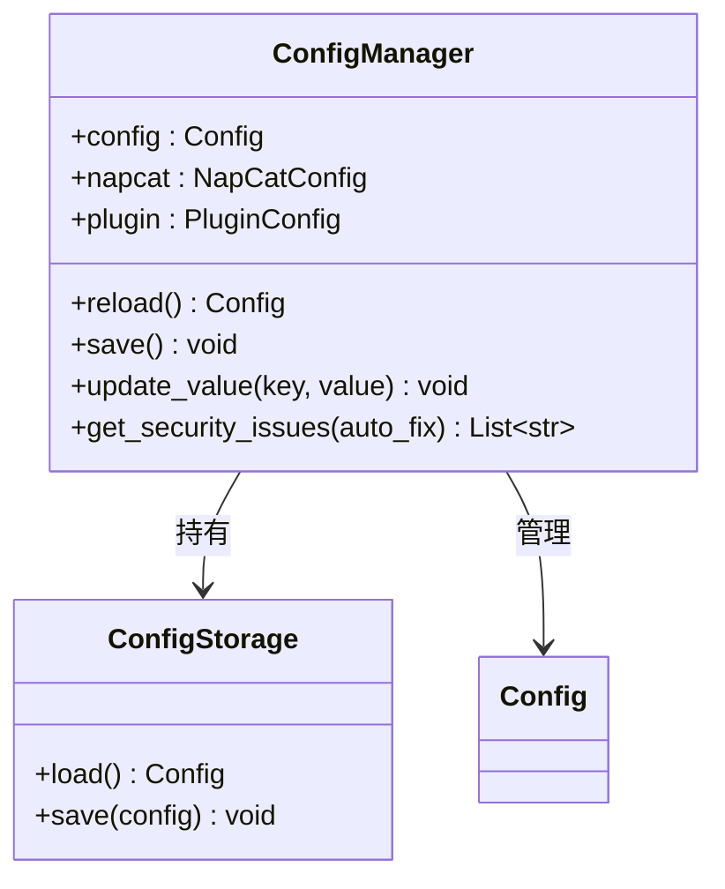

# ConfigManager 与配置安全

> `ConfigManager` 配置读写接口、`ConfigStorage` YAML 原子读写、以及安全工具。

---

## 目录

- [架构概览](#架构概览)
- [获取管理器](#获取管理器)
- [读取配置](#读取配置)
- [修改与保存](#修改与保存)
- [配置安全](#配置安全)
- [全局配置覆盖](#全局配置覆盖)

---

## 架构概览



---

## 获取管理器

```python
from ncatbot.utils import get_config_manager, ncatbot_config

manager = get_config_manager()                  # 全局单例
manager = get_config_manager("/path/to/config.yaml")  # 指定路径
print(ncatbot_config.bot_uin)                   # 便捷别名
```

---

## 读取配置

`ConfigManager` 使用**懒加载**——首次访问 `config` 属性时才从磁盘加载：

```python
manager = get_config_manager()
uin = manager.bot_uin           # str
ws_uri = manager.napcat.ws_uri  # str
config: Config = manager.config # 完整配置对象
```

---

## 修改与保存

### update_value — 通用键值写入

支持直接键和嵌套点分键：

```python
manager.update_value("debug", True)
manager.update_value("ws_uri", "ws://192.168.1.100:3001")  # 自动解析到 napcat.ws_uri
manager.save()
```

### update_napcat — 批量更新 NapCat 配置

```python
manager.update_napcat(ws_uri="ws://192.168.1.100:3001", ws_token="my_strong_token")
manager.save()
```

### reload — 重新加载

```python
config = manager.reload()  # 从磁盘重新读取
```

---

## 配置安全

安全工具定义在 `ncatbot.utils.config.security` 模块中。

### strong_password_check

检查密码/令牌强度（≥12位、含大小写字母+数字+特殊字符）：

```python
from ncatbot.utils.config.security import strong_password_check
strong_password_check("Abc123!defgh")   # True
```

### generate_strong_token

```python
from ncatbot.utils.config.security import generate_strong_token
token = generate_strong_token()       # 16 位强令牌
token = generate_strong_token(32)     # 32 位强令牌
```

### 自动修复

`ConfigManager.get_security_issues(auto_fix=True)` 检查 `ws_token` 和 `webui_token` 安全性。当 `ws_listen_ip == 0.0.0.0` 且令牌强度不足时，`auto_fix=True` 会自动生成新令牌替换。

---

## 全局配置覆盖

在 `config.yaml` 的 `plugin.plugin_configs` 节统一管理插件配置，优先级高于插件本地配置：

```yaml
plugin:
  plugin_configs:
    MyPlugin:
      api_key: sk-prod-xxxx
      max_retries: 10
```

---

## 延伸阅读

- [CLI 配置管理](../cli/1.commands.md#配置管理) — config show / get / set 命令
- [配置/数据 Mixin](../plugin/5a.config-data.md) — 插件中的 ConfigMixin
- [配置参考](../../reference/utils/1a_io_logging.md) — Config / NapCatConfig 完整字段
