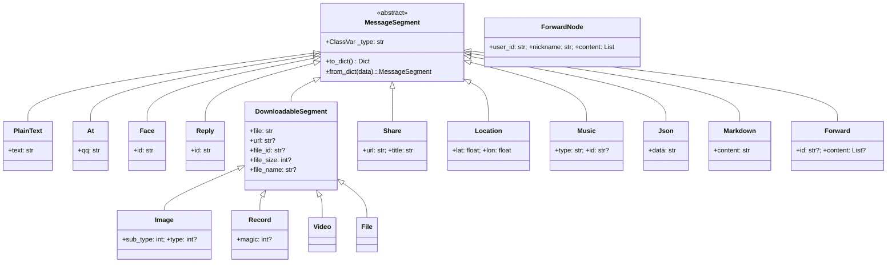

# 消息类型与消息段

> 介绍 NcatBot 的消息段（MessageSegment）体系：如何构造、组合和解析各类消息。

---

## 目录

| 文档 | 内容 |
|---|---|
| [概念总览与基类](basic.md) | 消息段概念、OB11 协议格式、`MessageSegment` 基类、基础消息段（`PlainText` / `At` / `Face` / `Reply`） |
| [多媒体消息段](media.md) | `DownloadableSegment` 基类、`Image` / `Record` / `Video` / `File` |
| [富文本消息段](rich.md) | `Share` / `Location` / `Music` / `Json` / `Markdown` |
| [合并转发消息段](forward.md) | `ForwardNode` / `Forward`，构造与引用两种方式 |
| [MessageArray 消息数组](array.md) | 消息段容器：创建、链式构造、查询过滤、序列化、容器操作 |
| [语法糖 — MessageSugarMixin](sugar.md) | 便捷发送方法、类型专用发送、合并转发发送 |
| [实战示例](examples.md) | 7 个完整场景：纯文本、图文混排、回复、合并转发、提取图片等 |

---

## 概念总览

NcatBot 遵循 **OneBot v11** 消息协议。每条消息由若干**消息段（MessageSegment）** 组成，每个消息段有一个 `type` 和对应的 `data`，序列化后的结构如下：

```json
{"type": "text", "data": {"text": "Hello"}}
{"type": "image", "data": {"file": "https://example.com/img.png"}}
```

多个消息段组成**消息数组（MessageArray）**，即一条完整的消息：

```json
[
  {"type": "text", "data": {"text": "看这张图 "}},
  {"type": "image", "data": {"file": "https://example.com/img.png"}}
]
```



类型注册是自动完成的：当子类定义了 `_type` 类属性时，会自动注册到全局 `SEGMENT_MAP`，从而支持 `parse_segment()` 自动解析。

---

## 消息段类型速查表

| 类型标识 | 类名 | 模块 | 说明 | 详细文档 |
|---|---|---|---|---|
| `text` | `PlainText` | `segment.text` | 纯文本 | [basic.md](basic.md) |
| `face` | `Face` | `segment.text` | QQ 表情 | [basic.md](basic.md) |
| `at` | `At` | `segment.text` | @某人 | [basic.md](basic.md) |
| `reply` | `Reply` | `segment.text` | 回复引用 | [basic.md](basic.md) |
| `image` | `Image` | `segment.media` | 图片 | [media.md](media.md) |
| `record` | `Record` | `segment.media` | 语音 | [media.md](media.md) |
| `video` | `Video` | `segment.media` | 视频 | [media.md](media.md) |
| `file` | `File` | `segment.media` | 文件 | [media.md](media.md) |
| `share` | `Share` | `segment.rich` | 链接分享 | [rich.md](rich.md) |
| `location` | `Location` | `segment.rich` | 定位 | [rich.md](rich.md) |
| `music` | `Music` | `segment.rich` | 音乐卡片 | [rich.md](rich.md) |
| `json` | `Json` | `segment.rich` | JSON 消息 | [rich.md](rich.md) |
| `markdown` | `Markdown` | `segment.rich` | Markdown | [rich.md](rich.md) |
| `forward` | `Forward` | `segment.forward` | 合并转发 | [forward.md](forward.md) |

所有类型均可从 `ncatbot.types.segment` 统一导入：

```python
from ncatbot.types.segment import (
    PlainText, Face, At, Reply,
    Image, Record, Video, File,
    Share, Location, Music, Json, Markdown,
    Forward, ForwardNode,
    MessageArray,
)
```
