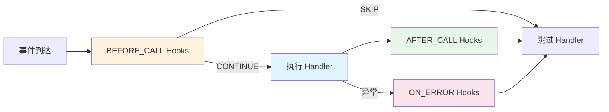

# Hook 基础与内置 Hook

> NcatBot 的请求处理中间件——在事件处理器执行前后拦截、过滤、增强行为，以及开箱即用的内置 Hook 和参数绑定。

---

## 目录

- [概述](#概述)
- [Hook 三阶段模型](#hook-三阶段模型)
- [HookContext 上下文](#hookcontext-上下文)
- [编写自定义 Hook](#编写自定义-hook)
- [内置 Hook 一览](#内置-hook-一览)
- [CommandHook 与参数绑定](#commandhook-与参数绑定)
- [Hook 优先级与执行顺序](#hook-优先级与执行顺序)

---

## 概述

Hook 是 NcatBot 的中间件机制，可以在事件处理器（Handler）执行的不同阶段插入逻辑：



常见用途：过滤（按关键词、权限拦截）、日志、错误处理、参数注入。

---

## Hook 三阶段模型

| 阶段 | `HookStage` | 触发时机 | 可返回的 Action |
|------|------------|---------|----------------|
| **前置** | `BEFORE_CALL` | Handler 执行**之前** | `CONTINUE`（继续）/ `SKIP`（跳过 Handler） |
| **后置** | `AFTER_CALL` | Handler 执行**之后** | `CONTINUE` |
| **错误** | `ON_ERROR` | Handler 执行**异常**时 | `CONTINUE` |

---

## HookContext 上下文

每个 Hook 的 `execute()` 方法接收一个 `HookContext`：

| 字段 | 类型 | 说明 |
|------|------|------|
| `ctx.event` | `Event` | 当前事件 |
| `ctx.event_type` | `str` | 事件类型字符串 |
| `ctx.handler_entry` | `HandlerEntry` | 处理器注册信息（含 `func` 属性） |
| `ctx.api` | `BotAPIClient` | Bot API 客户端 |
| `ctx.services` | `ServiceManager` | 服务管理器（可选） |
| `ctx.kwargs` | `Dict[str, Any]` | Hook 间共享的参数字典 |
| `ctx.result` | `Any` | Handler 返回值（仅 AFTER_CALL） |
| `ctx.error` | `Exception` | 异常信息（仅 ON_ERROR） |

---

## 编写自定义 Hook

### 基本结构

```python
from ncatbot.core.registry.hook import Hook, HookAction, HookContext, HookStage

class MyHook(Hook):
    stage = HookStage.BEFORE_CALL
    priority = 50

    async def execute(self, ctx: HookContext) -> HookAction:
        return HookAction.CONTINUE  # 或 HookAction.SKIP
```

### 附加 Hook 到 Handler

**方式一：`@add_hooks()` 批量绑定**

```python
@add_hooks(keyword_filter, logging_hook, error_notify)
@registrar.on_group_command("回声")
async def on_echo(self, event: GroupMessageEvent, content: str):
    await event.reply(f"🔊 {content}")
```

**方式二：`@hook` 装饰器语法**

```python
@error_notify
@registrar.on_group_command("除零")
async def on_divide_by_zero(self, event: GroupMessageEvent):
    _ = 1 / 0
```

> 完整三阶段 Hook 示例：[examples/06_hook_and_filter/main.py](../../../examples/06_hook_and_filter/main.py)

---

## 内置 Hook 一览

### 过滤类 Hook（BEFORE_CALL）

| Hook | 构造参数 | 说明 |
|------|---------|------|
| `MessageTypeFilter(message_type)` | `"group"` / `"private"` | 按消息类型过滤 |
| `PostTypeFilter(post_type)` | `"message"` / `"notice"` 等 | 按 post_type 过滤 |
| `SubTypeFilter(sub_type)` | `"poke"` / `"invite"` 等 | 按 sub_type 过滤 |
| `NoticeTypeFilter(notice_type)` | `"group_increase"` 等 | 按通知类型过滤 |
| `RequestTypeFilter(request_type)` | `"friend"` / `"group"` | 按请求类型过滤 |
| `SelfFilter()` | — | 过滤 Bot 自身发送的消息 |

### 文本匹配类 Hook（BEFORE_CALL）

| Hook | 构造参数 | 说明 |
|------|---------|------|
| `StartsWithHook(prefix)` | 前缀字符串 | 消息以指定前缀开头 |
| `KeywordHook(*words)` | 关键词列表 | 消息包含任一关键词 |
| `RegexHook(pattern, flags=0)` | 正则表达式 | 正则匹配，匹配结果存入 `ctx.kwargs['match']` |

### 便捷工厂函数

```python
from ncatbot.core.registry.builtin_hooks import (
    startswith, keyword, regex, group_only, private_only, non_self,
)
```

### 装饰器自动附加

| 装饰器 | 自动附加的 Hook |
|--------|----------------|
| `on_group_command("x")` | `MessageTypeFilter("group")` + `CommandHook("x")` |
| `on_private_command("x")` | `MessageTypeFilter("private")` + `CommandHook("x")` |
| `on_group_message()` | `MessageTypeFilter("group")` |
| `on_poke()` | `NoticeTypeFilter("notify")` + `SubTypeFilter("poke")` |

---

## CommandHook 与参数绑定

`CommandHook` 是 `on_command()` / `on_group_command()` / `on_private_command()` 内部使用的核心 Hook，负责命令匹配和参数提取。

### 绑定规则

| 参数类型 | 提取方式 | 示例 |
|---------|---------|------|
| `str` | 命令名后的剩余文本 | `"回声 你好"` → `content="你好"` |
| `int` | 从文本中提取数字 | `"禁言 @xxx 60"` → `duration=60` |
| `At` | 从消息段中提取 @段 | `"踢 @xxx"` → `target=At(qq=xxx)` |

```python
@registrar.on_group_command("禁言")
async def on_ban(
    self, event: GroupMessageEvent,
    target: At = None,        # 从 @ 段提取
    duration: int = 60        # 从文本中提取数字
):
    ...
```

> 参数绑定的实际示例：[examples/05_bot_api/](../../../examples/05_bot_api/) 和 [examples/15_full_featured_bot/](../../../examples/15_full_featured_bot/)。

---

## Hook 优先级与执行顺序

同一阶段的 Hook 按 `priority` **降序**执行（数值越大越先执行）。

| Hook 类别 | 默认 priority |
|----------|--------------|
| `SelfFilter` | 200（最先执行） |
| `MessageTypeFilter` / `PostTypeFilter` / `SubTypeFilter` | 100 |
| `StartsWithHook` / `KeywordHook` / `RegexHook` | 90 |
| 自定义 Hook | 0（默认） |

当 `BEFORE_CALL` 阶段的任何 Hook 返回 `HookAction.SKIP` 时，**立即跳过**当前 Handler，后续 Hook 和 AFTER_CALL/ON_ERROR 均不触发。

---

## 下一步

- [常用模式](7a.patterns.md) — 多步对话、状态机、插件通信
- [事件注册与装饰器](4a.event-registration.md) — Hook 如何与装饰器注册配合工作
