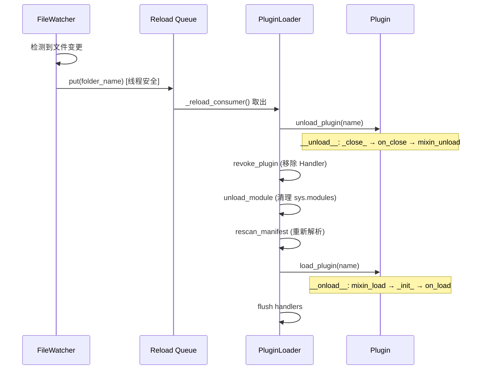
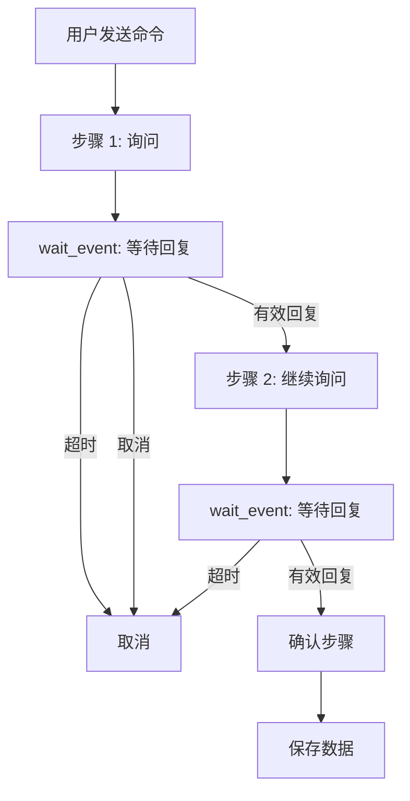

# 高级主题

> 热重载、依赖管理、跨插件交互、多步对话设计和实战案例分析。

---

## 目录

- [热重载机制](#热重载机制)
- [插件依赖管理](#插件依赖管理)
- [跨插件交互](#跨插件交互)
- [多步对话设计](#多步对话设计)
- [实战案例分析](#实战案例分析)
- [调试与排查](#调试与排查)

---

## 热重载机制

NcatBot 支持开发时修改插件代码后自动重载，无需重启整个 Bot。

### 工作原理



### 流程

1. **FileWatcherService** 监控 `plugins/` 目录的文件变更
2. 检测到变化后，将变更的文件夹名放入 `_reload_queue`（线程安全）
3. **`_reload_consumer`** 异步任务从队列中取出，映射到插件名
4. 执行完整的 **卸载 → 重新扫描 → 加载** 周期

### 开发体验

在开发模式下（`debug: true`），修改插件代码后保存文件，Bot 自动完成重载——无需手动重启。

### 注意事项

- 热重载会执行完整的卸载/加载周期：**`on_close()` → Mixin 保存 → 清理 → 重新加载 → `on_load()`**
- 全局变量会被重置——状态应保存在 `self.data` 中（DataMixin 自动持久化）
- Handler 会被撤销并重新注册——确保所有 Handler 都在类定义或 `on_load()` 中注册
- `__pycache__` 会被自动清除，确保新代码生效

---

## 插件依赖管理

### 插件间依赖

在 `manifest.toml` 中通过 `[dependencies]` 声明对其他插件的依赖：

```toml
[dependencies]
rbac = ">=1.0.0"
config_manager = ">=0.5.0"
```

### 拓扑排序

框架使用 **Kahn 算法**对所有插件进行拓扑排序，确保被依赖的插件先加载：

```
如果 A 依赖 B，B 依赖 C：
加载顺序: C → B → A
```

### 错误检测

| 错误类型 | 说明 |
|---------|------|
| `PluginMissingDependencyError` | 依赖的插件不存在 |
| `PluginCircularDependencyError` | 检测到循环依赖（A → B → A） |
| `PluginVersionError` | 版本约束不满足 |

### pip 依赖

在 `manifest.toml` 的 `[pip_dependencies]` 中声明 Python 包依赖：

```toml
[pip_dependencies]
aiohttp = ">=3.8.0"
beautifulsoup4 = ">=4.12.0"
```

框架在加载时会自动检查这些包是否已安装，未安装时提示用户确认安装。

> 示例：[examples/14_external_api/manifest.toml](../../../examples/14_external_api/manifest.toml) 声明了 `aiohttp` 依赖。

### 版本约束语法

使用 Python `packaging.specifiers` 标准语法：

| 语法 | 含义 |
|------|------|
| `>=1.0.0` | 大于等于 1.0.0 |
| `>=1.0.0,<2.0.0` | 大于等于 1.0.0 且小于 2.0.0 |
| `==1.2.3` | 精确匹配 |
| `~=1.4` | 兼容版本（≥1.4, <2.0） |

---

## 跨插件交互

### 获取其他插件实例

```python
class MyPlugin(NcatBotPlugin):
    name = "my_plugin"
    version = "1.0.0"

    async def on_load(self):
        # 获取其他插件实例
        rbac_plugin = self.get_plugin("rbac")
        if rbac_plugin:
            LOG.info("RBAC 插件已加载: %s", rbac_plugin.version)

        # 列出所有已加载插件
        all_plugins = self.list_plugins()
        LOG.info("已加载插件: %s", all_plugins)
```

### 跨插件 Python 导入

框架将 `plugins/` 目录添加到 `sys.path`，每个插件文件夹相当于一个 Python 包。因此可以直接导入其他插件的模块：

```python
# 在 plugin_a/main.py 中导入 plugin_b 的模块
from plugin_b.utils import some_helper
```

**注意**：
- 使用跨插件导入时，务必在 `manifest.toml` 中声明依赖关系，确保加载顺序正确
- 插件根目录在 `sys.path` 中的优先级低于标准库和第三方包

---

## 多步对话设计

多步对话是 Bot 开发中的常见需求——通过 `wait_event()` 串联多轮交互。

### 设计模式



### 封装辅助方法

推荐将 `wait_event` 的通用逻辑封装为辅助方法：

```python
TIMEOUT = 30  # 每步超时秒数

async def _wait_user_reply(self, group_id, user_id):
    """等待指定用户在指定群的下一条消息"""
    event = await self.wait_event(
        predicate=lambda e: (
            hasattr(e.data, "user_id")
            and str(e.data.user_id) == str(user_id)
            and hasattr(e.data, "group_id")
            and str(e.data.group_id) == str(group_id)
            and hasattr(e.data, "raw_message")
        ),
        timeout=TIMEOUT,
    )
    return event.data.raw_message.strip()
```

### 完整多步对话示例

```python
@registrar.on_group_command("注册")
async def on_register(self, event: GroupMessageEvent):
    gid, uid = event.group_id, event.user_id

    # 步骤 1: 询问名字
    await event.reply(f"📝 请输入你的名字（{TIMEOUT}秒内回复，输入「取消」退出）：")

    try:
        name = await self._wait_user_reply(gid, uid)
    except asyncio.TimeoutError:
        await self.api.post_group_msg(gid, text="⏰ 注册超时，已取消")
        return

    if name == "取消":
        await self.api.post_group_msg(gid, text="❌ 注册已取消")
        return

    # 步骤 2: 询问年龄
    await self.api.post_group_msg(gid, text=f"好的，{name}！请输入你的年龄：")

    try:
        age_str = await self._wait_user_reply(gid, uid)
    except asyncio.TimeoutError:
        await self.api.post_group_msg(gid, text="⏰ 注册超时，已取消")
        return

    if age_str == "取消":
        await self.api.post_group_msg(gid, text="❌ 注册已取消")
        return

    if not age_str.isdigit():
        await self.api.post_group_msg(gid, text="❌ 年龄必须是数字，注册已取消")
        return

    age = int(age_str)

    # 步骤 3: 确认
    await self.api.post_group_msg(
        gid,
        text=f"请确认你的信息:\n  名字: {name}\n  年龄: {age}\n回复「确认」完成注册：",
    )

    try:
        confirm = await self._wait_user_reply(gid, uid)
    except asyncio.TimeoutError:
        await self.api.post_group_msg(gid, text="⏰ 确认超时，已取消")
        return

    if confirm != "确认":
        await self.api.post_group_msg(gid, text="❌ 注册已取消")
        return

    # 保存数据
    self.data.setdefault("users", {})[str(uid)] = {"name": name, "age": age}
    await self.api.post_group_msg(gid, text=f"✅ 注册成功！欢迎你，{name}（{age}岁）")
```

> 完整代码：[examples/10_multi_step_dialog/main.py](../../../examples/10_multi_step_dialog/main.py)

### 设计要点

| 要点 | 说明 |
|------|------|
| **超时处理** | 每步都应设置超时（`asyncio.TimeoutError`） |
| **取消机制** | 检测用户输入"取消"以退出流程 |
| **输入验证** | 在每步验证输入合法性 |
| **状态持久化** | 结果保存到 `self.data`（DataMixin） |
| **用户隔离** | `predicate` 中限定 `user_id` + `group_id` |

---

## 实战案例分析

### 案例 1：群管理机器人

**整合**：RBAC 权限 + 通知事件 + 群管理 API + 配置管理

```python
class GroupManagerPlugin(NcatBotPlugin):
    name = "group_manager"
    version = "1.0.0"

    async def on_load(self):
        # RBAC 初始化
        self.add_permission("group_manager.admin")
        self.add_role("gm_admin", exist_ok=True)
        if self.rbac:
            self.rbac.grant("role", "gm_admin", "group_manager.admin")

        # 配置默认欢迎语
        if not self.get_config("welcome_template"):
            self.set_config("welcome_template", "欢迎 {user} 加入本群！📜")

    def _is_admin(self, user_id) -> bool:
        return self.check_permission(str(user_id), "group_manager.admin")

    @registrar.on_group_command("踢")
    async def on_kick(self, event: GroupMessageEvent, target: At = None):
        if not self._is_admin(event.user_id):
            await event.reply("🚫 你没有管理权限")
            return
        if target is None:
            await event.reply("请 @一个用户")
            return
        await self.api.manage.set_group_kick(event.group_id, target.qq)
        await event.reply(f"已踢出用户 {target.qq}")

    @registrar.on_group_increase()
    async def on_member_join(self, event: GroupIncreaseEvent):
        """新成员入群 → 使用配置模板发送欢迎消息"""
        template = self.get_config("welcome_template", "欢迎！")
        welcome_text = template.replace("{user}", str(event.user_id))
        msg = MessageArray()
        msg.add_at(event.user_id)
        msg.add_text(f" {welcome_text}")
        await self.api.post_group_array_msg(event.group_id, msg)
```

> 完整代码：[examples/11_group_manager/main.py](../../../examples/11_group_manager/main.py)

**关键模式**：
- 使用 `_is_admin()` 封装权限检查，所有管理命令共用
- 欢迎语模板通过 ConfigMixin 持久化，支持运行时修改
- `on_group_increase()` 自动处理新成员入群

---

### 案例 2：定时报告与统计

**整合**：定时任务 + 数据持久化 + 高优先级消息统计 + 合并转发

```python
class ScheduledReporterPlugin(NcatBotPlugin):
    name = "scheduled_reporter"
    version = "1.0.0"

    async def on_load(self):
        self.data.setdefault("enabled_groups", [])
        self.data.setdefault("daily_stats", {})
        # 每天 22:00 自动发送报告
        self.add_scheduled_task("daily_report", "22:00")

    @registrar.on_group_message(priority=200)
    async def on_count(self, event: GroupMessageEvent):
        """高优先级：每条消息都统计"""
        gid = str(event.group_id)
        if gid not in self.data.get("enabled_groups", []):
            return

        today = time.strftime("%Y-%m-%d")
        daily = self.data.setdefault("daily_stats", {})
        today_stats = daily.setdefault(today, {})
        group_stats = today_stats.setdefault(
            gid, {"total": 0, "users": {}, "words": {}}
        )
        group_stats["total"] += 1
        uid = str(event.user_id)
        group_stats["users"][uid] = group_stats["users"].get(uid, 0) + 1

    async def daily_report(self):
        """定时回调：逐群发送报告"""
        for gid in self.data.get("enabled_groups", []):
            try:
                await self._send_report(gid)
            except Exception as e:
                LOG.error("发送群 %s 报告失败: %s", gid, e)

    async def _send_report(self, group_id: str):
        """使用合并转发消息发送长报告"""
        # ... 构建 ForwardConstructor 报告 ...
        fc = ForwardConstructor(user_id="10000", nickname="📊 统计助手")
        fc.attach_text(f"📊 群活跃度报告\n总消息: {total} 条")
        # ... 活跃排行、热词等 ...
        forward = fc.build()
        await self.api.post_group_forward_msg(group_id, forward)
```

> 完整代码：[examples/13_scheduled_reporter/main.py](../../../examples/13_scheduled_reporter/main.py)

**关键模式**：
- 高优先级 Handler（`priority=200`）统计所有消息，不影响其他命令匹配
- 任务回调方法与任务同名（`daily_report`）
- 使用 `ForwardConstructor` 将长报告打包为合并转发消息

---

### 案例 3：外部 API 集成

**整合**：异步 HTTP 请求 + 配置管理 + 错误处理 + 优雅降级

```python
class ExternalAPIPlugin(NcatBotPlugin):
    name = "external_api"
    version = "1.0.0"

    async def on_load(self):
        if not self.get_config("hitokoto_url"):
            self.set_config("hitokoto_url", "https://v1.hitokoto.cn")
        self.data.setdefault("api_call_count", 0)

    @registrar.on_group_command("每日一言")
    async def on_hitokoto(self, event: GroupMessageEvent):
        url = self.get_config("hitokoto_url")

        try:
            async with aiohttp.ClientSession() as session:
                async with session.get(
                    url,
                    params={"encode": "json"},
                    timeout=aiohttp.ClientTimeout(total=10),
                ) as resp:
                    if resp.status != 200:
                        await event.reply(f"⚠️ API 请求失败 (HTTP {resp.status})")
                        return
                    data = await resp.json()

            hitokoto = data.get("hitokoto", "获取失败")
            source = data.get("from", "未知")
            self.data["api_call_count"] += 1
            await event.reply(f"📜 {hitokoto}\n    —— {source}")

        except aiohttp.ClientError as e:
            LOG.error("API 请求异常: %s", e)
            await event.reply("⚠️ 网络请求失败，请稍后重试")
        except Exception as e:
            LOG.error("未知异常: %s", e)
            await event.reply("⚠️ 获取失败")
```

> 完整代码：[examples/14_external_api/main.py](../../../examples/14_external_api/main.py)

**关键模式**：
- API 地址通过 ConfigMixin 管理，运行时可修改
- 调用次数通过 DataMixin 统计
- 多层异常捕获：HTTP 状态码 → 网络异常 → 未知异常
- pip 依赖声明在 `manifest.toml` 的 `[pip_dependencies]`

---

### 案例 4：全功能群助手

[examples/15_full_featured_bot/](../../../examples/15_full_featured_bot/) 是一个综合了**所有框架特性**的实战案例：

| 子系统 | 使用的 Mixin / 特性 |
|--------|-------------------|
| 签到与积分 | DataMixin（积分数据）+ MessageArray（@提及） |
| 关键词自动回复 | DataMixin + 高优先级 Handler（`priority=30`） |
| 配置管理 | ConfigMixin（命令前缀、欢迎语） |
| 管理命令 | RBACMixin + api.manage（踢人/禁言） |
| 定时早安 | TimeTaskMixin（`"07:30"` 每日） |
| 新成员欢迎 | `on_group_increase()` + ConfigMixin 模板 |
| 帮助系统 | 命令装饰器 + 静态文本 |

> 建议通读 [完整源码](../../../examples/15_full_featured_bot/main.py)，了解如何在单个插件中组织 15+ 个命令和多个子系统。

---

## 调试与排查

### 日志系统

使用 `get_log()` 获取日志实例：

```python
from ncatbot.utils import get_log

LOG = get_log("MyPlugin")

LOG.info("消息内容: %s", text)
LOG.warning("配置缺失，使用默认值")
LOG.error("API 调用失败: %s", error)
LOG.debug("调试信息")  # 仅在 debug=True 时输出
```

### debug 模式

在 `config.yaml` 中设置 `debug: true`，会启用更详细的日志输出。在插件中可通过 `self.debug` 检查：

```python
if self.debug:
    LOG.debug("详细调试: event.data = %s", event.data)
```

### 常见问题

| 问题 | 原因 | 解决方案 |
|------|------|---------|
| 插件没有加载 | manifest.toml 缺少必填字段 | 检查 `name` / `version` / `main` 是否存在 |
| 命令不响应 | Handler 未注册 | 确认 `@registrar.on_*()` 装饰器在类方法上 |
| 配置/数据丢失 | 插件异常退出 | DataMixin 仅在正常卸载时保存；可手动调用 `_save_data()` |
| 热重载不生效 | `__pycache__` 缓存 | 框架自动清理；如仍有问题，手动删除 `__pycache__` |
| 循环依赖 | A ↔ B 互相依赖 | 重新设计依赖关系，提取公共逻辑到第三个插件 |
| 权限检查总是 False | RBAC 服务未加载 | 检查 `self.rbac is not None`；确保 RBACService 已启动 |
| 定时任务不执行 | 回调方法名不匹配 | 任务名必须与异步方法名完全一致 |

---

## 下一步

- [消息类型详解](../send_message/) — 深入消息段构造和合并转发
- [架构总览](../../architecture.md) — 理解框架整体分层设计
- [示例插件集合](../../../examples/README.md) — 15 个渐进式示例
