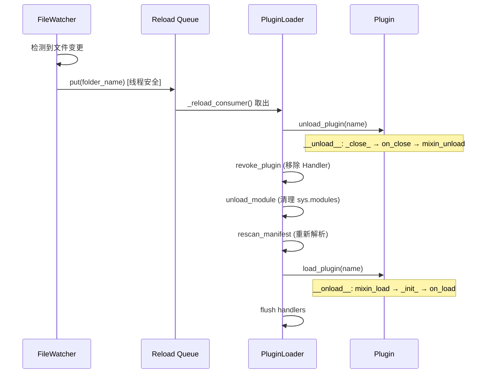
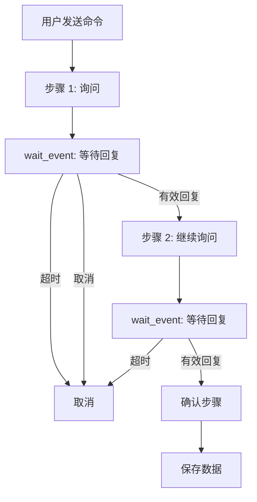

# 高级模式

> 热重载、依赖管理、跨插件交互、多步对话设计。

---

## 目录

- [热重载机制](#热重载机制)
- [插件依赖管理](#插件依赖管理)
- [跨插件交互](#跨插件交互)
- [多步对话设计](#多步对话设计)

---

## 热重载机制

NcatBot 支持开发时修改插件代码后自动重载，无需重启整个 Bot。

### 工作原理



### 流程

1. **FileWatcherService** 监控 `plugins/` 目录的文件变更
2. 检测到变化后，将变更的文件夹名放入 `_reload_queue`（线程安全）
3. **`_reload_consumer`** 异步任务从队列中取出，映射到插件名
4. 执行完整的 **卸载 → 重新扫描 → 加载** 周期

### 开发体验

在开发模式下（`debug: true`），修改插件代码后保存文件，Bot 自动完成重载——无需手动重启。

### 注意事项

- 热重载会执行完整的卸载/加载周期：**`on_close()` → Mixin 保存 → 清理 → 重新加载 → `on_load()`**
- 全局变量会被重置——状态应保存在 `self.data` 中（DataMixin 自动持久化）
- Handler 会被撤销并重新注册——确保所有 Handler 都在类定义或 `on_load()` 中注册
- `__pycache__` 会被自动清除，确保新代码生效

---

## 插件依赖管理

### 插件间依赖

在 `manifest.toml` 中通过 `[dependencies]` 声明对其他插件的依赖：

```toml
[dependencies]
rbac = ">=1.0.0"
config_manager = ">=0.5.0"
```

### 拓扑排序

框架使用 **Kahn 算法**对所有插件进行拓扑排序，确保被依赖的插件先加载：

```yaml
如果 A 依赖 B，B 依赖 C：
加载顺序: C → B → A
```

### 错误检测

| 错误类型 | 说明 |
|---------|------|
| `PluginMissingDependencyError` | 依赖的插件不存在 |
| `PluginCircularDependencyError` | 检测到循环依赖（A → B → A） |
| `PluginVersionError` | 版本约束不满足 |

### pip 依赖

在 `manifest.toml` 的 `[pip_dependencies]` 中声明 Python 包依赖：

```toml
[pip_dependencies]
aiohttp = ">=3.8.0"
beautifulsoup4 = ">=4.12.0"
```

框架在加载时会自动检查这些包是否已安装，未安装时提示用户确认安装。

> 示例：[examples/14_external_api/manifest.toml](../../../examples/14_external_api/manifest.toml) 声明了 `aiohttp` 依赖。

### 版本约束语法

使用 Python `packaging.specifiers` 标准语法：

| 语法 | 含义 |
|------|------|
| `>=1.0.0` | 大于等于 1.0.0 |
| `>=1.0.0,<2.0.0` | 大于等于 1.0.0 且小于 2.0.0 |
| `==1.2.3` | 精确匹配 |
| `~=1.4` | 兼容版本（≥1.4, <2.0） |

---

## 跨插件交互

### 获取其他插件实例

```python
class MyPlugin(NcatBotPlugin):
    name = "my_plugin"
    version = "1.0.0"

    async def on_load(self):
        # 获取其他插件实例
        rbac_plugin = self.get_plugin("rbac")
        if rbac_plugin:
            LOG.info("RBAC 插件已加载: %s", rbac_plugin.version)

        # 列出所有已加载插件
        all_plugins = self.list_plugins()
        LOG.info("已加载插件: %s", all_plugins)
```

### 跨插件 Python 导入

框架将 `plugins/` 目录添加到 `sys.path`，每个插件文件夹相当于一个 Python 包。因此可以直接导入其他插件的模块：

```python
# 在 plugin_a/main.py 中导入 plugin_b 的模块
from plugin_b.utils import some_helper
```

**注意**：
- 使用跨插件导入时，务必在 `manifest.toml` 中声明依赖关系，确保加载顺序正确
- 插件根目录在 `sys.path` 中的优先级低于标准库和第三方包

---

## 多步对话设计

多步对话是 Bot 开发中的常见需求——通过 `wait_event()` 串联多轮交互。

### 设计模式



### 封装辅助方法

推荐将 `wait_event` 的通用逻辑封装为辅助方法：

```python
TIMEOUT = 30  # 每步超时秒数

async def _wait_user_reply(self, group_id, user_id):
    """等待指定用户在指定群的下一条消息"""
    event = await self.wait_event(
        predicate=lambda e: (
            hasattr(e.data, "user_id")
            and str(e.data.user_id) == str(user_id)
            and hasattr(e.data, "group_id")
            and str(e.data.group_id) == str(group_id)
            and hasattr(e.data, "raw_message")
        ),
        timeout=TIMEOUT,
    )
    return event.data.raw_message.strip()
```

### 完整多步对话示例

```python
@registrar.on_group_command("注册")
async def on_register(self, event: GroupMessageEvent):
    gid, uid = event.group_id, event.user_id

    # 步骤 1: 询问名字
    await event.reply(f"📝 请输入你的名字（{TIMEOUT}秒内回复，输入「取消」退出）：")

    try:
        name = await self._wait_user_reply(gid, uid)
    except asyncio.TimeoutError:
        await self.api.post_group_msg(gid, text="⏰ 注册超时，已取消")
        return

    if name == "取消":
        await self.api.post_group_msg(gid, text="❌ 注册已取消")
        return

    # 步骤 2: 询问年龄
    await self.api.post_group_msg(gid, text=f"好的，{name}！请输入你的年龄：")

    try:
        age_str = await self._wait_user_reply(gid, uid)
    except asyncio.TimeoutError:
        await self.api.post_group_msg(gid, text="⏰ 注册超时，已取消")
        return

    if age_str == "取消":
        await self.api.post_group_msg(gid, text="❌ 注册已取消")
        return

    if not age_str.isdigit():
        await self.api.post_group_msg(gid, text="❌ 年龄必须是数字，注册已取消")
        return

    age = int(age_str)

    # 步骤 3: 确认
    await self.api.post_group_msg(
        gid,
        text=f"请确认你的信息:\n  名字: {name}\n  年龄: {age}\n回复「确认」完成注册：",
    )

    try:
        confirm = await self._wait_user_reply(gid, uid)
    except asyncio.TimeoutError:
        await self.api.post_group_msg(gid, text="⏰ 确认超时，已取消")
        return

    if confirm != "确认":
        await self.api.post_group_msg(gid, text="❌ 注册已取消")
        return

    # 保存数据
    self.data.setdefault("users", {})[str(uid)] = {"name": name, "age": age}
    await self.api.post_group_msg(gid, text=f"✅ 注册成功！欢迎你，{name}（{age}岁）")
```

> 完整代码：[examples/10_multi_step_dialog/main.py](../../../examples/10_multi_step_dialog/main.py)

### 设计要点

| 要点 | 说明 |
|------|------|
| **超时处理** | 每步都应设置超时（`asyncio.TimeoutError`） |
| **取消机制** | 检测用户输入"取消"以退出流程 |
| **输入验证** | 在每步验证输入合法性 |
| **状态持久化** | 结果保存到 `self.data`（DataMixin） |
| **用户隔离** | `predicate` 中限定 `user_id` + `group_id` |

---

## 下一步

- [实战案例与调试](7b.case-studies.md) — 综合实战案例分析、调试与排查
