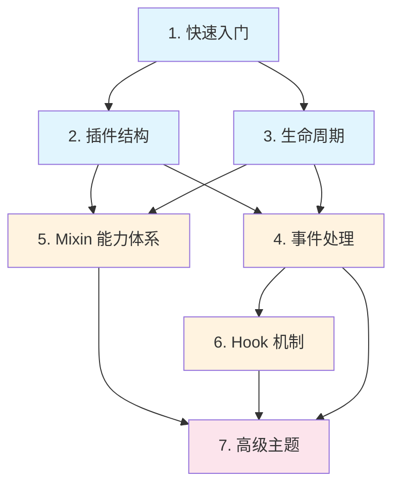

# 插件开发指南

> NcatBot 插件开发从入门到实战的完整指南，覆盖插件结构、生命周期、事件处理、Mixin 能力、Hook 机制和高级主题。

---

## 目录

| 章节 | 说明 | 难度 |
|------|------|------|
| [1. 快速入门](1.quick-start.md) | 5 分钟跑通第一个插件 | ⭐ |
| [2. 插件结构](2.structure.md) | manifest.toml、目录布局、基类选择 | ⭐ |
| [3. 生命周期](3.lifecycle.md) | 插件加载/卸载流程、Mixin 钩子链 | ⭐ |
| [4. 事件处理](4.event-handling.md) | 三种事件消费模式、事件类型体系 | ⭐⭐ |
| [5. Mixin 能力体系](5.mixins.md) | 配置、数据、权限、定时任务 | ⭐⭐ |
| [6. Hook 机制](6.hooks.md) | 中间件、过滤器、参数绑定 | ⭐⭐ |
| [7. 高级主题](7.advanced.md) | 热重载、依赖管理、多步对话、实战案例 | ⭐⭐⭐ |

---

## 阅读路线图

### 按角色推荐

| 角色 | 推荐阅读顺序 |
|------|-------------|
| **新手**：第一次开发 NcatBot 插件 | 1.快速入门 → 2.插件结构 → 4.事件处理 |
| **进阶**：需要使用配置/权限/定时任务 | 5.Mixin能力体系 → 6.Hook机制 |
| **高级**：热重载、多步对话、综合实战 | 7.高级主题 |
| **全面学习** | 按顺序通读所有章节 |

---

## 相关资源

- [架构总览](../../architecture.md) — NcatBot 整体分层架构
- [消息类型详解](../send_message/) — 消息段构造、MessageArray、合并转发
- [示例插件集合](../../../examples/README.md) — 15 个渐进式示例插件
- API 参考（`reference/`）— 完整方法签名（规划中）
