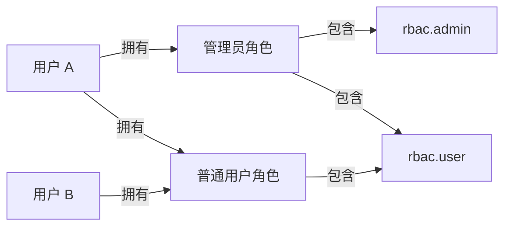
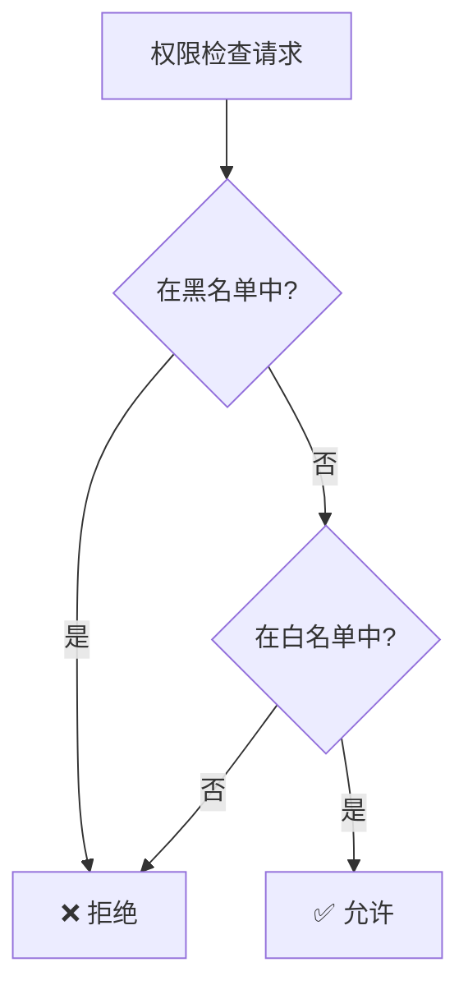
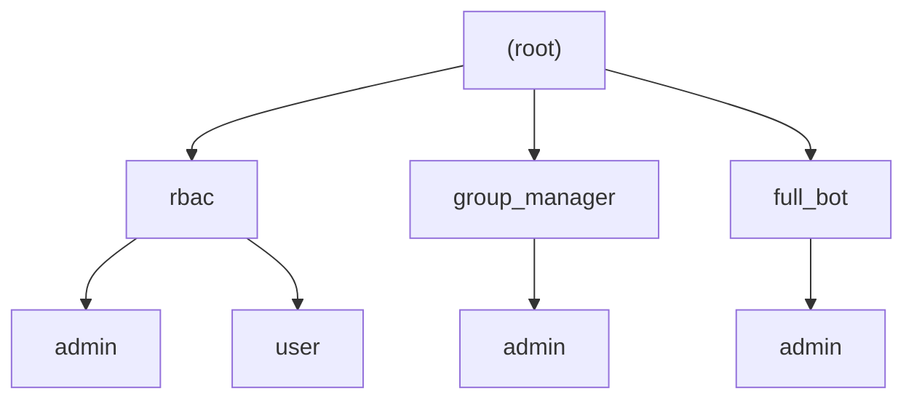
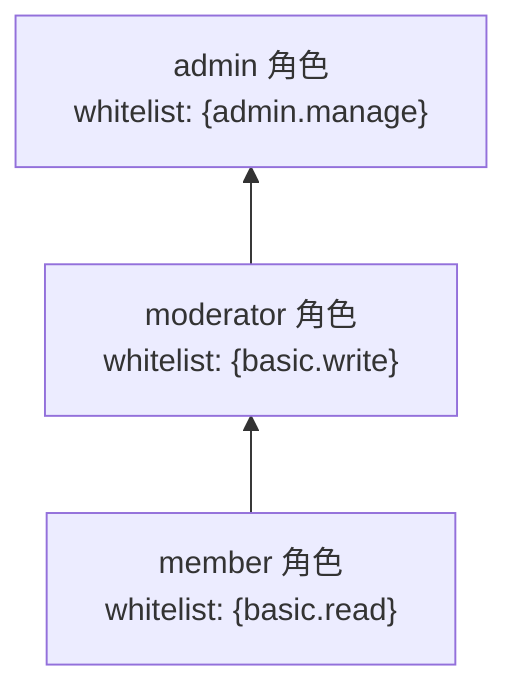

# RBAC 模型详解

> 三层模型、权限路径体系、rbac.json 完整格式、角色继承与权限命名规范。

---

## 目录

- [1. 三层模型](#1-三层模型)
- [2. 权限路径体系](#2-权限路径体系)
  - [2.1 路径格式与 PermissionPath](#21-路径格式与-permissionpath)
  - [2.2 Trie 树结构](#22-trie-树结构)
  - [2.3 通配符机制](#23-通配符机制)
- [3. 角色与继承](#3-角色与继承)
- [4. rbac.json 完整格式](#4-rbacjson-完整格式)
- [5. 权限命名规范](#5-权限命名规范)

---

## 1. 三层模型

RBAC（Role-Based Access Control）的核心思想是通过角色间接关联用户与权限：



修改角色的权限集合即可批量影响该角色下所有用户。

NcatBot 在经典模型基础上做了以下扩展：

| 特性 | 说明 |
|---|---|
| **白名单/黑名单双模式** | 权限可通过白名单授予，也可通过黑名单显式拒绝 |
| **黑名单优先** | 检查规则：黑名单 > 白名单 > 默认拒绝 |
| **角色继承** | 角色可以继承父角色的权限集，支持多层继承 |
| **路径通配符** | 权限路径支持 `*`（单层）和 `**`（任意深度）通配符匹配 |
| **Trie 树存储** | 权限路径以 Trie 树结构存储，高效检索与前缀匹配 |
| **自动持久化** | 服务关闭时自动保存至 `data/rbac.json` |
| **插件友好** | 通过 `RBACMixin` 为插件提供简洁的高层 API |

判定流程：



---

## 2. 权限路径体系

### 2.1 路径格式与 PermissionPath

权限路径使用 **点分隔** 的层级格式，由 `PermissionPath` 类表示：

```text
<命名空间>.<模块>.<操作>
```

**示例路径：**

| 路径 | 含义 |
|---|---|
| `rbac.admin` | RBAC 系统管理权限 |
| `rbac.user` | RBAC 系统普通用户权限 |
| `group_manager.admin` | 群管理插件的管理权限 |
| `my_plugin.feature.edit` | 自定义插件的编辑功能权限 |

`PermissionPath` 的核心属性：

```python
from ncatbot.service.builtin.rbac import PermissionPath

path = PermissionPath("plugin.admin.kick")
path.raw      # "plugin.admin.kick" — 原始字符串
path.parts    # ("plugin", "admin", "kick") — 各层级元组
path.SEPARATOR  # "." — 分隔符
```

`PermissionPath` 支持多种初始化方式：

```python
PermissionPath("a.b.c")           # 字符串
PermissionPath(["a", "b", "c"])   # 列表
PermissionPath(("a", "b", "c"))   # 元组
PermissionPath(another_path)      # 另一个 PermissionPath 实例
```

还可以使用 `join()` 拼接路径：

```python
base = PermissionPath("my_plugin")
full = base.join("admin", "kick")  # PermissionPath("my_plugin.admin.kick")
```

### 2.2 Trie 树结构

权限路径在内部以 **Trie 树**（`PermissionTrie`）存储，保证高效的路径检索和前缀匹配。



上图对应 `data/rbac.json` 中 `permissions` 字段的树结构：

```json
{
  "permissions": {
    "rbac": {
      "admin": {},
      "user": {}
    },
    "group_manager": {
      "admin": {}
    },
    "full_bot": {
      "admin": {}
    }
  }
}
```

`PermissionTrie` 的核心方法：

| 方法 | 签名 | 说明 |
|---|---|---|
| `add` | `add(path: str) -> None` | 添加权限路径（不允许含通配符） |
| `remove` | `remove(path: str) -> None` | 删除权限路径 |
| `exists` | `exists(path: str, exact: bool = False) -> bool` | 检查路径是否存在，`exact=True` 要求精确匹配到叶子节点 |
| `get_all_paths` | `get_all_paths() -> List[str]` | 获取所有已注册路径 |
| `to_dict` | `to_dict() -> Dict` | 导出为字典 |
| `from_dict` | `from_dict(data: Dict) -> None` | 从字典恢复 |

### 2.3 通配符机制

`PermissionPath.matches()` 方法支持两种通配符：

| 通配符 | 含义 | 示例 |
|---|---|---|
| `*` | 匹配 **单层** 任意节点 | `plugin.*.read` 匹配 `plugin.foo.read`，不匹配 `plugin.foo.bar.read` |
| `**` | 匹配 **任意深度** 的节点 | `plugin.**` 匹配 `plugin.foo`、`plugin.foo.bar.baz` |

```python
from ncatbot.service.builtin.rbac import PermissionPath

pattern = PermissionPath("plugin.*.read")
pattern.matches("plugin.news.read")      # True
pattern.matches("plugin.news.bar.read")  # False

pattern2 = PermissionPath("plugin.**")
pattern2.matches("plugin.news")          # True
pattern2.matches("plugin.news.detail")   # True
```

> **注意**：通配符用于权限检查阶段的模式匹配，注册权限路径时（`PermissionTrie.add`）不允许包含通配符。

---

## 3. 角色与继承

每个角色内部维护两个权限集合：

| 字段 | 类型 | 说明 |
|---|---|---|
| `whitelist` | `set` | 白名单 — 拥有该角色的用户将获得这些权限 |
| `blacklist` | `set` | 黑名单 — 拥有该角色的用户将被显式拒绝这些权限 |

角色支持 **多层继承**：子角色会聚合所有父角色的白名单和黑名单权限。



上图中 `admin` 继承 `moderator`，`moderator` 继承 `member`。拥有 `admin` 角色的用户将同时获得 `admin.manage`、`basic.write`、`basic.read` 三项权限。

**继承循环检测**：`set_role_inheritance` 会自动检测循环继承（如 A→B→A），检测到时抛出 `ValueError`。

---

## 4. rbac.json 完整格式

RBAC 数据默认存储在 `data/rbac.json`，由 `save_rbac_data` / `load_rbac_data` 函数处理。完整结构如下：

```json
{
  "case_sensitive": true,
  "default_role": null,
  "roles": {
    "rbac_admin": {
      "whitelist": ["rbac.admin", "rbac.user"],
      "blacklist": []
    },
    "rbac_user": {
      "whitelist": ["rbac.user"],
      "blacklist": []
    }
  },
  "users": {
    "3051561876": {
      "whitelist": [],
      "blacklist": [],
      "roles": ["rbac_admin"]
    }
  },
  "role_users": {
    "rbac_admin": ["3051561876"],
    "rbac_user": []
  },
  "role_inheritance": {
    "rbac_admin": [],
    "rbac_user": []
  },
  "permissions": {
    "rbac": {
      "admin": {},
      "user": {}
    }
  }
}
```

**各字段说明：**

| 字段 | 类型 | 说明 |
|---|---|---|
| `case_sensitive` | `bool` | 权限路径是否区分大小写 |
| `default_role` | `str \| null` | 新用户自动分配的默认角色 |
| `roles` | `Dict[str, {whitelist, blacklist}]` | 角色定义，每个角色包含白名单和黑名单 |
| `users` | `Dict[str, {whitelist, blacklist, roles}]` | 用户数据，包含个人权限和角色列表 |
| `role_users` | `Dict[str, List[str]]` | 角色到用户的反向映射 |
| `role_inheritance` | `Dict[str, List[str]]` | 角色继承关系（值为父角色列表） |
| `permissions` | `Dict` | 权限 Trie 树的字典序列化 |

**存储机制：**

存储层由 `storage.py` 中的四个函数组成：

| 函数 | 说明 |
|---|---|
| `save_rbac_data(path: Path, data: Dict) -> None` | 将数据保存为 JSON 文件，自动创建父目录 |
| `load_rbac_data(path: Path) -> Optional[Dict]` | 从文件加载数据，文件不存在时返回 `None` |
| `serialize_rbac_state(...)` | 将内存中的 RBAC 状态（含 `set` 等类型）序列化为可 JSON 化的字典 |
| `deserialize_rbac_state(data: Dict) -> Dict` | 将 JSON 数据反序列化为内存状态（`list` → `set` 等） |

序列化过程中的类型转换：

```text
内存 (set)  ──serialize──>  JSON (list)  ──deserialize──>  内存 (set)
```

---

## 5. 权限命名规范

推荐采用 `<插件名>.<模块>.<操作>` 的层级命名：

```text
✅ 推荐
my_plugin.admin                    # 插件管理权限
my_plugin.user                     # 插件用户权限
my_plugin.feature.read             # 功能级别 — 读
my_plugin.feature.write            # 功能级别 — 写

❌ 避免
admin                              # 过于笼统，容易与其他插件冲突
MyPlugin.Admin                     # 不建议使用大写（除非 case_sensitive=True 且有必要）
my-plugin.admin                    # 避免使用连字符，使用下划线
```

---

> **返回**：[RBAC 权限管理](README.md) · **下一篇**：[RBAC 核心模块与插件集成](2.integration.md)
