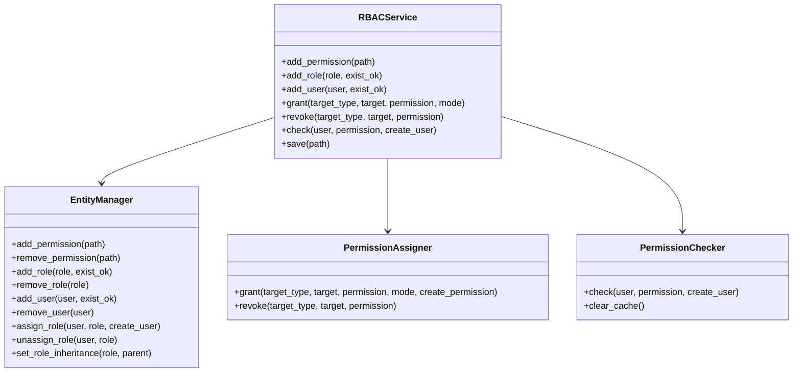
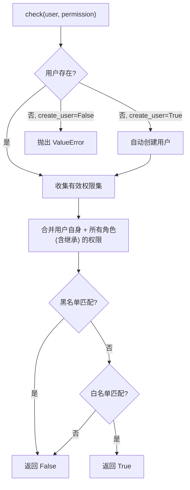

# RBAC 插件集成

> EntityManager / PermissionAssigner / PermissionChecker 核心模块详解与 RBACMixin 插件集成、高级用法。

---

## 目录

- [1. 核心模块](#1-核心模块)
- [2. 插件集成：RBACMixin](#2-插件集成rbacmixin)
- [3. RBACService 完整 API](#3-rbacservice-完整-api)
- [4. 高级用法](#4-高级用法)

---

## 1. 核心模块

NcatBot 的 RBAC 由四个核心模块组成：



### 1.1 实体管理（EntityManager）

```python
# 权限管理
entity_manager.add_permission("my_plugin.admin")
entity_manager.permission_exists("my_plugin.admin")  # True

# 角色管理
entity_manager.add_role("admin", exist_ok=True)
entity_manager.set_role_inheritance("admin", "user")  # admin 继承 user 的权限

# 用户管理
entity_manager.add_user("12345678")
entity_manager.assign_role("12345678", "admin", create_user=True)
```

### 1.2 权限分配（PermissionAssigner）

```python
def grant(self, target_type, target, permission, mode="white", create_permission=True): ...
def revoke(self, target_type, target, permission): ...
```

- `mode="white"` 授予权限；`mode="black"` 拒绝权限
- `revoke` 同时从白名单和黑名单中移除

### 1.3 权限检查（PermissionChecker）



---

## 2. 插件集成：RBACMixin

> 详见 [guide/plugin/5b.rbac-schedule-event.md](../plugin/5b.rbac-schedule-event.md) 了解 RBACMixin 在插件中的基础用法。

---

## 3. RBACService 完整 API

### 3.1 服务生命周期

`RBACService` 继承自 `BaseService`，作为内置服务由 `ServiceManager` 管理。启动时从 `data/rbac.json` 加载数据，关闭时自动保存。

### 3.2 完整接口表

> 完整方法签名见 [reference/services/1_rbac_service.md](../../reference/services/1_rbac_service.md)

**权限路径管理**：`add_permission` / `remove_permission` / `permission_exists`

**角色管理**：`add_role` / `remove_role` / `role_exists` / `set_role_inheritance`

**用户管理**：`add_user` / `remove_user` / `user_exists` / `user_has_role` / `assign_role` / `unassign_role`

**权限分配**：`grant` / `revoke`

**权限检查**：`check`

**持久化**：`save`

---

## 4. 高级用法

### 4.1 层级权限设计

利用角色继承实现层级权限体系：

```python
async def on_load(self):
    self.add_permission("shop.browse")
    self.add_permission("shop.buy")
    self.add_permission("shop.manage")
    self.add_permission("shop.admin")

    self.add_role("shop_guest")
    self.add_role("shop_member")
    self.add_role("shop_manager")
    self.add_role("shop_admin")

    if self.rbac:
        self.rbac.grant("role", "shop_guest", "shop.browse")
        self.rbac.grant("role", "shop_member", "shop.buy")
        self.rbac.grant("role", "shop_manager", "shop.manage")
        self.rbac.grant("role", "shop_admin", "shop.admin")

        # 继承链: admin > manager > member > guest
        self.rbac.set_role_inheritance("shop_member", "shop_guest")
        self.rbac.set_role_inheritance("shop_manager", "shop_member")
        self.rbac.set_role_inheritance("shop_admin", "shop_manager")
```

### 4.2 默认权限策略

**默认角色**：通过 `default_role` 参数，新用户自动获得基础权限。

**白名单模式（推荐）**：默认拒绝，仅通过授权开放。

**黑名单排除**：`mode="black"` 拒绝特定用户，黑名单优先级高于白名单。

---

## 下一步

- [权限模型](1_model.md) — 权限路径、Trie 树、匹配规则
- [RBAC 服务参考](../../reference/services/1_rbac_service.md) — 完整 API 签名
