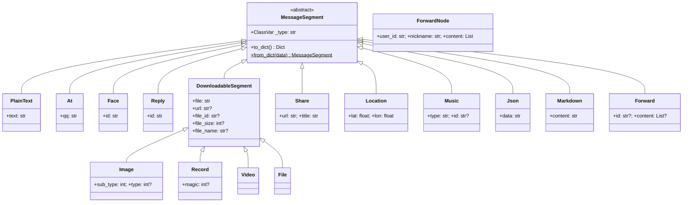

# 发送消息指南

> 从快速发送到精细构造，NcatBot 的完整消息发送参考。

---

## Quick Start

三种方式覆盖日常 90% 的发送需求，复制即用。

### 方式一：event.reply() — 最快回复

自动引用原消息并 @发送者，一行搞定。

```python
from ncatbot.core import registrar
from ncatbot.event import GroupMessageEvent

@registrar.on_group_command("hello", ignore_case=True)
async def on_hello(self, event: GroupMessageEvent):
    # 纯文本
    await event.reply(text="你好呀！🎉")

    # 文字 + 图片
    await event.reply(text="看这张图", image="https://example.com/img.png")

    # 不 @发送者
    await event.reply(text="收到", at_sender=False)

    # 附带自定义 MessageArray
    from ncatbot.types import MessageArray
    msg = MessageArray().add_text("复杂消息 ").add_image("a.png")
    await event.reply(rtf=msg)
```

### 方式二：post_group_msg() — 关键字快捷发送

不引用回复时使用，通过关键字参数快捷组装。参数组装顺序：`reply → at → text → image → video → rtf`。

```python
@registrar.on_group_command("send")
async def on_send(self, event: GroupMessageEvent):
    gid = event.group_id

    # 纯文本
    await self.api.post_group_msg(gid, text="Hello, World! 👋")

    # 文字 + 图片
    await self.api.post_group_msg(gid, text="📸 看图:", image="photo.png")

    # @某人 + 文字
    await self.api.post_group_msg(gid, text=" 欢迎！", at=event.user_id)

    # 引用回复 + 文字
    await self.api.post_group_msg(gid, text="已收到", reply=event.message_id)
```

> 私聊版本为 `post_private_msg(user_id, ...)`，参数相同（无 `at`）。

### 方式三：MessageArray — 自由组装

需要复杂消息排列时，链式构造后通过 `post_group_array_msg` 或 `rtf` 参数发送。

```python
from ncatbot.types import MessageArray

@registrar.on_group_command("fancy")
async def on_fancy(self, event: GroupMessageEvent):
    msg = (
        MessageArray()
        .add_reply(event.message_id)        # 回复引用
        .add_at(event.user_id)              # @发送者
        .add_text(" 你好！看看这些图 ")       # 文本
        .add_image("https://example.com/1.png")
        .add_image("https://example.com/2.png")
    )
    await self.api.post_group_array_msg(event.group_id, msg)

    # 也可通过 rtf 参数传入 post_group_msg
    await self.api.post_group_msg(event.group_id, rtf=msg)
```

---

## 速查参考

### 发送方式速查

| 方式 | 适用场景 | 示例 |
|---|---|---|
| `event.reply(text=...)` | 最快回复（自动引用 + @发送者） | `await event.reply(text="收到！")` |
| `post_group_msg(gid, text=..., image=...)` | 关键字快捷发送 | `await self.api.post_group_msg(gid, text="Hi", image="a.png")` |
| `post_group_array_msg(gid, msg)` | 发送自定义 MessageArray | `await self.api.post_group_array_msg(gid, msg)` |
| `send_group_text(gid, text)` | 单独发文本 | `await self.api.send_group_text(gid, "Hello")` |
| `send_group_image(gid, image)` | 单独发图片 | `await self.api.send_group_image(gid, "a.png")` |
| `send_group_file(gid, file)` | 发送文件 | `await self.api.send_group_file(gid, "doc.pdf")` |
| `post_group_forward_msg(gid, fwd)` | 合并转发 | `await self.api.post_group_forward_msg(gid, forward)` |

> 以上群方法均有对应的私聊版本（`post_private_msg`、`send_private_text` 等）。

### 消息段类型速查

所有消息段均继承自 `MessageSegment`，使用 `to_dict()` 序列化、`from_dict()` 反序列化。

**基础消息段**

| 类型 | 类名 | 构造 | 说明 |
|---|---|---|---|
| `text` | `PlainText` | `PlainText(text="你好")` | 纯文本 |
| `at` | `At` | `At(qq="123456")` / `At(qq="all")` | @某人 / @全体 |
| `face` | `Face` | `Face(id="178")` | QQ 表情 |
| `reply` | `Reply` | `Reply(id="12345")` | 回复引用 |

**多媒体消息段**（均继承 `DownloadableSegment`，共享 `file / url / file_id / file_size / file_name`）

| 类型 | 类名 | 构造 | 说明 |
|---|---|---|---|
| `image` | `Image` | `Image(file="https://…/img.png")` | 图片。`type=1` 为闪照 |
| `record` | `Record` | `Record(file="audio.silk")` | 语音。`magic=1` 变声 |
| `video` | `Video` | `Video(file="video.mp4")` | 视频 |
| `file` | `File` | `File(file="doc.pdf", file_name="手册.pdf")` | 文件 |

> `file` 字段支持三种格式：URL、本地路径（`file:///...`）、Base64（`base64://...`）。

**富文本消息段**

| 类型 | 类名 | 构造 | 说明 |
|---|---|---|---|
| `share` | `Share` | `Share(url="…", title="标题")` | 链接分享 |
| `location` | `Location` | `Location(lat=39.9, lon=116.4)` | 定位 |
| `music` | `Music` | `Music(type="qq", id="12345")` | 音乐（qq / 163 / custom） |
| `json` | `Json` | `Json(data='{"app":"…"}')` | JSON 卡片 |
| `markdown` | `Markdown` | `Markdown(content="# Title")` | Markdown 消息 |

**转发消息段**

| 类型 | 类名 | 构造 | 说明 |
|---|---|---|---|
| `node` | `ForwardNode` | `ForwardNode(user_id="…", nickname="…", content=[…])` | 转发节点 |
| `forward` | `Forward` | `Forward(id="…")` / `Forward(content=[…])` | 合并转发 |

### MessageArray 常用操作速查

**创建**

```python
from ncatbot.types import MessageArray, PlainText, At

msg = MessageArray()                                    # 空数组
msg = MessageArray([PlainText(text="Hi"), At(qq="123")]) # 传入列表
msg = MessageArray.from_list([{"type": "text", "data": {"text": "Hi"}}])  # OB11 字典
msg = MessageArray.from_any("[CQ:at,qq=123]Hello")       # CQ 码自动解析
```

**链式添加**

| 方法 | 参数 | 说明 |
|---|---|---|
| `.add_text(text)` | `str` | 纯文本 |
| `.add_image(image)` | `str \| Image` | 图片 |
| `.add_video(video)` | `str \| Video` | 视频 |
| `.add_at(user_id)` | `str \| int` | @某人 |
| `.add_at_all()` | — | @全体 |
| `.add_reply(msg_id)` | `str \| int` | 回复引用 |
| `.add_segment(seg)` | `MessageSegment` | 任意消息段 |
| `.add_segments(data)` | `Any` | 任意数据（自动解析） |

**查询过滤**

```python
msg.text                    # str — 拼接所有纯文本
msg.filter_text()           # List[PlainText]
msg.filter_image()          # List[Image]
msg.filter_at()             # List[At]
msg.filter(Record)          # List[Record] — 按类型泛型过滤
msg.is_at(123456)           # bool — 是否 @了指定用户
msg.is_forward_msg()        # bool — 是否合并转发
```

**序列化 & 容器操作**

```python
msg.to_list()               # 序列化为 OB11 字典列表
len(msg)                    # 消息段数量
for seg in msg: ...         # 迭代
msg2 = msg + other_msg      # 拼接（返回新 MessageArray）
```

---

## 概念总览

NcatBot 遵循 **OneBot v11** 消息协议。每条消息由若干**消息段（MessageSegment）**组成，每个消息段有 `type` 和 `data`：

```json
{"type": "text", "data": {"text": "Hello"}}
{"type": "image", "data": {"file": "https://example.com/img.png"}}
```

多个消息段组成**消息数组（MessageArray）**：

```json
[
  {"type": "text", "data": {"text": "看这张图 "}},
  {"type": "image", "data": {"file": "https://example.com/img.png"}}
]
```

---

## 消息段类图



---

## 深入阅读

| # | 文档 | 内容 |
|---|---|---|
| 2 | [消息段参考](2_segments.md) | 所有消息段类型的字段、构造方式和序列化格式 |
| 3 | [MessageArray 消息数组](3_array.md) | 容器：创建、链式构造、查询过滤、序列化 |
| 4 | [合并转发](4_forward.md) | `ForwardNode` / `Forward` / `ForwardConstructor` 构造器 |
| 5 | [便捷接口参考](5_sugar.md) | `event.reply()`、所有 sugar 方法、`send_poke` 完整清单 |
| 6 | [实战示例](6_examples.md) | 常见场景速查：纯文本、图文、回复、转发等 |
