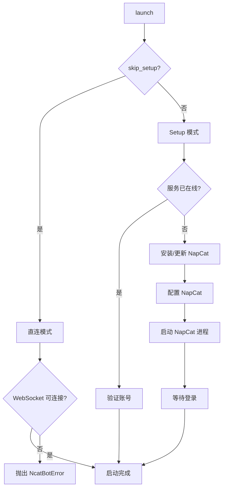

# 连接管理

> WebSocket 连接管理 — NapCatWebSocket 完整 API、重连策略、NapCatLauncher 进程管理

---

## NapCatWebSocket — 连接管理

**模块**: `ncatbot.adapter.napcat.connection.websocket`

负责 WebSocket 连接的建立、维护、重连和数据收发，不依赖任何外部 adapter/service 模块。

```python
class NapCatWebSocket:
    def __init__(self, uri: str): ...
    async def connect(self) -> None: ...
    async def disconnect(self) -> None: ...
    async def send(self, data: dict) -> None: ...
    async def listen(self, on_message: Callable[[dict], Awaitable[None]]) -> None: ...
    @property
    def connected(self) -> bool: ...
```

### 方法详解

| 方法 | 签名 | 说明 |
|---|---|---|
| `__init__` | `def __init__(self, uri: str)` | 传入 WebSocket URI 创建连接管理器 |
| `connect` | `async def connect(self) -> None` | 建立 WebSocket 连接 |
| `disconnect` | `async def disconnect(self) -> None` | 关闭 WebSocket 连接 |
| `send` | `async def send(self, data: dict) -> None` | 发送 JSON 数据（内部有发送锁保证线程安全） |
| `listen` | `async def listen(self, on_message: Callable[[dict], Awaitable[None]]) -> None` | 阻塞监听消息，连接断开时自动重连 |
| `connected` | `@property def connected(self) -> bool` | 当前连接状态 |

### 连接流程

`NapCatAdapter.connect()` 中的典型调用：

```python
async def connect(self) -> None:
    uri = ncatbot_config.get_uri_with_token()
    self._ws = NapCatWebSocket(uri)
    await self._ws.connect()
    self._protocol = OB11Protocol(self._ws)
    self._api = NapCatBotAPI(self._protocol)
    self._protocol.set_event_handler(self._on_event)
```

流程说明：
1. 从配置获取 WebSocket URI（含 Token）
2. 创建 `NapCatWebSocket` 并建立连接
3. 创建 `OB11Protocol` 用于请求-响应匹配
4. 创建 `NapCatBotAPI` 作为 `IBotAPI` 实现
5. 将内部事件处理方法注册到协议层

### 监听与消息分流

```python
async def listen(self) -> None:
    await self._ws.listen(self._protocol.on_message)
```

阻塞监听 WebSocket 消息，通过 `OB11Protocol.on_message` 区分 API 响应和事件推送。收到事件推送后，经 `NapCatEventParser` 解析为数据模型，回调给分发器。

### 重连策略

采用指数退避算法，连接断开时自动重连：

| 参数 | 值 |
|---|---|
| 最大重连次数 | 5 |
| 初始延迟 | 1.0 秒 |
| 最大延迟 | 30.0 秒 |
| 退避方式 | 延迟 × 2（指数退避） |

重连逻辑在 `listen()` 内部实现。每次连接断开后：
1. 检查已重连次数，超过最大次数则抛出异常
2. 等待当前延迟时间
3. 延迟翻倍（不超过最大延迟）
4. 尝试重新连接
5. 连接成功后重置重连计数器

### 断开连接

```python
async def disconnect(self) -> None:
    if self._protocol:
        self._protocol.cancel_all()
    if self._ws:
        await self._ws.disconnect()
    self._api = self._protocol = self._ws = None
```

断开连接时：取消所有挂起的 API 请求 → 关闭 WebSocket → 清除组件引用。

---

## NapCatLauncher — 进程管理

**模块**: `ncatbot.adapter.napcat.setup.launcher`

负责 NapCat 服务的启动编排，支持两种模式：

| 模式 | 条件 | 行为 |
|---|---|---|
| **Setup 模式**（默认） | `skip_setup: false` | 检查环境 → 安装/更新 → 配置 → 启动进程 → 登录 |
| **Connect 模式** | `skip_setup: true` | 直接连接已有服务，失败报错 |

### API 方法

```python
class NapCatLauncher:
    async def launch(self) -> None: ...
    async def is_service_ok(self, timeout: int = 0, show_info: bool = True) -> bool: ...
    async def wait_for_service(self, timeout: int = 60) -> None: ...
```

| 方法 | 签名 | 说明 |
|---|---|---|
| `launch` | `async def launch(self) -> None` | 主入口，根据配置选择 Setup 或 Connect 模式 |
| `is_service_ok` | `async def is_service_ok(self, timeout: int = 0, show_info: bool = True) -> bool` | 检测 WebSocket 是否连通（QQ 是否已登录） |
| `wait_for_service` | `async def wait_for_service(self, timeout: int = 60) -> None` | 等待服务就绪，超时抛出 `NcatBotError` |

### Setup 模式流程



**Setup 模式**（默认）：
1. 检测 NapCat 服务是否已在线
2. 若已在线，验证账号一致后直接完成
3. 若未在线，执行安装/更新 → 配置 → 启动进程 → 等待登录

**Connect 模式**（`skip_setup: true`）：
- 直接尝试连接已有 NapCat 服务
- 连接成功即完成启动
- 连接失败抛出 `NcatBotError`（不会自动安装或启动 NapCat）

### 内部子组件

| 组件 | 模块 | 职责 |
|---|---|---|
| `PlatformOps` | `ncatbot.adapter.napcat.setup.platform` | 平台适配（启动命令、路径、进程管理） |
| `NapCatInstaller` | `ncatbot.adapter.napcat.setup.installer` | NapCat 安装与更新 |
| `NapCatConfig` | `ncatbot.adapter.napcat.setup.config` | NapCat 配置文件管理 |
| `AuthHandler` | `ncatbot.adapter.napcat.setup.auth` | WebUI 登录引导 |

### 配置参考

与连接管理相关的 `config.yaml` 配置项：

```yaml
bot_uin: 123456789              # QQ 号
ws_uri: "ws://localhost:3001"  # WebSocket 地址
token: ""                      # 认证 Token（可选）
skip_setup: false              # true = Connect 模式, false = Setup 模式
```

`NapCatWebSocket` 接收的 URI 由 `ncatbot_config.get_uri_with_token()` 构造，当 `token` 非空时自动附加到 URI 查询参数中。
