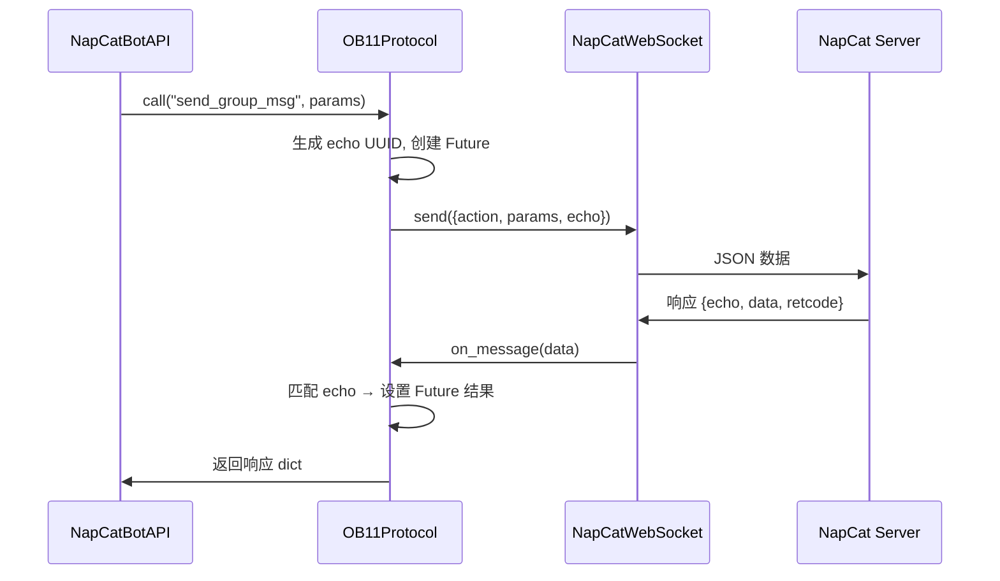

# 协议处理

> 协议处理 — OB11Protocol 请求-响应匹配、NapCatEventParser 事件解析、NapCatBotAPI 实现

---

## OB11Protocol — 协议编解码

**模块**: `ncatbot.adapter.napcat.connection.protocol`

使用 `echo` + UUID + `asyncio.Future` 实现 OneBot v11 请求-响应匹配。同时将非响应消息（事件推送）转发给事件回调。

```python
class OB11Protocol:
    def __init__(self, ws: NapCatWebSocket): ...
    def set_event_handler(self, handler: Callable[[dict], Awaitable[None]]) -> None: ...
    async def call(self, action: str, params: Optional[dict] = None, timeout: float = 30.0) -> dict: ...
    def cancel_all(self) -> None: ...
    async def on_message(self, data: dict) -> None: ...
```

### 方法详解

| 方法 | 签名 | 说明 |
|---|---|---|
| `set_event_handler` | `def set_event_handler(self, handler: Callable[[dict], Awaitable[None]]) -> None` | 设置事件推送回调 |
| `call` | `async def call(self, action: str, params: Optional[dict] = None, timeout: float = 30.0) -> dict` | 发送 API 请求并等待响应（默认 30 秒超时） |
| `cancel_all` | `def cancel_all(self) -> None` | 取消所有挂起的请求（断连时调用） |
| `on_message` | `async def on_message(self, data: dict) -> None` | 处理收到的消息：区分 API 响应和事件推送 |

### 请求-响应匹配流程



**匹配机制**：
1. `call()` 为每个 API 请求生成唯一的 UUID 作为 `echo` 字段
2. 同时创建一个 `asyncio.Future` 与该 `echo` 关联
3. 请求发送后，`call()` 等待 Future 完成（带超时）
4. `on_message()` 收到消息时，若包含 `echo` 字段，则匹配到对应的 Future 并设置结果
5. 若消息不包含 `echo` 字段，识别为事件推送，转发给事件回调

### 错误处理

| 场景 | 行为 |
|---|---|
| API 请求超时 | `call()` 抛出 `asyncio.TimeoutError`（默认 30 秒） |
| 连接断开 | `cancel_all()` 取消所有挂起的 Future |
| 响应 `retcode` 非零 | 返回完整响应 dict，由上层判断是否为错误 |

### OneBot v11 响应格式

```json
{
    "status": "ok",
    "retcode": 0,
    "data": { ... },
    "echo": "uuid-xxx"
}
```

| 字段 | 类型 | 说明 |
|---|---|---|
| `status` | `str` | `"ok"` 或 `"failed"` |
| `retcode` | `int` | 返回码，`0` 表示成功 |
| `data` | `any` | 响应数据 |
| `echo` | `str` | 请求时传入的 echo 标识 |

---

## NapCatEventParser — 事件解析

**模块**: `ncatbot.adapter.napcat.parser`

将 OB11 原始 JSON 转换为 `BaseEventData` 数据模型。内部使用 `EventParser` 注册表，基于 `(post_type, secondary_key)` 二元组路由到对应的数据模型类。

```python
class NapCatEventParser:
    def parse(self, raw_data: dict) -> Optional[BaseEventData]: ...
```

| 方法 | 签名 | 说明 |
|---|---|---|
| `parse` | `def parse(self, raw_data: dict) -> Optional[BaseEventData]` | 解析原始 JSON → 数据模型，解析失败返回 `None` |

### EventParser 注册表

通过 `EventParser.register(post_type, secondary_key)` 装饰器注册事件数据模型：

| post_type | secondary_key | 数据模型 |
|---|---|---|
| `message` | `private` | `PrivateMessageEventData` |
| `message` | `group` | `GroupMessageEventData` |
| `request` | `friend` | `FriendRequestEventData` |
| `request` | `group` | `GroupRequestEventData` |
| `meta_event` | `lifecycle` | `LifecycleMetaEventData` |
| `meta_event` | `heartbeat` | `HeartbeatMetaEventData` |
| `notice` | `group_upload` | `GroupUploadNoticeEventData` |
| `notice` | `group_admin` | `GroupAdminNoticeEventData` |
| `notice` | `group_decrease` | `GroupDecreaseNoticeEventData` |
| `notice` | `group_increase` | `GroupIncreaseNoticeEventData` |
| `notice` | `group_ban` | `GroupBanNoticeEventData` |
| `notice` | `friend_add` | `FriendAddNoticeEventData` |
| `notice` | `group_recall` | `GroupRecallNoticeEventData` |
| `notice` | `friend_recall` | `FriendRecallNoticeEventData` |
| `notice` | `poke` | `PokeNotifyEventData` |
| `notice` | `lucky_king` | `LuckyKingNotifyEventData` |
| `notice` | `honor` | `HonorNotifyEventData` |

### 解析路由逻辑

事件解析的路由键由两部分组成：

1. **`post_type`** — 事件大类：`message` / `notice` / `request` / `meta_event`
2. **`secondary_key`** — 事件子类型，具体字段因 `post_type` 而异：
   - `message` → `message_type`（`private` / `group`）
   - `notice` → `notice_type`（`group_recall` / `poke` 等）
   - `request` → `request_type`（`friend` / `group`）
   - `meta_event` → `meta_event_type`（`lifecycle` / `heartbeat`）

未注册的事件类型会被忽略（`parse()` 返回 `None`），同时记录警告日志。

---

## NapCatBotAPI — IBotAPI 实现

**模块**: `ncatbot.adapter.napcat.api.bot_api`

`NapCatBotAPI` 是 `IBotAPI` 的 NapCat 平台实现，通过 Mixin 模式组合多个功能模块：

```python
class NapCatBotAPI(
    MessageAPIMixin,      # 消息操作
    GroupAPIMixin,        # 群管理
    AccountAPIMixin,      # 账号操作
    QueryAPIMixin,        # 信息查询
    FileAPIMixin,         # 文件操作
    IBotAPI,
):
    def __init__(self, protocol: OB11Protocol): ...
    async def _call(self, action: str, params: Optional[dict] = None) -> dict: ...
    async def _call_data(self, action: str, params: Optional[dict] = None) -> Any: ...
```

### Mixin 组合

| Mixin | 模块 | 职责 |
|---|---|---|
| `MessageAPIMixin` | `ncatbot.adapter.napcat.api.message` | `send_private_msg` / `send_group_msg` / `delete_msg` / `send_forward_msg` |
| `GroupAPIMixin` | `ncatbot.adapter.napcat.api.group` | 群管理（踢人、禁言、设置管理员等） |
| `AccountAPIMixin` | `ncatbot.adapter.napcat.api.account` | 好友/群请求处理 |
| `QueryAPIMixin` | `ncatbot.adapter.napcat.api.query` | 信息查询（登录信息、好友列表、群成员等） |
| `FileAPIMixin` | `ncatbot.adapter.napcat.api.file` | 文件上传与管理 |

### 核心内部方法

| 方法 | 签名 | 说明 |
|---|---|---|
| `_call` | `async def _call(self, action: str, params: Optional[dict] = None) -> dict` | 发送 API 请求，返回完整响应 |
| `_call_data` | `async def _call_data(self, action: str, params: Optional[dict] = None) -> Any` | 发送 API 请求，返回 `data` 字段 |

两者都委托给 `OB11Protocol.call()` 实现实际的请求-响应通信。`_call_data` 是 `_call` 的便捷封装，直接提取响应中的 `data` 字段。

### 预上传机制

`NapCatBotAPI` 重写了 `send_group_msg`、`send_private_msg`、`send_forward_msg`，在发送前自动对消息中的可下载资源执行预上传（`PreUploadService`），将 URL 资源转换为本地文件，提升消息发送可靠性。

```python
async def send_group_msg(
    self, group_id: Union[str, int], message: list, **kwargs: Any,
) -> dict:
    message = await self._preupload_message(message)
    return await super().send_group_msg(group_id, message, **kwargs)
```

### 附加 API

| 方法 | 签名 | 说明 |
|---|---|---|
| `send_like` | `async def send_like(self, user_id: Union[str, int], times: int = 1) -> None` | 发送点赞 |
| `send_poke` | `async def send_poke(self, group_id: Union[str, int], user_id: Union[str, int]) -> None` | 发送戳一戳 |

### 序列化与反序列化

所有 API 请求和响应均使用 JSON 格式通过 WebSocket 传输：

**请求序列化**（`OB11Protocol.call`）：
```json
{
    "action": "send_group_msg",
    "params": {
        "group_id": 12345,
        "message": [{"type": "text", "data": {"text": "hello"}}]
    },
    "echo": "uuid-xxx"
}
```

**事件反序列化**（`NapCatEventParser.parse`）：
```json
{
    "post_type": "message",
    "message_type": "group",
    "group_id": 12345,
    "user_id": 67890,
    "message": [{"type": "text", "data": {"text": "hello"}}],
    "raw_message": "hello",
    "time": 1700000000,
    "self_id": 123456789
}
```

原始 JSON 经 `NapCatEventParser.parse()` 解析后转换为对应的 `BaseEventData` 子类实例（如 `GroupMessageEventData`），包含类型化的字段访问。
