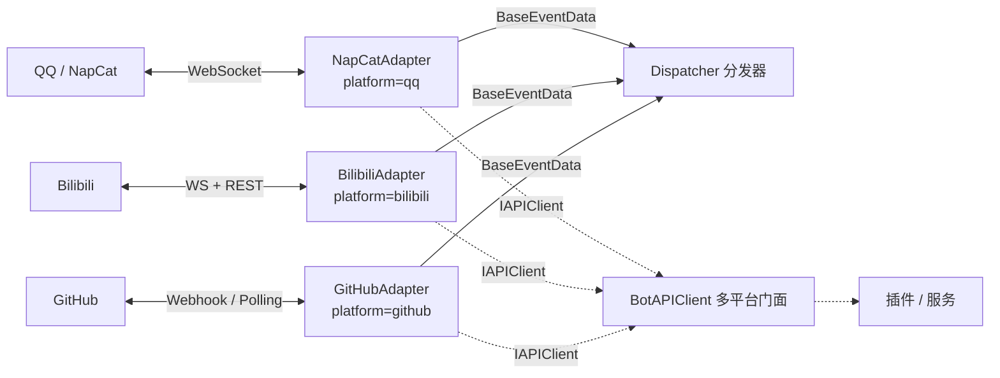

# 适配器参考

> 适配器层完整参考 — 多平台适配、WebSocket 连接、事件解析、API 调用

---

## Quick Reference

```python
from ncatbot.adapter import BaseAdapter, NapCatAdapter, MockAdapter
from ncatbot.adapter.bilibili import BilibiliAdapter
from ncatbot.adapter.github import GitHubAdapter
```

适配层（Adapter）负责屏蔽底层通信协议差异，为上层提供统一的事件流和 Bot API 接口。

| 适配器 | `platform` | 协议 | 用途 | 使用指南 |
|---|---|---|---|---|
| `NapCatAdapter` | `"qq"` | OneBot v11 (WebSocket) | QQ 群聊/私聊 Bot | [NapCat 指南](../../guide/adapter/1_napcat_qq.md) |
| `BilibiliAdapter` | `"bilibili"` | bilibili-api-python | 直播弹幕 / 私信 / 评论 | [Bilibili 指南](../../guide/adapter/2_bilibili.md) |
| `GitHubAdapter` | `"github"` | Webhook / REST Polling | Issue/PR/Push 事件处理 | [GitHub 指南](../../guide/adapter/3_github.md) |
| `MockAdapter` | `"mock"` | 内存模拟 | 测试环境，无需网络 | [Mock 指南](../../guide/adapter/4_mock.md) |



### BaseAdapter 抽象接口

| 属性/方法 | 签名 | 说明 |
|-----------|------|------|
| `name` | `str` | 适配器名称 |
| `platform` | `str` | 平台标识（`"qq"` / `"mock"` 等） |
| `supported_protocols` | `List[str]` | 支持的协议列表 |
| `setup` | `async () → None` | *abstract* — 准备平台环境 |
| `ensure_deps` | `async () → bool` | 检查并安装 pip 依赖，返回是否就绪 |
| `connect` | `async () → None` | *abstract* — 建立连接并初始化 API |
| `disconnect` | `async () → None` | *abstract* — 断开连接，释放资源 |
| `listen` | `async () → None` | *abstract* — 阻塞监听消息 |
| `get_api` | `() → IAPIClient` | *abstract* — 返回 API 客户端 |
| `connected` | `@property → bool` | *abstract* — 连接状态 |
| `set_event_callback` | `(callback) → None` | 设置事件数据回调 |

### AdapterRegistry 方法

| 方法 | 签名 | 说明 |
|------|------|------|
| `register` | `(name, cls) → None` | 注册适配器类 |
| `discover` | `() → Dict[str, Type[BaseAdapter]]` | 发现内置 + entry_point 适配器 |
| `list_available` | `() → list[str]` | 列出可用适配器名 |
| `create` | `(entry, *, bot_uin="", websocket_timeout=15) → BaseAdapter` | 工厂创建适配器实例 |

### MockAdapter 方法（测试用）

| 方法 | 签名 | 说明 |
|------|------|------|
| `inject_event` | `async (data: BaseEventData) → None` | 注入测试事件 |
| `stop` | `() → None` | 停止 listen 循环 |
| `mock_api` | `@property → MockBotAPI` | 获取 Mock API 实例 |

### MockBotAPI 断言方法

| 方法 | 签名 | 说明 |
|------|------|------|
| `called` | `(action) → bool` | 检查 action 是否被调用 |
| `call_count` | `(action) → int` | 调用次数 |
| `get_calls` | `(action) → List[APICall]` | 获取指定调用记录 |
| `last_call` | `(action=None) → Optional[APICall]` | 最后一次调用 |
| `set_response` | `(action, response) → None` | 预设返回值 |
| `reset` | `() → None` | 清除所有记录 |

**源码位置**: `ncatbot/adapter/` · 详见 [适配器使用指南](../../guide/adapter/) · [多平台开发指南](../../guide/multi_platform/)

---

## BilibiliAdapter

**模块**: `ncatbot.adapter.bilibili`

| 属性 | 值 |
|------|-----|
| `name` | `"bilibili"` |
| `platform` | `"bilibili"` |
| `supported_protocols` | `["bilibili_live", "bilibili_session", "bilibili_comment"]` |
| `pip_dependencies` | `{"bilibili-api-python": ">=17.0.0"}` |

### BilibiliConfig 配置模型

| 字段 | 类型 | 默认值 | 说明 |
|------|------|--------|------|
| `sessdata` | `str` | `""` | SESSDATA Cookie |
| `bili_jct` | `str` | `""` | CSRF Token |
| `buvid3` | `str` | `""` | 设备指纹 |
| `dedeuserid` | `str` | `""` | 用户 UID |
| `ac_time_value` | `str` | `""` | 账号时间戳 |
| `live_rooms` | `List[int]` | `[]` | 直播间房间号 |
| `enable_session` | `bool` | `false` | 启用私信 |
| `comment_watches` | `List[CommentWatch]` | `[]` | 评论监听 |
| `session_poll_interval` | `float` | `6.0` | 私信轮询间隔 |
| `comment_poll_interval` | `float` | `30.0` | 评论轮询间隔 |
| `max_retry` | `int` | `5` | 最大重连次数 |
| `retry_after` | `float` | `1.0` | 重连延迟 |

### 认证流程

1. `setup()` 检查 `sessdata` 是否非空
2. 非空 → 构造 `Credential` 并调用 `check_valid()` 验证
3. 验证失败或为空 → 调用 `qrcode_login()` 扫码登录
4. 登录成功 → `save_credential_to_config()` 写回 config.yaml

详见 [Bilibili 使用指南](../../guide/adapter/2_bilibili.md)。

---

## GitHubAdapter

**模块**: `ncatbot.adapter.github`

| 属性 | 值 |
|------|-----|
| `name` | `"github"` |
| `platform` | `"github"` |
| `supported_protocols` | `["github_webhook", "github_polling"]` |

### GitHubConfig 配置模型

| 字段 | 类型 | 默认值 | 说明 |
|------|------|--------|------|
| `token` | `str` | `""` | GitHub PAT |
| `repos` | `List[str]` | `[]` | 监听仓库 (`owner/repo`) |
| `mode` | `Literal["webhook", "polling"]` | `"webhook"` | 连接模式 |
| `webhook_host` | `str` | `"0.0.0.0"` | HTTP Server 地址 |
| `webhook_port` | `int` | `8080` | HTTP Server 端口 |
| `webhook_path` | `str` | `"/webhook"` | Webhook 路径 |
| `webhook_secret` | `str` | `""` | 签名 Secret |
| `poll_interval` | `float` | `60.0` | Polling 间隔 |

### 认证流程

1. `setup()` 调用 `GET /user` 验证 Token
2. 验证成功打印用户名，失败抛出异常
3. 不配置 Token 也可运行（公开仓库 Webhook），但 API 速率受限

详见 [GitHub 使用指南](../../guide/adapter/3_github.md)。

---

## 适配器组件速查

---

## 本目录索引

| 文件 | 说明 |
|------|------|
| [1_connection.md](1_connection.md) | WebSocket 连接管理 — NapCatWebSocket、重连策略、NapCatLauncher 进程管理 |
| [2_protocol.md](2_protocol.md) | 协议处理 — OB11Protocol 请求-响应匹配、事件解析、NapCatBotAPI 实现 |
