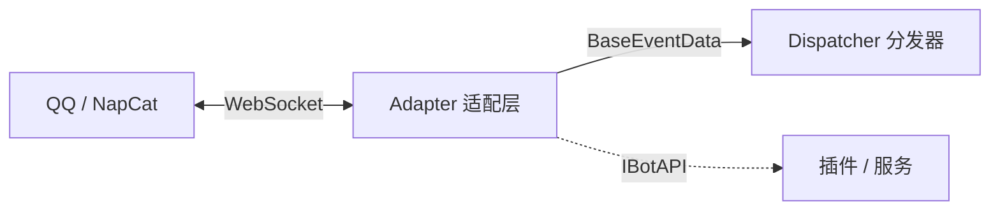
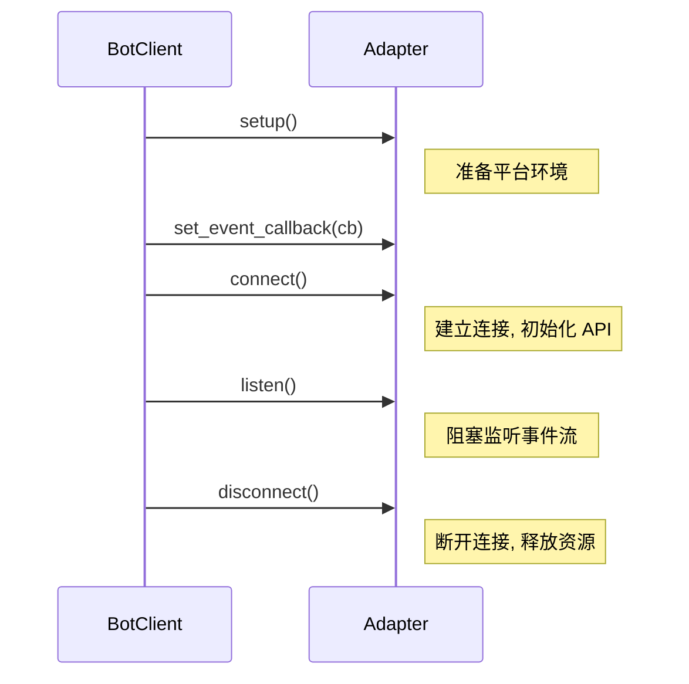
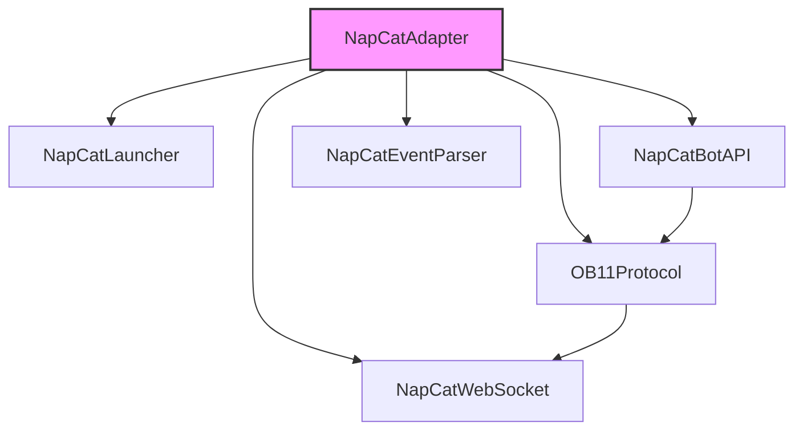

# 适配器参考

> NapCat 适配器层完整参考 — WebSocket 连接、事件解析、API 调用

---

## Quick Start

适配层（Adapter）负责屏蔽底层通信协议差异，为上层提供统一的事件流和 Bot API 接口。NcatBot 采用**策略模式**，通过 `BaseAdapter` 抽象接口将协议实现与业务逻辑完全解耦。

| 适配器 | 协议 | 用途 |
|---|---|---|
| `NapCatAdapter` | OneBot v11 (NapCat) | 生产环境，连接真实 QQ 服务 |
| `MockAdapter` | mock | 测试环境，内存模拟，无需网络 |

适配器在整体架构中的位置：



> 适配器只产出纯数据模型（`BaseEventData`），不创建事件实体。事件实体由 `Dispatcher` 在下游构建。

**源码位置**: `ncatbot/adapter/`

### 生产环境 — NapCatAdapter

```python
from ncatbot.app import BotClient

# 默认使用 NapCatAdapter，从 config.yaml 读取连接配置
bot = BotClient()
bot.run()
```

`config.yaml` 中的适配器相关配置：

```yaml
bot_uin: 123456789          # QQ 号
ws_uri: "ws://localhost:3001"  # WebSocket 地址
token: ""                  # 认证 Token（可选）
skip_setup: false          # true = 跳过安装，直接连接已有 NapCat 服务
```

### 测试环境 — MockAdapter

```python
from ncatbot.adapter import MockAdapter
from ncatbot.app import BotClient

adapter = MockAdapter()
bot = BotClient(adapter=adapter)

# 在 bot 启动后注入事件
await adapter.inject_event(some_event_data)

# 检查 API 调用
assert adapter.mock_api.called("send_group_msg")
adapter.stop()
```

---

## 适配器组件速查

### BaseAdapter 抽象接口

**模块**: `ncatbot.adapter.base`

所有适配器的抽象基类，定义生命周期方法、API 访问和状态查询接口。

```python
class BaseAdapter(ABC):
    name: str
    description: str
    supported_protocols: List[str]
    _event_callback: Optional[Callable[["BaseEventData"], Awaitable[None]]] = None
```

**类属性**:

| 属性 | 类型 | 说明 |
|---|---|---|
| `name` | `str` | 适配器标识名（如 `"napcat"`、`"mock"`） |
| `description` | `str` | 人类可读的适配器描述 |
| `supported_protocols` | `List[str]` | 支持的协议列表（如 `["onebot_v11"]`） |
| `_event_callback` | `Optional[Callable]` | 事件回调，由分发器在启动时通过 `set_event_callback()` 注入 |

**生命周期方法**（由 `BotClient` 按顺序编排）:



| 方法 | 签名 | 说明 |
|---|---|---|
| `setup` | `async def setup(self) -> None` | 准备平台环境（安装 / 配置 / 启动外部服务） |
| `connect` | `async def connect(self) -> None` | 建立连接并初始化 API |
| `listen` | `async def listen(self) -> None` | 阻塞监听消息，内部完成事件解析后回调数据模型 |
| `disconnect` | `async def disconnect(self) -> None` | 断开连接，释放资源 |
| `get_api` | `def get_api(self) -> IBotAPI` | 返回 `IBotAPI` 实现实例 |
| `set_event_callback` | `def set_event_callback(self, callback) -> None` | 设置事件数据回调 |
| `connected` | `@property -> bool` | 当前是否已连接 |

### NapCatAdapter

**模块**: `ncatbot.adapter.napcat.adapter`

NcatBot 的主力适配器，**纯编排类**，通过组合子组件完成全部功能：

| 组件 | 职责 | 详细文档 |
|---|---|---|
| `NapCatWebSocket` | WebSocket 连接的建立、维护、重连和数据收发 | [连接管理](1_connection.md#napcatwebsocket--连接管理) |
| `OB11Protocol` | OneBot v11 请求-响应匹配、事件转发 | [协议处理](2_protocol.md#ob11protocol--协议编解码) |
| `NapCatBotAPI` | `IBotAPI` 的 NapCat 实现 | [协议处理](2_protocol.md#napcatbotapi--ibotapi-实现) |
| `NapCatEventParser` | OB11 原始 JSON → `BaseEventData` | [协议处理](2_protocol.md#napcateventparser--事件解析) |
| `NapCatLauncher` | NapCat 服务的安装、配置、启动 | [连接管理](1_connection.md#napcatlauncher--进程管理) |



**生命周期概览**:

| 阶段 | 行为 |
|---|---|
| `setup()` | 调用 `NapCatLauncher.launch()`：Setup 模式安装+启动，Connect 模式直连 |
| `connect()` | 创建 WebSocket → OB11Protocol → NapCatBotAPI → 注册事件回调 |
| `listen()` | 阻塞监听 WebSocket 消息，经 `OB11Protocol.on_message` 分流 |
| `disconnect()` | 取消挂起请求 → 关闭 WebSocket → 清除组件引用 |

### MockAdapter

**模块**: `ncatbot.adapter.mock.adapter`

`BaseAdapter` 的内存实现，用于无网络环境下的集成测试。

| 方法 | 签名 | 说明 |
|---|---|---|
| `inject_event` | `async def inject_event(self, data: BaseEventData) -> None` | 注入事件，触发 dispatcher 回调 |
| `stop` | `def stop(self) -> None` | 停止 `listen()` 阻塞循环 |
| `mock_api` | `@property -> MockBotAPI` | 获取 `MockBotAPI` 实例 |

**MockBotAPI** (`ncatbot.adapter.mock.api`)：`IBotAPI` 的完整 Mock 实现，记录所有 API 调用并返回可配置的模拟响应。

| 方法 | 说明 |
|---|---|
| `set_response(action, response)` | 预设某个 action 的返回值 |
| `called(action) -> bool` | 某个 action 是否被调用过 |
| `call_count(action) -> int` | 调用次数 |
| `get_calls(action) -> List[APICall]` | 获取某个 action 所有调用记录 |
| `last_call(action?) -> APICall` | 获取最近一次调用 |
| `reset()` | 清空所有调用记录 |

```python
@dataclass
class APICall:
    action: str     # API 动作名
    args: tuple     # 位置参数
    kwargs: dict    # 关键字参数
```

### 自定义适配器指南

1. **创建适配器模块**：在 `ncatbot/adapter/` 下新建目录
2. **继承 BaseAdapter**：实现所有抽象方法（`setup` / `connect` / `listen` / `disconnect` / `get_api` / `connected`）
3. **实现 IBotAPI**：为目标协议编写 `IBotAPI` 实现
4. **注册适配器**：在 `BotClient` 初始化时传入自定义适配器实例

**最小示例骨架**:

```python
from ncatbot.adapter import BaseAdapter
from ncatbot.api import IBotAPI


class MyBotAPI(IBotAPI):
    """自定义协议的 IBotAPI 实现"""

    async def send_private_msg(self, user_id, message, **kwargs) -> dict:
        ...

    async def send_group_msg(self, group_id, message, **kwargs) -> dict:
        ...

    # ... 实现其他 IBotAPI 抽象方法


class MyAdapter(BaseAdapter):
    name = "my_protocol"
    description = "自定义协议适配器"
    supported_protocols = ["my_protocol"]

    async def setup(self) -> None:
        # 准备环境
        ...

    async def connect(self) -> None:
        self._api = MyBotAPI()
        # 建立连接...

    async def listen(self) -> None:
        # 阻塞监听消息循环
        ...

    async def disconnect(self) -> None:
        # 释放资源
        ...

    def get_api(self) -> IBotAPI:
        return self._api

    @property
    def connected(self) -> bool:
        return self._api is not None
```

**IBotAPI 完整方法清单**:

| 类别 | 方法 |
|---|---|
| 消息 | `send_private_msg` · `send_group_msg` · `delete_msg` · `send_forward_msg` |
| 群管理 | `set_group_kick` · `set_group_ban` · `set_group_whole_ban` · `set_group_admin` · `set_group_card` · `set_group_name` · `set_group_leave` · `set_group_special_title` |
| 请求处理 | `set_friend_add_request` · `set_group_add_request` |
| 信息查询 | `get_login_info` · `get_stranger_info` · `get_friend_list` · `get_group_info` · `get_group_list` · `get_group_member_info` · `get_group_member_list` · `get_msg` · `get_forward_msg` |
| 文件 | `upload_group_file` · `get_group_root_files` · `get_group_file_url` · `delete_group_file` |
| 其他 | `send_like` · `send_poke` |

---

## 深入阅读

| 文档 | 内容 |
|---|---|
| [连接管理](1_connection.md) | WebSocket 连接管理 — NapCatWebSocket 完整 API、重连策略、NapCatLauncher 进程管理 |
| [协议处理](2_protocol.md) | 协议处理 — OB11Protocol 请求-响应匹配、NapCatEventParser 事件解析、NapCatBotAPI 实现 |

**相关文档**:

- [事件系统参考](../events/) — 事件数据模型与分发器
- [Bot API 接口参考](../api/) — IBotAPI 完整接口文档
