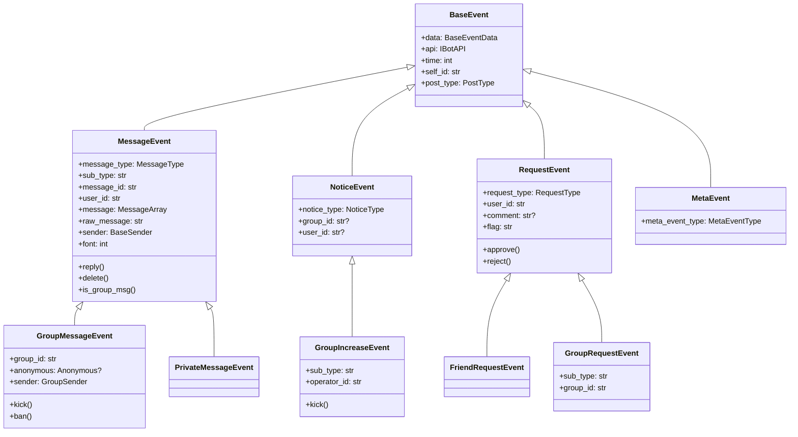
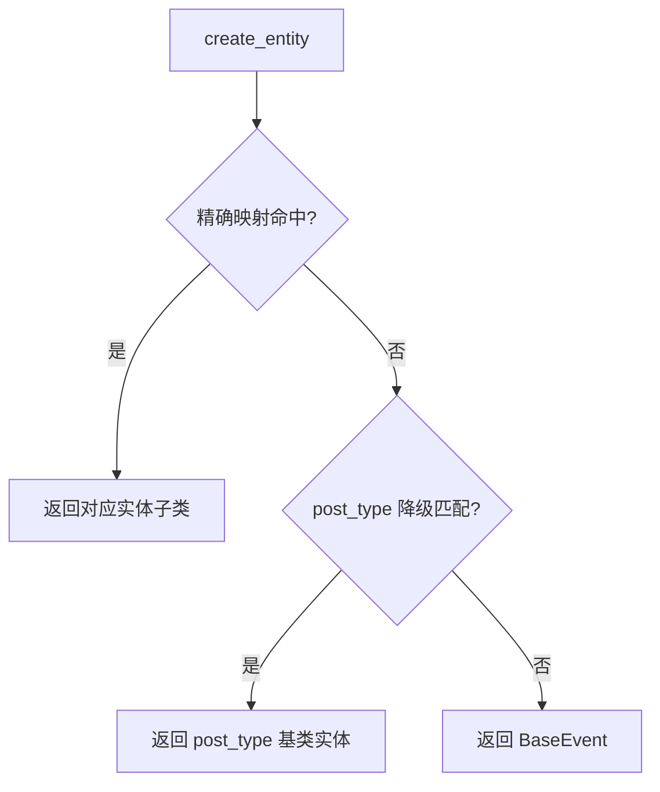

# 事件类详解

> 事件类继承体系、完整属性方法表与工厂函数。

[← 返回事件参考](README.md)

---

## 继承关系



---

## BaseEvent

**模块**：`ncatbot.event.base`

```python
class BaseEvent:
    __slots__ = ("_data", "_api")
    def __init__(self, data: BaseEventData, api: IBotAPI) -> None
```

| 属性 | 类型 | 说明 |
|---|---|---|
| `data` | `BaseEventData` | 底层纯数据模型（可序列化） |
| `api` | `IBotAPI` | Bot API 接口 |
| `time` | `int` | 事件发生时间戳（Unix） |
| `self_id` | `str` | 收到事件的机器人 QQ 号 |
| `post_type` | `PostType` | 事件上报类型 |

---

## MessageEvent

**模块**：`ncatbot.event.message` | **继承**：`BaseEvent`

### 属性

| 属性 | 类型 | 说明 |
|---|---|---|
| `message_type` | `MessageType` | `"private"` / `"group"` |
| `sub_type` | `str` | `"friend"` / `"normal"` / `"anonymous"` |
| `message_id` | `str` | 消息 ID |
| `user_id` | `str` | 发送者 QQ 号 |
| `message` | `MessageArray` | 消息内容（消息段数组） |
| `raw_message` | `str` | CQ 码原始消息字符串 |
| `sender` | `BaseSender` | 发送者信息 |
| `font` | `int` | 字体（默认 `0`） |

### 方法

#### `is_group_msg() -> bool`

判断该消息是否为群消息。

#### `async reply(...) -> Any`

快捷回复消息，自动判断群/私聊并引用原消息。

```python
async def reply(
    self,
    text: Optional[str] = None,
    *,
    at: Optional[Union[str, int]] = None,
    image: Optional[Union[str, Image]] = None,
    video: Optional[Union[str, Video]] = None,
    rtf: Optional[MessageArray] = None,
    at_sender: bool = True,
) -> Any
```

| 参数 | 类型 | 默认值 | 说明 |
|---|---|---|---|
| `text` | `str \| None` | `None` | 文本内容 |
| `at` | `str \| int \| None` | `None` | 额外 @ 某人 |
| `image` | `str \| Image \| None` | `None` | 图片（URL 或 `Image` 对象） |
| `video` | `str \| Video \| None` | `None` | 视频（URL 或 `Video` 对象） |
| `rtf` | `MessageArray \| None` | `None` | 自定义消息段数组 |
| `at_sender` | `bool` | `True` | 群消息时是否自动 @ 发送者 |

**行为逻辑**：自动添加 `reply` 消息段 → 群消息且 `at_sender=True` 时添加 `at` → 拼接 `text`/`at`/`image`/`video`/`rtf` → 按 `message_type` 调用对应发送 API。

#### `async delete() -> Any`

撤回该消息。

---

## GroupMessageEvent

**模块**：`ncatbot.event.message` | **继承**：`MessageEvent`

### 属性

| 属性 | 类型 | 说明 |
|---|---|---|
| `group_id` | `str` | 群号 |
| `anonymous` | `Anonymous \| None` | 匿名消息信息 |
| `sender` | `GroupSender` | 群发送者（含 `role` / `card` / `title`） |

### 方法

#### `async kick(reject_add_request: bool = False) -> Any`

将发送者踢出群。`reject_add_request=True` 拒绝再次加群。

#### `async ban(duration: int = 1800) -> Any`

禁言发送者。`duration` 单位秒，`0` 解除禁言。

---

## PrivateMessageEvent

**模块**：`ncatbot.event.message` | **继承**：`MessageEvent`

与 `MessageEvent` 接口一致，无额外属性或方法。默认 `message_type = "private"`，`sub_type = "friend"`。

---

## NoticeEvent

**模块**：`ncatbot.event.notice` | **继承**：`BaseEvent`

### 属性

| 属性 | 类型 | 说明 |
|---|---|---|
| `notice_type` | `NoticeType` | 通知类型 |
| `group_id` | `str \| None` | 群号 |
| `user_id` | `str \| None` | 相关用户 QQ 号 |

---

## GroupIncreaseEvent

**模块**：`ncatbot.event.notice` | **继承**：`NoticeEvent`

### 属性

| 属性 | 类型 | 说明 |
|---|---|---|
| `sub_type` | `str` | `"approve"`（管理员同意）/ `"invite"`（被邀请） |
| `operator_id` | `str` | 操作者 QQ 号 |

### 方法

#### `async kick(reject_add_request: bool = False) -> Any`

将新加入的成员踢出群。参数同 `GroupMessageEvent.kick()`。

---

## RequestEvent

**模块**：`ncatbot.event.request` | **继承**：`BaseEvent`

### 属性

| 属性 | 类型 | 说明 |
|---|---|---|
| `request_type` | `RequestType` | `"friend"` / `"group"` |
| `user_id` | `str` | 请求发送者 QQ 号 |
| `comment` | `str \| None` | 验证消息 |
| `flag` | `str` | 请求标识 |

### 方法

#### `async approve(remark: str = "", reason: str = "") -> Any`

同意请求。好友请求时 `remark` 为备注名；群请求时自动传递 `sub_type`。

#### `async reject(reason: str = "") -> Any`

拒绝请求。`reason` 仅群请求时有效。

---

## FriendRequestEvent

**模块**：`ncatbot.event.request` | **继承**：`RequestEvent`

与 `RequestEvent` 接口一致，无额外属性。默认 `request_type = "friend"`。

---

## GroupRequestEvent

**模块**：`ncatbot.event.request` | **继承**：`RequestEvent`

### 属性

| 属性 | 类型 | 说明 |
|---|---|---|
| `sub_type` | `str` | `"add"`（主动加群）/ `"invite"`（被邀请） |
| `group_id` | `str` | 群号 |

---

## MetaEvent

**模块**：`ncatbot.event.meta` | **继承**：`BaseEvent`

### 属性

| 属性 | 类型 | 说明 |
|---|---|---|
| `meta_event_type` | `MetaEventType` | 元事件类型 |

---

## create_entity() 工厂函数

**模块**：`ncatbot.event.factory`

```python
def create_entity(data: BaseEventData, api: IBotAPI) -> BaseEvent
```

采用 **精确映射优先、降级 post_type 匹配** 的两级策略：

### 第一级：精确映射

| 数据模型类 | → 实体类 |
|---|---|
| `PrivateMessageEventData` | `PrivateMessageEvent` |
| `GroupMessageEventData` | `GroupMessageEvent` |
| `FriendRequestEventData` | `FriendRequestEvent` |
| `GroupRequestEventData` | `GroupRequestEvent` |
| `GroupIncreaseNoticeEventData` | `GroupIncreaseEvent` |

### 第二级：降级匹配

| `post_type` | → 降级实体类 |
|---|---|
| `message` / `message_sent` | `MessageEvent` |
| `notice` | `NoticeEvent` |
| `request` | `RequestEvent` |
| `meta_event` | `MetaEvent` |

两级均未命中则返回 `BaseEvent`。


