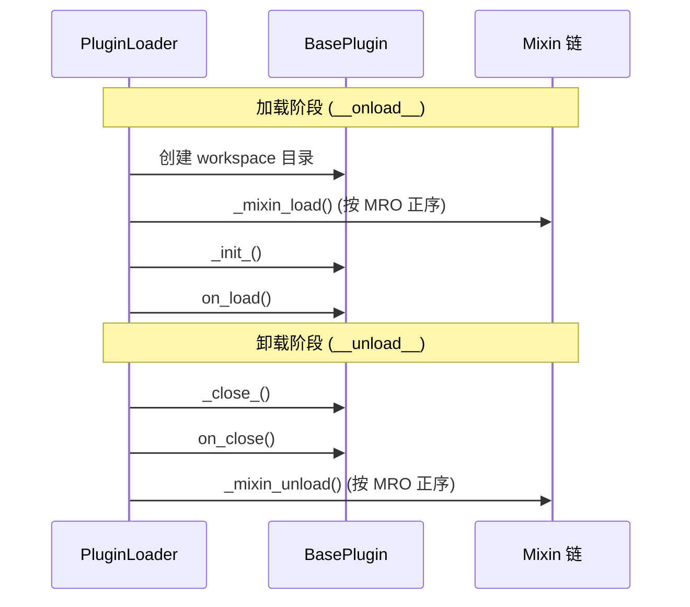

# 基类详解

> NCatBotPlugin 完整 API — 属性、方法、继承关系、PluginManifest、PluginLoader、依赖解析

---

## 1. BasePlugin

> 路径：`ncatbot/plugin/base.py`

所有插件的根基类，定义元数据声明、生命周期接口和 Mixin 钩子编排。

### 1.1 元数据属性

插件子类**必须**定义 `name` 和 `version`，其余可选。

| 属性 | 类型 | 必填 | 默认值 | 说明 |
|------|------|:----:|--------|------|
| `name` | `str` | ✅ | — | 插件唯一标识 |
| `version` | `str` | ✅ | — | 语义化版本号 |
| `author` | `str` | — | `"Unknown"` | 作者信息 |
| `description` | `str` | — | `""` | 插件描述 |
| `dependencies` | `Dict[str, str]` | — | `{}` | 插件间依赖，格式 `{插件名: 版本约束}` |

```python
class MyPlugin(NcatBotPlugin):
    name = "my_plugin"
    version = "1.0.0"
    author = "dev"
    description = "示例插件"
    dependencies = {"core_plugin": ">=1.0.0"}
```

### 1.2 运行时注入属性

以下属性由 `PluginLoader` 在实例化时自动注入，插件代码中可直接使用：

| 属性 | 类型 | 说明 |
|------|------|------|
| `workspace` | `Path` | 插件工作目录（`data/<plugin_name>/`） |
| `services` | `ServiceManager` | 服务管理器，可获取 RBAC、定时任务等内置服务 |
| `api` | `BotAPIClient` | Bot API 客户端，调用 OneBot v11 接口 |
| `_dispatcher` | `AsyncEventDispatcher` | 事件分发器（EventMixin 内部使用） |
| `_plugin_loader` | `PluginLoader` | 插件加载器引用 |
| `_manifest` | `PluginManifest \| None` | 插件清单数据 |
| `_debug` | `bool` | 调试模式标志 |

### 1.3 生命周期方法

插件生命周期分为**加载**和**卸载**两个阶段，框架按固定顺序调用钩子。



| 方法 | 签名 | 调用时机 | 说明 |
|------|------|----------|------|
| `_init_` | `_init_(self) -> None` | `on_load` 之前 | 同步初始化钩子 |
| `on_load` | `async on_load(self) -> None` | 加载阶段 | 异步初始化，主要业务逻辑放这里 |
| `on_close` | `async on_close(self) -> None` | 卸载阶段 | 异步清理 |
| `_close_` | `_close_(self) -> None` | `on_close` 之前 | 同步清理钩子 |

> ⚠️ **注意**：`__onload__` 和 `__unload__` 是框架内部方法，子类**不应重写**。

### 1.4 Mixin 钩子协议

每个 Mixin 可通过声明以下方法参与插件生命周期：

| 方法 | 说明 |
|------|------|
| `_mixin_load(self)` | 加载时调用，支持 sync / async |
| `_mixin_unload(self)` | 卸载时调用，支持 sync / async |

框架通过 `_run_mixin_hooks(hook_name)` 按 MRO 顺序收集所有 Mixin 的钩子，
每个钩子独立 try/except，单个失败不影响其余钩子执行。

```python
# BasePlugin._run_mixin_hooks 简化逻辑
async def _run_mixin_hooks(self, hook_name: str) -> None:
    for cls in type(self).__mro__:
        hook = cls.__dict__.get(hook_name)
        if hook is not None:
            result = hook(self)
            if asyncio.iscoroutine(result):
                await result
```

### 1.5 工具方法

| 方法 | 签名 | 说明 |
|------|------|------|
| `list_plugins` | `list_plugins(self) -> List[str]` | 获取所有已加载插件的名称列表 |
| `get_plugin` | `get_plugin(self, name: str) -> Optional[BasePlugin]` | 根据名称获取已加载的插件实例 |
| `debug` | `@property debug -> bool` | 只读属性，是否处于调试模式 |
| `meta_data` | `@property meta_data -> Dict[str, Any]` | 返回插件元数据字典 |

---

## 2. NcatBotPlugin

> 路径：`ncatbot/plugin/ncatbot_plugin.py`

**插件开发者应继承此类**，而非直接继承 `BasePlugin`。

### 2.1 MRO 继承顺序

```python
class NcatBotPlugin(
    BasePlugin, EventMixin, TimeTaskMixin, RBACMixin, ConfigMixin, DataMixin
):
    ...
```

**Mixin 钩子执行顺序**（由 MRO 决定）：

| 阶段 | 顺序 |
|------|------|
| `_mixin_load` | EventMixin → TimeTaskMixin → RBACMixin → ConfigMixin → DataMixin |
| `_mixin_unload` | EventMixin(关流) → TimeTaskMixin(清任务) → RBACMixin → ConfigMixin(存配置) → DataMixin(存数据) |

### 2.2 聚合能力概览

| 能力 | 来源 Mixin | 核心接口 |
|------|-----------|----------|
| 事件流消费 | EventMixin | `self.events()`, `self.wait_event()` |
| 定时任务 | TimeTaskMixin | `self.add_scheduled_task()`, `self.remove_scheduled_task()` |
| 权限管理 | RBACMixin | `self.check_permission()`, `self.add_permission()` |
| 配置持久化 | ConfigMixin | `self.get_config()`, `self.set_config()` |
| 数据持久化 | DataMixin | `self.data` 字典 |
| 插件间访问 | BasePlugin | `self.get_plugin()`, `self.list_plugins()` |
| Bot API | 注入属性 | `self.api` |

```python
class MyPlugin(NcatBotPlugin):
    name = "my_plugin"
    version = "1.0.0"

    async def on_load(self):
        self.set_config("greeting", "hello")
        self.add_scheduled_task("tick", "60s")

    async def on_close(self):
        pass  # Mixin 钩子自动清理定时任务、关闭事件流、保存数据
```

---

## 3. PluginManifest

> 路径：`ncatbot/plugin/manifest.py`

插件清单数据类，对应每个插件目录下的 `manifest.toml` 文件。

### 3.1 字段总览

| 字段 | 类型 | 必填 | 默认值 | 说明 |
|------|------|:----:|--------|------|
| `name` | `str` | ✅ | — | 插件唯一标识 |
| `version` | `str` | ✅ | — | 语义化版本号 |
| `main` | `str` | ✅ | — | 入口文件名（带或不带 `.py`） |
| `entry_class` | `str \| None` | — | `None` | 指定入口类名，`None` 时自动发现 |
| `author` | `str` | — | `"Unknown"` | 作者 |
| `description` | `str` | — | `""` | 插件描述 |
| `dependencies` | `Dict[str, str]` | — | `{}` | 插件间依赖 `{名称: 版本约束}` |
| `pip_dependencies` | `Dict[str, str]` | — | `{}` | pip 包依赖 `{包名: 版本约束}`，兼容 list 写法 |
| `plugin_dir` | `Path` | — | `Path(".")` | 插件目录（运行时填充） |
| `folder_name` | `str` | — | `""` | 文件夹名（运行时填充） |

**manifest.toml 示例**：

```toml
name = "my_plugin"
version = "1.0.0"
main = "main.py"
author = "dev"
description = "一个示例插件"

[dependencies]
core_plugin = ">=1.0.0"

[pip_dependencies]
requests = ">=2.28.0"
aiohttp = ">=3.8.0"
```

### 3.2 from_toml()

```python
@classmethod
def from_toml(cls, manifest_path: Path) -> PluginManifest
```

从 `manifest.toml` 文件解析清单。

| 参数 | 类型 | 说明 |
|------|------|------|
| `manifest_path` | `Path` | manifest.toml 的路径 |

**异常**：

| 异常类型 | 说明 |
|----------|------|
| `FileNotFoundError` | 文件不存在 |
| `ValueError` | 缺少必填字段或入口文件不存在 |

### 3.3 便捷属性

| 属性 | 类型 | 说明 |
|------|------|------|
| `entry_stem` | `str` | 入口文件名（无 `.py` 后缀） |
| `entry_file` | `Path` | 入口文件的完整路径 |
| `as_dict()` | `Dict[str, Any]` | 返回元数据字典（name/version/author/description/dependencies） |

---

## 4. PluginLoader

> 路径：`ncatbot/plugin/loader/core.py`

插件加载器，组合 `PluginIndexer` + `DependencyResolver` + `ModuleImporter`，
管理插件的完整生命周期（扫描 → 依赖解析 → 加载 → 卸载 → 热重载）。


### 4.1 load_all()

```python
async def load_all(self, plugin_dir: Path) -> List[str]
```

扫描目录并按依赖顺序加载所有插件。

**内部流程**：
1. 将 `plugin_dir` 加入 `sys.path`
2. `PluginIndexer.scan()` 扫描所有 `manifest.toml`
3. `DependencyResolver.resolve()` 拓扑排序
4. 批量检查 pip 依赖
5. 按序调用 `load_plugin()`

### 4.2 load_selected()

```python
async def load_selected(
    self,
    plugin_dir: Path,
    names: List[str],
    *,
    skip_pip: bool = True,
) -> List[str]
```

只加载指定插件及其传递依赖。

| 参数 | 类型 | 默认值 | 说明 |
|------|------|--------|------|
| `plugin_dir` | `Path` | — | 插件根目录 |
| `names` | `List[str]` | — | 目标插件名列表 |
| `skip_pip` | `bool` | `True` | 是否跳过 pip 依赖检查 |

### 4.3 load_plugin() / unload_plugin() / reload_plugin()

```python
async def load_plugin(self, name: str) -> Optional[BasePlugin]
async def unload_plugin(self, name: str) -> bool
async def reload_plugin(self, name: str) -> bool
async def unload_all(self) -> None
```

| 方法 | 说明 |
|------|------|
| `load_plugin` | 加载单个插件（需已通过 `PluginIndexer` 索引） |
| `unload_plugin` | 卸载单个插件并从 `sys.modules` 清理 |
| `reload_plugin` | 重载插件（卸载 → 重索引 manifest → 加载） |
| `unload_all` | 卸载所有已加载插件（并发执行） |

### 4.4 热重载

```python
def setup_hot_reload(
    self,
    file_watcher,
    *,
    loop: Optional[asyncio.AbstractEventLoop] = None,
) -> None

async def stop_hot_reload(self) -> None
```

将 `FileWatcherService` 的文件变更回调连接到重载队列。
当检测到插件目录文件变更时，自动调用 `reload_plugin()`。

---

## 5. 依赖解析

> 路径：`ncatbot/plugin/loader/resolver.py`

### 5.1 DependencyResolver

基于 **Kahn 拓扑排序** 确定插件加载顺序。

| 方法 | 说明 |
|------|------|
| `resolve(manifests)` | 全量拓扑排序，返回加载顺序 |
| `resolve_subset(manifests, target_names)` | 仅解析目标插件及其传递依赖 |
| `validate_versions(manifests)` | 检查所有插件间版本约束是否满足 |

### 5.2 异常类型

| 异常 | 说明 |
|------|------|
| `PluginCircularDependencyError` | 检测到循环依赖 |
| `PluginMissingDependencyError` | 依赖的插件未找到 |
| `PluginVersionError` | 版本约束不满足 |

---

> **相关文档**：[Mixin 详解](2_mixins.md) · [架构文档](../../architecture.md) · [开发指南](../../guide/)
