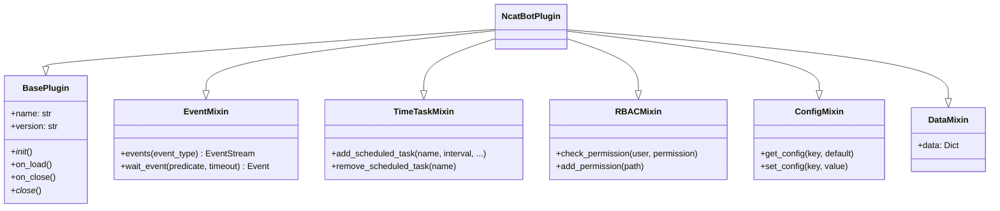

# 插件系统参考

> 插件基类、Mixin、生命周期的完整 API 参考

**源码位置**：`ncatbot/plugin/`

---

## Quick Start

继承 `NcatBotPlugin`，定义 `name` 和 `version`，覆写 `on_load` 即可创建插件：

```python
from ncatbot.plugin import NcatBotPlugin


class MyPlugin(NcatBotPlugin):
    name = "my_plugin"
    version = "1.0.0"

    async def on_load(self):
        # 配置管理
        self.set_config("greeting", "hello")
        # 定时任务
        self.add_scheduled_task("tick", "60s")
        # 事件消费
        async with self.events("message") as stream:
            async for event in stream:
                await self.api.send_msg(event, event.raw_message)

    async def on_close(self):
        pass  # Mixin 钩子自动清理
```

> 完整属性和方法参见 [基类详解](1_base_class.md)，Mixin 接口参见 [Mixin 详解](2_mixins.md)。

---

## 基类与 Mixin 速查

### 架构概览

NcatBot 插件系统采用 **Mixin 组合模式**，将各能力拆分为独立 Mixin，
通过多继承组合到 `NcatBotPlugin` 中：



### 继承关系

```python
class NcatBotPlugin(
    BasePlugin, EventMixin, TimeTaskMixin, RBACMixin, ConfigMixin, DataMixin
): ...
```

插件开发者应始终继承 `NcatBotPlugin`，而非直接继承 `BasePlugin`。

### 元数据属性

| 属性 | 类型 | 必填 | 默认值 | 说明 |
|------|------|:----:|--------|------|
| `name` | `str` | ✅ | — | 插件唯一标识 |
| `version` | `str` | ✅ | — | 语义化版本号 |
| `author` | `str` | — | `"Unknown"` | 作者信息 |
| `description` | `str` | — | `""` | 插件描述 |
| `dependencies` | `Dict[str, str]` | — | `{}` | 插件间依赖，格式 `{插件名: 版本约束}` |

### 运行时注入属性

以下属性由框架在实例化时自动注入，插件代码中可直接使用：

| 属性 | 类型 | 说明 |
|------|------|------|
| `workspace` | `Path` | 插件工作目录（`data/<plugin_name>/`） |
| `api` | `BotAPIClient` | Bot API 客户端，调用 OneBot v11 接口 |
| `services` | `ServiceManager` | 服务管理器，可获取 RBAC、定时任务等内置服务 |
| `debug` | `bool` | 调试模式标志（只读属性） |

### 工具方法

| 方法 | 签名 | 说明 |
|------|------|------|
| `list_plugins` | `() -> List[str]` | 所有已加载插件名称 |
| `get_plugin` | `(name: str) -> Optional[BasePlugin]` | 按名称获取插件实例 |
| `meta_data` | `@property -> Dict[str, Any]` | 返回插件元数据字典 |

### Mixin 方法速查表

#### EventMixin — 事件流消费

| 方法 | 签名 | 说明 |
|------|------|------|
| `events` | `(event_type=None) -> EventStream` | 创建事件流，支持类型过滤 |
| `wait_event` | `(predicate=None, timeout=None) -> Event` | 等待单个匹配事件 |

#### TimeTaskMixin — 定时任务

| 方法 | 签名 | 说明 |
|------|------|------|
| `add_scheduled_task` | `(name, interval, conditions=None, max_runs=None) -> bool` | 添加定时任务 |
| `remove_scheduled_task` | `(name) -> bool` | 移除任务 |
| `get_task_status` | `(name) -> Optional[Dict]` | 查询任务状态 |
| `list_scheduled_tasks` | `() -> List[str]` | 列出所有任务名 |
| `cleanup_scheduled_tasks` | `() -> None` | 清理所有任务（通常自动调用） |

#### RBACMixin — 权限管理

| 方法 | 签名 | 说明 |
|------|------|------|
| `check_permission` | `(user, permission) -> bool` | 检查权限 |
| `add_permission` | `(path) -> None` | 注册权限路径 |
| `remove_permission` | `(path) -> None` | 移除权限 |
| `add_role` | `(role, exist_ok=True) -> None` | 创建角色 |
| `user_has_role` | `(user, role) -> bool` | 检查用户角色 |

#### ConfigMixin — 配置持久化

| 方法 | 签名 | 说明 |
|------|------|------|
| `get_config` | `(key, default=None) -> Any` | 读取配置 |
| `set_config` | `(key, value) -> None` | 设置配置（立即持久化） |
| `remove_config` | `(key) -> bool` | 移除配置 |
| `update_config` | `(updates: Dict) -> None` | 批量更新配置 |

#### DataMixin — 数据持久化

| 属性/方法 | 类型 | 说明 |
|-----------|------|------|
| `self.data` | `Dict[str, Any]` | 数据字典，卸载时自动持久化到 `data.json` |
| `self._save_data()` | `-> None` | 手动立即保存（通常无需调用） |

### 聚合能力概览

继承 `NcatBotPlugin` 后自动获得以下能力：

| 能力 | 来源 Mixin | 核心接口 |
|------|-----------|----------|
| 事件流消费 | EventMixin | `self.events()`, `self.wait_event()` |
| 定时任务 | TimeTaskMixin | `self.add_scheduled_task()`, `self.remove_scheduled_task()` |
| 权限管理 | RBACMixin | `self.check_permission()`, `self.add_permission()` |
| 配置持久化 | ConfigMixin | `self.get_config()`, `self.set_config()` |
| 数据持久化 | DataMixin | `self.data` 字典 |
| 插件间访问 | BasePlugin | `self.get_plugin()`, `self.list_plugins()` |
| Bot API | 注入属性 | `self.api` |

---

## 生命周期速查

### 加载顺序

```text
1. 创建 workspace 目录
2. _mixin_load() — 按 MRO 正序：
   EventMixin → TimeTaskMixin → RBACMixin → ConfigMixin → DataMixin
3. _init_()  — 同步初始化钩子
4. on_load() — 异步初始化（主业务逻辑）
```

### 卸载顺序

```text
1. _close_()  — 同步清理钩子
2. on_close() — 异步清理
3. _mixin_unload() — 按 MRO 正序：
   EventMixin(关流) → TimeTaskMixin(清任务) → RBACMixin
   → ConfigMixin(存配置) → DataMixin(存数据)
```

### 生命周期方法一览

| 方法 | 签名 | 调用时机 | 说明 |
|------|------|----------|------|
| `_init_` | `() -> None` | `on_load` 之前 | 同步初始化钩子 |
| `on_load` | `async () -> None` | 加载阶段 | 异步初始化，主业务逻辑 |
| `_close_` | `() -> None` | `on_close` 之前 | 同步清理钩子 |
| `on_close` | `async () -> None` | 卸载阶段 | 异步清理 |

> ⚠️ `__onload__` 和 `__unload__` 是框架内部方法，子类**不应重写**。

### Mixin 钩子协议

每个 Mixin 可声明以下方法参与插件生命周期：

| 方法 | 说明 |
|------|------|
| `_mixin_load(self)` | 加载时调用，支持 sync / async |
| `_mixin_unload(self)` | 卸载时调用，支持 sync / async |

框架通过 `_run_mixin_hooks(hook_name)` 按 MRO 顺序收集并执行所有 Mixin 钩子，
单个钩子失败不影响其余钩子。

---

## 深入阅读

| 文档 | 内容 |
|------|------|
| [基类详解](1_base_class.md) | NCatBotPlugin 完整 API — 属性、方法、继承关系、PluginManifest、PluginLoader、依赖解析 |
| [Mixin 详解](2_mixins.md) | EventMixin / TimeTaskMixin / RBACMixin / ConfigMixin / DataMixin 完整 API |
| [架构文档](../../architecture.md) | 系统架构与设计理念 |
| [开发指南](../../guide/) | 插件开发教程 |
