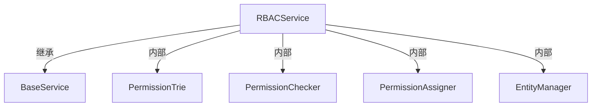

# RBACService — 角色权限控制

> 源码：`ncatbot/service/builtin/rbac/service.py`
> 服务名称：`"rbac"`
> 数据文件：`data/rbac.json`

提供用户、角色、权限的管理功能，支持通配符路径匹配、角色继承、黑白名单机制。

---

## 初始化参数

```python
class RBACService(BaseService):
    name = "rbac"

    def __init__(
        self,
        storage_path: Optional[str] = "data/rbac.json",
        default_role: Optional[str] = None,
        case_sensitive: bool = True,
        **config,
    ):
```

| 参数 | 类型 | 默认值 | 说明 |
|---|---|---|---|
| `storage_path` | `str \| None` | `"data/rbac.json"` | 持久化文件路径，`None` 则不持久化 |
| `default_role` | `str \| None` | `None` | 默认角色名，服务加载时自动创建 |
| `case_sensitive` | `bool` | `True` | 权限路径是否区分大小写 |

**只读属性：**

| 属性 | 类型 | 说明 |
|---|---|---|
| `users` | `Dict[str, Dict]` | 所有用户数据 |
| `roles` | `Dict[str, Dict]` | 所有角色数据 |

**内部组件依赖：**



---

## 权限路径管理

| 方法 | 签名 | 说明 |
|---|---|---|
| `add_permission` | `add_permission(path: str) -> None` | 注册权限路径 |
| `remove_permission` | `remove_permission(path: str) -> None` | 移除权限路径 |
| `permission_exists` | `permission_exists(path: str) -> bool` | 检查权限路径是否存在 |

权限路径采用点号分隔的层级结构，支持通配符匹配：

```python
rbac = manager.rbac

# 注册权限路径
rbac.add_permission("admin.panel")
rbac.add_permission("admin.users.manage")
rbac.add_permission("plugin.echo.use")

# 检查
rbac.permission_exists("admin.panel")  # True
```

---

## 角色管理

| 方法 | 签名 | 说明 |
|---|---|---|
| `add_role` | `add_role(role: str, exist_ok: bool = False) -> None` | 创建角色 |
| `remove_role` | `remove_role(role: str) -> None` | 删除角色 |
| `role_exists` | `role_exists(role: str) -> bool` | 检查角色是否存在 |
| `set_role_inheritance` | `set_role_inheritance(role: str, parent: str) -> None` | 设置角色继承关系 |

```python
# 创建角色
rbac.add_role("admin")
rbac.add_role("moderator")

# 角色继承：admin 继承 moderator 的所有权限
rbac.set_role_inheritance("admin", "moderator")
```

---

## 用户管理

| 方法 | 签名 | 说明 |
|---|---|---|
| `add_user` | `add_user(user: str, exist_ok: bool = False) -> None` | 添加用户 |
| `remove_user` | `remove_user(user: str) -> None` | 删除用户 |
| `user_exists` | `user_exists(user: str) -> bool` | 检查用户是否存在 |
| `user_has_role` | `user_has_role(user: str, role: str, create_user: bool = True) -> bool` | 检查用户是否拥有指定角色 |
| `assign_role` | `assign_role(target_type: Literal["user"], user: str, role: str, create_user: bool = True) -> None` | 为用户分配角色 |
| `unassign_role` | `unassign_role(target_type: Literal["user"], user: str, role: str) -> None` | 取消用户的角色 |

```python
# 用户管理
rbac.add_user("user_123")
rbac.assign_role("user", "user_123", "admin")
rbac.user_has_role("user_123", "admin")  # True
```

---

## 权限分配

| 方法 | 签名 | 说明 |
|---|---|---|
| `grant` | `grant(target_type: Literal["user", "role"], target: str, permission: str, mode: Literal["white", "black"] = "white", create_permission: bool = True) -> None` | 授予权限 |
| `revoke` | `revoke(target_type: Literal["user", "role"], target: str, permission: str) -> None` | 撤销权限 |

**模式说明：**

| 模式 | 含义 |
|---|---|
| `"white"` | 白名单模式（默认） — 允许访问 |
| `"black"` | 黑名单模式 — 禁止访问，**优先级高于白名单** |

```python
# 给角色授权（白名单）
rbac.grant("role", "admin", "admin.panel")
rbac.grant("role", "moderator", "plugin.echo.use")

# 给用户单独黑名单
rbac.grant("user", "user_456", "admin.panel", mode="black")

# 撤销权限
rbac.revoke("role", "moderator", "plugin.echo.use")
```

---

## 权限检查

```python
def check(self, user: str, permission: str, create_user: bool = True) -> bool:
```

| 参数 | 类型 | 说明 |
|---|---|---|
| `user` | `str` | 用户标识 |
| `permission` | `str` | 权限路径 |
| `create_user` | `bool` | 用户不存在时是否自动创建，默认 `True` |

**检查优先级：** 黑名单 > 白名单。用户的有效权限 = 自身权限 ∪ 所有角色权限（含继承）。

```python
rbac.check("user_123", "admin.panel")       # True（admin 角色有此权限）
rbac.check("user_456", "admin.panel")       # False（被黑名单禁止）
rbac.check("unknown_user", "admin.panel")   # False（无角色、无权限）
```

---

## 持久化

```python
def save(self, path: Optional[Path] = None) -> None:
```

手动将当前 RBAC 数据保存到文件。不传 `path` 时使用初始化时的 `storage_path`。

- **自动保存：** 服务关闭（`on_close()`）时自动调用 `save()`
- **自动加载：** 服务启动（`on_load()`）时自动从 `storage_path` 加载数据
- **数据格式：** JSON，存储于 `data/rbac.json`

---

## 完整示例

```python
from ncatbot.service import ServiceManager
from ncatbot.service import RBACService

manager = ServiceManager()
manager.register(RBACService, storage_path="data/rbac.json", default_role="user")
await manager.load_all()

rbac = manager.rbac

# 建立权限体系
rbac.add_permission("admin.panel")
rbac.add_permission("plugin.echo.use")
rbac.add_role("admin")
rbac.add_role("user", exist_ok=True)
rbac.set_role_inheritance("admin", "user")

# 给角色授权
rbac.grant("role", "user", "plugin.echo.use")
rbac.grant("role", "admin", "admin.panel")

# 用户管理
rbac.assign_role("user", "qq_123456", "admin")
rbac.check("qq_123456", "admin.panel")      # True
rbac.check("qq_123456", "plugin.echo.use")  # True（继承自 user 角色）

# 手动保存
rbac.save()
```

---

> **相关文档：**
> - [服务层总览](./README.md)
> - [定时任务与文件监控](./2_config_task_service.md)
