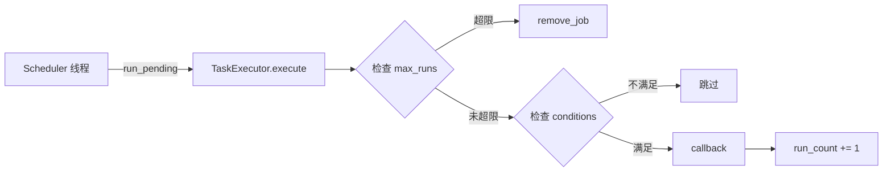

# 定时任务与文件监控

> TimeTaskService / FileWatcherService 详解及服务交互流程。

---

## TimeTaskService — 定时任务

> 源码：`ncatbot/service/builtin/schedule/service.py`
> 服务名称：`"time_task"`
> 依赖：`schedule` 库

基于 `schedule` 库的线程安全定时任务调度服务，通过回调槽通知任务触发。

### 时间格式

`TimeTaskParser`（`ncatbot/service/builtin/schedule/parser.py`）支持以下时间格式：

| 类型 | 格式 | 示例 | 说明 |
|---|---|---|---|
| 一次性 | `YYYY-MM-DD HH:MM:SS` | `"2026-12-31 23:59:59"` | 指定时间执行一次 |
| 一次性 | `YYYY:MM:DD-HH:MM:SS` | `"2026:12:31-23:59:59"` | 同上（备选格式） |
| 每日 | `HH:MM` | `"08:30"` | 每天指定时刻执行 |
| 间隔 | `<数值><单位>` | `"30s"` / `"2h"` / `"0.5d"` | 单位：`s`(秒) `m`(分) `h`(时) `d`(天) |
| 间隔 | `HH:MM:SS` | `"01:30:00"` | 冒号分隔的 时:分:秒 |
| 间隔 | 自然语言 | `"2天3小时5秒"` | 中文自然语言格式 |

### 任务管理 API

| 方法 | 签名 | 说明 |
|---|---|---|
| `add_job` | `add_job(name, interval, callback, conditions=None, max_runs=None, plugin_name=None) -> bool` | 添加定时任务 |
| `remove_job` | `remove_job(name: str) -> bool` | 移除指定任务 |
| `get_job_status` | `get_job_status(name: str) -> Optional[Dict[str, Any]]` | 获取任务状态 |
| `list_jobs` | `list_jobs() -> List[str]` | 列出所有任务名称 |

**只读属性：**

| 属性 | 类型 | 说明 |
|---|---|---|
| `is_running` | `bool` | 调度线程是否正在运行 |
| `job_count` | `int` | 当前任务数量 |

**`add_job` 参数详解：**

| 参数 | 类型 | 说明 |
|---|---|---|
| `name` | `str` | 任务唯一标识，重复添加会失败 |
| `interval` | `str \| int \| float` | 调度时间参数，支持上表中所有格式 |
| `callback` | `Callable[[], None]` | 任务触发时调用的回调函数（在调度线程中执行） |
| `conditions` | `List[Callable[[], bool]] \| None` | 执行条件列表，所有条件返回 `True` 时才执行 |
| `max_runs` | `int \| None` | 最大执行次数，`None` 为无限次 |
| `plugin_name` | `str \| None` | 关联的插件名称 |

**`get_job_status` 返回值：**

```python
{
    "name": "heartbeat",
    "next_run": datetime(2026, 3, 15, 12, 0, 0),
    "run_count": 42,
    "max_runs": None,
}
```

### 回调机制

每个任务通过 `add_job(callback=...)` 绑定回调，`TaskExecutor` 在调度线程中直接调用：



> **插件开发者**通常使用 `TimeTaskMixin.add_scheduled_task(name, interval)`，框架自动查找同名方法作为 callback。也可显式传入 `callback` 参数。

### 完整示例

```python
# 通过插件 Mixin（推荐）
class MyPlugin(NcatBotPlugin):
    async def on_load(self):
        self.add_scheduled_task("heartbeat", "30s")

    async def heartbeat(self):
        print("heartbeat")

# 直接使用服务
tt = manager.time_task
tt.add_job("my_task", "10s", callback=lambda: print("tick"))
```

---

## FileWatcherService — 文件监控

> 源码：`ncatbot/service/builtin/file_watcher/service.py`
> 服务名称：`"file_watcher"`

监视插件目录中的 `.py` 文件变化，支持防抖、暂停/恢复、全局配置文件监控。

### 监控目录配置

通过 `add_watch_dir()` 添加需要监控的目录，服务会递归扫描目录下所有 `.py` 文件的修改时间（mtime）。

**配置常量：**

| 常量 | 值 | 说明 |
|---|---|---|
| `DEFAULT_WATCH_INTERVAL` | `1.0` 秒 | 扫描间隔（正常模式） |
| `DEFAULT_DEBOUNCE_DELAY` | `1.0` 秒 | 防抖延迟（正常模式） |
| `FAST_WATCH_INTERVAL` | `0.02` 秒 | 扫描间隔（测试模式） |
| `FAST_DEBOUNCE_DELAY` | `0.02` 秒 | 防抖延迟（测试模式） |

> **注意：** 文件变化检测仅在初始化时传入 `debug_mode=True` 时触发回调。

### 公开 API

| 方法/属性 | 签名 | 说明 |
|---|---|---|
| `add_watch_dir` | `add_watch_dir(directory: str) -> None` | 添加监控目录（自动转为绝对路径） |
| `pause` | `pause() -> None` | 暂停回调处理（扫描线程仍在运行） |
| `resume` | `resume() -> None` | 恢复回调处理 |
| `is_watching` | `bool`（只读属性） | 监控线程是否正在运行 |
| `pending_count` | `int`（只读属性） | 待处理的变更插件目录数量 |

### 回调机制

`FileWatcherService` 提供两个回调槽：

**1. 插件文件变化回调：**

```python
on_file_changed: Optional[Callable[[str], None]]
```

- **参数**：发生变化的插件一级目录名（非完整路径）
- **触发条件**：`debug_mode=True` 且插件目录下 `.py` 文件发生增删改
- **防抖机制**：在 `DEFAULT_DEBOUNCE_DELAY` 窗口内合并同一目录的多次变更

**2. 全局配置文件变化回调：**

```python
on_config_changed: Optional[Callable[[], None]]
```

- 自动监听 `config.yaml` 文件的修改时间（mtime）变化
- 在 `on_load()` 时自动设置

**文件变化处理流程：**

```python
flowchart TD
    A[Watcher 线程] -->|扫描 .py 文件| B{mtime 变化?}
    B -->|否| A
    B -->|是| C[记录到 pending_dirs]
    C --> D{防抖延迟到期?}
    D -->|否| A
    D -->|是| E{paused?}
    E -->|是| A
    E -->|否| F[on_file_changed 回调]
    F --> A
```

### 完整示例

```python
from ncatbot.service import ServiceManager
from ncatbot.service import FileWatcherService

manager = ServiceManager()
manager.register(FileWatcherService, debug_mode=True)
await manager.load_all()

fw = manager.file_watcher

# 添加监控目录
fw.add_watch_dir("plugins")

# 设置回调
def on_plugin_changed(plugin_dir: str):
    print(f"插件变化: {plugin_dir}")

def on_config_reload():
    print("全局配置文件已修改")

fw.on_file_changed = on_plugin_changed
fw.on_config_changed = on_config_reload

# 暂停/恢复（热重载期间暂停避免重复触发）
fw.pause()
# ... 执行热重载操作 ...
fw.resume()

# 查询状态
print(fw.is_watching)     # True
print(fw.pending_count)   # 0
```

---

## 服务交互流程

以下展示框架启动时服务层的完整交互流程：

```text
sequenceDiagram
    participant App as BotClient
    participant SM as ServiceManager
    participant RBAC as RBACService
    participant TT as TimeTaskService
    participant FW as FileWatcherService

    App->>SM: register_builtin(debug=True)
    SM->>SM: register(RBACService, ...)
    SM->>SM: register(FileWatcherService, ...)
    SM->>SM: register(TimeTaskService)

    App->>SM: set_event_callback(handler)
    App->>SM: load_all()

    SM->>SM: _topological_sort()
    SM->>RBAC: emit_event = callback
    SM->>RBAC: on_load()
    RBAC-->>SM: 加载 rbac.json 数据

    SM->>TT: emit_event = callback
    SM->>TT: on_load()
    TT-->>SM: 启动调度线程

    SM->>FW: emit_event = callback
    SM->>FW: on_load()
    FW-->>SM: 启动监控线程

    Note over App,FW: === Bot 运行中 ===

    App->>SM: close_all()
    SM->>FW: on_close()
    FW-->>SM: 停止监控线程
    SM->>TT: on_close()
    TT-->>SM: 停止调度线程
    SM->>RBAC: on_close()
    RBAC-->>SM: 保存 rbac.json
```

---

> **相关文档：**
> - [服务层总览](./README.md)
> - [RBACService 完整 API](./1_rbac_service.md)
