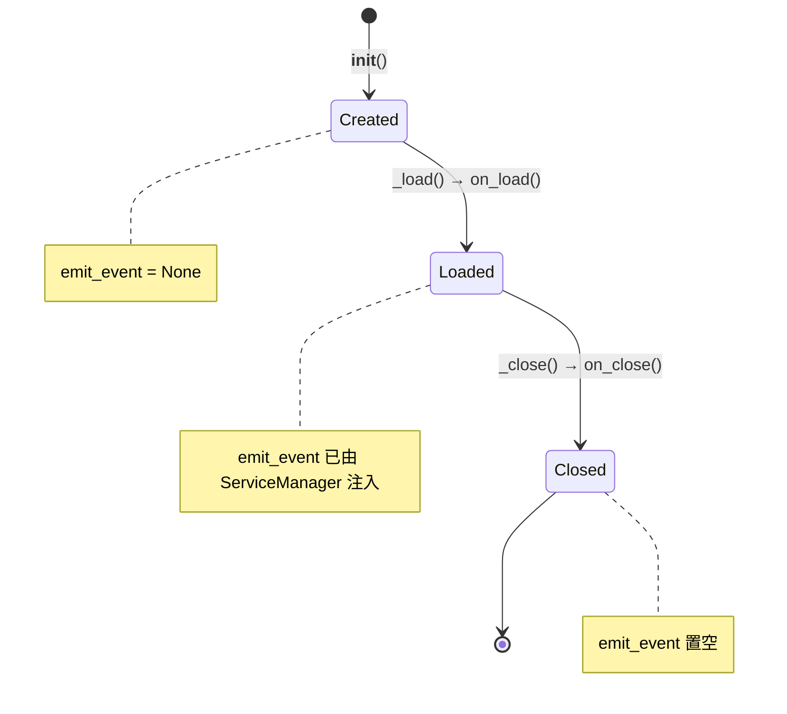

# 服务层参考

> RBAC / 定时任务 / 文件监控等服务组件参考。服务层位于 `ncatbot/service/`，与插件系统解耦，由 `ServiceManager` 统一编排。

---

## Quick Start

**导入方式：**

```python
from ncatbot.service import BaseService, ServiceManager
from ncatbot.service import RBACService, TimeTaskService, FileWatcherService
```

**获取服务实例并调用：**

```python
# 创建管理器 & 注册内置服务
manager = ServiceManager()
manager.register_builtin(debug=True)

# 设置事件回调（可选）
manager.set_event_callback(my_event_handler)

# 加载所有服务
await manager.load_all()

# 通过快捷属性访问（IDE 自动补全友好）
manager.rbac.check("user_123", "admin.panel")
manager.time_task.add_job("heartbeat", "30s", callback=lambda: print("beat"))

# 关闭
await manager.close_all()
```

**目录结构：**

```python
ncatbot/service/
├── __init__.py          # 导出 BaseService, ServiceManager
├── base.py              # 服务基类
├── manager.py           # 服务管理器
└── builtin/
    ├── rbac/            # RBAC 角色权限服务
    ├── schedule/        # 定时任务服务
    └── file_watcher/    # 文件监控服务
```

---

## 服务清单与方法速查

### BaseService — 服务基类

> 源码：`ncatbot/service/base.py`

所有服务必须继承 `BaseService` 并实现 `on_load()` / `on_close()` 生命周期钩子。

**类属性：**

| 属性 | 类型 | 默认值 | 说明 |
|---|---|---|---|
| `name` | `str` | `None`（**必须定义**） | 服务唯一标识名称 |
| `description` | `str` | `"未提供描述"` | 服务描述信息 |
| `dependencies` | `list` | `[]` | 依赖的其他服务名称列表 |

**实例属性：**

| 属性 | 类型 | 说明 |
|---|---|---|
| `config` | `dict` | 初始化时传入的配置参数 |
| `emit_event` | `EventCallback \| None` | 事件发布回调，由 `ServiceManager` 在加载时注入 |
| `is_loaded` | `bool`（只读属性） | 服务是否已加载 |

**生命周期钩子：**

```python
class BaseService(ABC):

    @abstractmethod
    async def on_load(self) -> None:
        """服务加载时调用 — 分配资源、启动后台线程"""

    @abstractmethod
    async def on_close(self) -> None:
        """服务关闭时调用 — 释放资源、停止后台线程"""
```

**生命周期流程：**



> **注意：** `__init__()` 只做轻量级初始化，所有异步资源分配（线程启动、文件 I/O 等）应在 `on_load()` 中完成。

**emit_event 回调：**

```python
EventCallback = Callable[["BaseEventData"], Awaitable[None]]
```

`emit_event` 由 `ServiceManager` 在调用 `load()` 时注入，允许服务向框架事件系统发布自定义事件。服务关闭时自动置为 `None`。

**自定义服务示例：**

```python
from ncatbot.service import BaseService

class MyService(BaseService):
    name = "my_service"
    description = "自定义服务示例"
    dependencies = ["rbac"]  # 声明依赖，确保加载顺序

    def __init__(self, **config):
        super().__init__(**config)
        self._data = {}

    async def on_load(self) -> None:
        self._data = {"ready": True}

    async def on_close(self) -> None:
        self._data.clear()
```

---

### ServiceManager — 服务管理器

> 源码：`ncatbot/service/manager.py`

管理所有服务的注册、加载（按依赖拓扑排序）、卸载与获取。

**注册与加载：**

| 方法 | 签名 | 说明 |
|---|---|---|
| `register` | `register(service_class: Type[BaseService], **config: Any) -> None` | 注册服务类及其配置参数 |
| `register_builtin` | `register_builtin(*, debug: bool = False) -> None` | 一次性注册所有内置服务 |
| `load` | `async load(service_name: str) -> BaseService` | 加载单个服务（含 `emit_event` 注入） |
| `unload` | `async unload(service_name: str) -> None` | 卸载单个服务 |
| `load_all` | `async load_all() -> None` | 按依赖拓扑排序加载所有已注册服务 |
| `close_all` | `async close_all() -> None` | 逆序关闭所有已加载服务 |

**获取与查询：**

| 方法 | 签名 | 说明 |
|---|---|---|
| `get` | `get(service_name: str) -> Optional[BaseService]` | 获取已加载的服务实例，未找到返回 `None` |
| `has` | `has(service_name: str) -> bool` | 检查服务是否已加载 |
| `list_services` | `list_services() -> List[str]` | 列出所有已加载的服务名称 |

```python
# 获取服务实例
rbac = manager.get("rbac")

# 检查服务状态
if manager.has("time_task"):
    task_service = manager.get("time_task")

# 列出所有服务
print(manager.list_services())  # ['rbac', 'file_watcher', 'time_task']
```

**内置服务快捷属性：**

| 属性 | 返回类型 | 对应服务名称 |
|---|---|---|
| `rbac` | `RBACService` | `"rbac"` |
| `file_watcher` | `FileWatcherService` | `"file_watcher"` |
| `time_task` | `TimeTaskService` | `"time_task"` |

**依赖拓扑排序：**

`ServiceManager` 内部使用 **Kahn 算法** 对服务的 `dependencies` 进行拓扑排序，确保被依赖的服务先加载。若存在循环依赖，`load_all()` 将抛出 `ValueError`。

---

### RBACService — 角色权限控制

> 服务名称：`"rbac"` · 数据文件：`data/rbac.json`

| 方法 | 签名 | 说明 |
|---|---|---|
| `add_permission` | `add_permission(path: str) -> None` | 注册权限路径 |
| `remove_permission` | `remove_permission(path: str) -> None` | 移除权限路径 |
| `permission_exists` | `permission_exists(path: str) -> bool` | 检查权限路径是否存在 |
| `add_role` | `add_role(role: str, exist_ok: bool = False) -> None` | 创建角色 |
| `remove_role` | `remove_role(role: str) -> None` | 删除角色 |
| `set_role_inheritance` | `set_role_inheritance(role: str, parent: str) -> None` | 设置角色继承关系 |
| `add_user` | `add_user(user: str, exist_ok: bool = False) -> None` | 添加用户 |
| `remove_user` | `remove_user(user: str) -> None` | 删除用户 |
| `assign_role` | `assign_role(target_type, user, role, create_user=True) -> None` | 分配角色 |
| `grant` | `grant(target_type, target, permission, mode="white", create_permission=True) -> None` | 授予权限 |
| `revoke` | `revoke(target_type, target, permission) -> None` | 撤销权限 |
| `check` | `check(user: str, permission: str, create_user: bool = True) -> bool` | 权限检查 |
| `save` | `save(path: Optional[Path] = None) -> None` | 持久化保存 |

---

### TimeTaskService — 定时任务

> 服务名称：`"time_task"` · 依赖：`schedule` 库

| 方法 | 签名 | 说明 |
|---|---|---|
| `add_job` | `add_job(name, interval, callback, conditions=None, max_runs=None, plugin_name=None) -> bool` | 添加定时任务 |
| `remove_job` | `remove_job(name: str) -> bool` | 移除指定任务 |
| `get_job_status` | `get_job_status(name: str) -> Optional[Dict[str, Any]]` | 获取任务状态 |
| `list_jobs` | `list_jobs() -> List[str]` | 列出所有任务名称 |

| 属性 | 类型 | 说明 |
|---|---|---|
| `is_running` | `bool` | 调度线程是否正在运行 |
| `job_count` | `int` | 当前任务数量 |

---

### FileWatcherService — 文件监控

> 服务名称：`"file_watcher"`

| 方法/属性 | 签名 | 说明 |
|---|---|---|
| `add_watch_dir` | `add_watch_dir(directory: str) -> None` | 添加监控目录 |
| `pause` | `pause() -> None` | 暂停回调处理 |
| `resume` | `resume() -> None` | 恢复回调处理 |
| `is_watching` | `bool`（只读属性） | 监控线程是否正在运行 |
| `pending_count` | `int`（只读属性） | 待处理的变更插件目录数量 |
| `on_file_changed` | `Callable[[str], None]` | 插件文件变化回调槽 |
| `on_config_changed` | `Callable[[], None]` | 全局配置变化回调槽 |

---

## 深入阅读

| 文档 | 说明 |
|---|---|
| [RBACService 完整 API](./1_rbac_service.md) | 权限路径、角色管理、用户管理、权限分配与检查、持久化 |
| [定时任务与文件监控](./2_config_task_service.md) | TimeTaskService / FileWatcherService 详解 + 服务交互流程 |
| [架构概览](../../architecture.md) | 全局架构与模块关系 |
| [插件系统参考](../plugin/) | 插件如何使用服务 |
