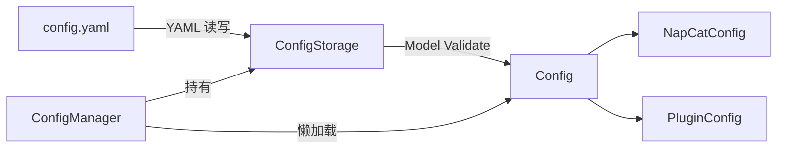

# 配置管理

> ConfigManager、Config / NapCatConfig / PluginConfig 模型、ConfigStorage 完整 API。

**源码位置**：`ncatbot/utils/config/`

---

## 配置架构

配置系统由三层组成：**数据模型**（Pydantic）→ **存储后端**（YAML）→ **管理器**（对外接口）。



### ConfigManager

对外暴露的主要配置接口，支持懒加载、嵌套键读写和安全检查。

```python
from ncatbot.utils.config.manager import ConfigManager, get_config_manager

# 单例获取
cm = get_config_manager()                    # 默认路径
cm = get_config_manager("dev/config.yaml")   # 指定路径
```

#### 构造函数

```python
class ConfigManager:
    def __init__(self, path: Optional[str] = None): ...
```

| 参数 | 类型 | 默认值 | 说明 |
|------|------|--------|------|
| `path` | `Optional[str]` | `None` | 配置文件路径，`None` 时使用环境变量 `NCATBOT_CONFIG_PATH` 或 `./config.yaml` |

#### 属性

| 属性 | 类型 | 说明 |
|------|------|------|
| `config` | `Config` | 主配置对象（懒加载，首次访问时从文件读取） |
| `napcat` | `NapCatConfig` | NapCat 连接子配置 |
| `plugin` | `PluginConfig` | 插件子配置 |
| `bot_uin` | `str` | 机器人 QQ 号 |
| `root` | `str` | 管理员 QQ 号 |
| `debug` | `bool` | 调试模式开关（可写） |

#### 方法

| 方法 | 签名 | 说明 |
|------|------|------|
| `reload` | `() -> Config` | 从文件重新加载配置 |
| `save` | `() -> None` | 将当前配置写回文件 |
| `update_value` | `(key: str, value) -> None` | 更新配置项，支持嵌套键如 `"napcat.ws_uri"` |
| `update_napcat` | `(**kwargs) -> None` | 批量更新 NapCat 子配置 |
| `get_uri_with_token` | `() -> str` | 返回带 `access_token` 参数的 WS URI |
| `is_local` | `() -> bool` | 判断 WS 连接是否为本地 |
| `is_default_uin` | `() -> bool` | 判断 QQ 号是否为默认值 |
| `is_default_root` | `() -> bool` | 判断管理员号是否为默认值 |
| `get_security_issues` | `(auto_fix: bool = True) -> List[str]` | 安全检查，`auto_fix=True` 时自动修复弱 token |
| `get_issues` | `() -> List[str]` | 返回所有配置问题（安全 + 必填项） |
| `ensure_plugins_dir` | `() -> None` | 确保插件目录存在 |

#### 工厂函数

```python
def get_config_manager(path: Optional[str] = None) -> ConfigManager
```

获取全局单例。传入 `path` 时会重新创建实例。

### Config 模型

主配置模型，聚合所有子配置。继承自 `BaseConfig`（Pydantic `BaseModel`，启用 `validate_assignment` 和 `extra="allow"`）。

| 字段 | 类型 | 默认值 | 说明 |
|------|------|--------|------|
| `napcat` | `NapCatConfig` | `NapCatConfig()` | NapCat 连接配置 |
| `plugin` | `PluginConfig` | `PluginConfig()` | 插件配置 |
| `bot_uin` | `str` | `"123456"` | 机器人 QQ 号 |
| `root` | `str` | `"123456"` | 管理员 QQ 号 |
| `debug` | `bool` | `False` | 调试模式 |
| `enable_webui_interaction` | `bool` | `True` | 启用 WebUI 交互 |
| `github_proxy` | `Optional[str]` | 环境变量 `GITHUB_PROXY` | GitHub 代理地址 |
| `check_ncatbot_update` | `bool` | `True` | 启动时检查 NcatBot 更新 |
| `skip_ncatbot_install_check` | `bool` | `False` | 跳过安装检查 |
| `websocket_timeout` | `int` | `15` | WebSocket 超时秒数（最小 1） |

**验证器**：`bot_uin`、`root` 自动转换为字符串；`websocket_timeout` 强制最小值为 1。

**对应 YAML 示例**：

```yaml
bot_uin: "1234567890"
root: "9876543210"
debug: false
websocket_timeout: 15
napcat:
  ws_uri: "ws://localhost:3001"
  ws_token: "your_token"
plugin:
  plugins_dir: "plugins"
  load_plugin: true
```

### NapCatConfig 模型

NapCat 客户端连接配置。

| 字段 | 类型 | 默认值 | 说明 |
|------|------|--------|------|
| `ws_uri` | `str` | `"ws://localhost:3001"` | WebSocket 连接地址 |
| `ws_token` | `str` | `"napcat_ws"` | WebSocket 认证令牌 |
| `ws_listen_ip` | `str` | `"localhost"` | WS 监听 IP |
| `webui_uri` | `str` | `"http://localhost:6099"` | WebUI 地址 |
| `webui_token` | `str` | `"napcat_webui"` | WebUI 认证令牌 |
| `enable_webui` | `bool` | `True` | 启用 WebUI |
| `enable_update_check` | `bool` | `False` | 启用 NapCat 更新检查 |
| `stop_napcat` | `bool` | `False` | 关闭时停止 NapCat |
| `skip_setup` | `bool` | `False` | 跳过 NapCat 初始化 |

**计算属性（只读）**：

| 属性 | 类型 | 说明 |
|------|------|------|
| `ws_host` | `Optional[str]` | 从 `ws_uri` 解析的主机名 |
| `ws_port` | `Optional[int]` | 从 `ws_uri` 解析的端口号 |
| `webui_host` | `Optional[str]` | 从 `webui_uri` 解析的主机名 |
| `webui_port` | `Optional[int]` | 从 `webui_uri` 解析的端口号 |

**验证器**：`ws_uri` 自动补全 `ws://` 前缀；`webui_uri` 自动补全 `http://` 前缀。

### PluginConfig 模型

| 字段 | 类型 | 默认值 | 说明 |
|------|------|--------|------|
| `plugins_dir` | `str` | `"plugins"` | 插件目录路径 |
| `plugin_whitelist` | `List[str]` | `[]` | 插件白名单 |
| `plugin_blacklist` | `List[str]` | `[]` | 插件黑名单 |
| `load_plugin` | `bool` | `False` | 是否加载插件 |
| `auto_install_pip_deps` | `bool` | `True` | 是否允许自动安装插件 pip 依赖（仍会先询问用户确认） |
| `plugin_configs` | `Dict[str, Dict[str, Any]]` | `{}` | 全局配置中的插件配置覆盖，键为插件名 |

### ConfigStorage

YAML 文件读写后端。

| 方法 | 签名 | 说明 |
|------|------|------|
| `__init__` | `(path: Optional[str] = None)` | 路径默认取环境变量 `NCATBOT_CONFIG_PATH` 或 `./config.yaml` |
| `load` | `() -> Config` | 读取 YAML 并通过 `Config.model_validate()` 校验 |
| `save` | `(config: Config) -> None` | 序列化并原子写入（先写 `.tmp` 再 `os.replace`） |
| `exists` | `() -> bool` | 配置文件是否存在 |

> **安全特性**：写入操作使用临时文件 + `os.replace` 保证原子性，避免写入中断导致配置损坏。
