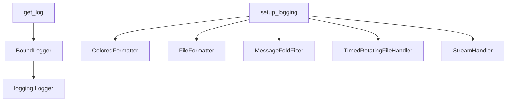

# 日志系统与网络工具

> BoundLogger、setup_logging、日志过滤器 / 格式化器、网络请求工具完整 API。

**源码位置**：`ncatbot/utils/logger/`、`ncatbot/utils/network.py`

---

## 1. 日志系统

日志系统基于标准库 `logging`，通过 `BoundLogger` 包装器提供上下文绑定能力。



### 1.1 get_log

获取 `BoundLogger` 实例的工厂函数。

```python
from ncatbot.utils import get_log

log = get_log("plugin.my_plugin")
log.info("启动完成")
```

```python
def get_log(name: Optional[str] = None) -> BoundLogger
```

| 参数 | 类型 | 默认值 | 说明 |
|------|------|--------|------|
| `name` | `Optional[str]` | `None` | Logger 名称，`None` 返回 root logger |

**级别策略**：通过 `get_log()` 创建的 logger 显式设为 `DEBUG` 级别，而第三方库 logger 继承 root 的 `INFO` 级别，其 `DEBUG` 自然不输出。

### 1.2 BoundLogger

包装标准 `logging.Logger`，支持 `bind` 上下文绑定。

```python
log = get_log("plugin.my_plugin")

# 绑定上下文 — 后续日志 extra 自动携带 user_id、group_id
log = log.bind(user_id="12345", group_id="67890")
log.info("收到消息")

# 移除上下文
log = log.unbind("group_id")
```

#### 核心方法

| 方法 | 签名 | 说明 |
|------|------|------|
| `bind` | `(**kwargs: Any) -> BoundLogger` | 返回携带新上下文的新实例（不可变） |
| `unbind` | `(*keys: str) -> BoundLogger` | 移除指定上下文键，返回新实例 |

#### 日志方法

| 方法 | 签名 | 说明 |
|------|------|------|
| `debug` | `(msg: str, *args, **kwargs)` | DEBUG 级别 |
| `info` | `(msg: str, *args, **kwargs)` | INFO 级别 |
| `warning` | `(msg: str, *args, **kwargs)` | WARNING 级别 |
| `error` | `(msg: str, *args, **kwargs)` | ERROR 级别 |
| `critical` | `(msg: str, *args, **kwargs)` | CRITICAL 级别 |
| `exception` | `(msg: str, *args, **kwargs)` | ERROR 级别 + 异常堆栈（自动 `exc_info=True`） |

#### 属性代理

| 属性/方法 | 类型 | 说明 |
|-----------|------|------|
| `name` | `str` | Logger 名称 |
| `level` | `int` | 当前日志级别 |
| `setLevel` | `(level: int \| str) -> None` | 设置日志级别 |
| `isEnabledFor` | `(level: int) -> bool` | 判断是否启用指定级别 |

### 1.3 setup_logging

全局日志初始化，应在应用启动时调用一次。内部做幂等保护（重复调用无效）。

```python
from ncatbot.utils.logger.setup import setup_logging

setup_logging(
    console_level="INFO",
    file_level="DEBUG",
    log_dir="./logs",
    backup_count=7,
)
```

```python
def setup_logging(
    *,
    console_level: str | None = None,
    file_level: str | None = None,
    log_dir: str | None = None,
    backup_count: int | None = None,
    routing_rules: Sequence[tuple[str, str]] | None = None,
) -> None
```

| 参数 | 类型 | 默认值 | 说明 |
|------|------|--------|------|
| `console_level` | `str \| None` | 环境变量 `LOG_LEVEL`，兜底 `"DEBUG"` | 控制台日志级别 |
| `file_level` | `str \| None` | 环境变量 `FILE_LOG_LEVEL`，兜底 `"DEBUG"` | 文件日志级别 |
| `log_dir` | `str \| None` | 环境变量 `LOG_FILE_PATH`，兜底 `"./logs"` | 日志目录 |
| `backup_count` | `int \| None` | 环境变量 `BACKUP_COUNT`，兜底 `7` | 日志保留天数 |
| `routing_rules` | `Sequence[tuple[str, str]] \| None` | `DEFAULT_ROUTING_RULES` | 日志路由规则 |

**初始化行为**：

1. 清理 `get_early_logger` 创建的临时 handler
2. 创建控制台 handler（`ColoredFormatter` + `MessageFoldFilter`）
3. 创建主文件 handler（`TimedRotatingFileHandler`，按日轮转）
4. 根据 `routing_rules` 创建子文件 handler，按 logger 名称正则匹配路由

**默认路由规则**：

| 正则模式 | 输出文件 |
|----------|----------|
| `database` | `db.log` |
| `network` | `network.log` |

### 1.4 日志过滤器

源码位置：`ncatbot/utils/logger/filters.py`

#### MessageFoldFilter

折叠超长消息和 base64 内容，防止日志膨胀。

| 行为 | 阈值 | 替换内容 |
|------|------|----------|
| base64 内容替换 | 连续 1000+ 字符的 base64 片段 | `[BASE64_CONTENT]` |
| 消息截断 | 总长超过 2000 字符 | 截断并附加 `...[TRUNCATED]` |

### 1.5 日志格式化器

源码位置：`ncatbot/utils/logger/formatter.py`

#### ColoredFormatter

控制台格式化器，根据日志级别动态切换颜色和格式模板。

```python
from ncatbot.utils.logger.formatter import ColoredFormatter

formatter = ColoredFormatter(datefmt="%H:%M:%S")
```

各级别输出格式示例（去除颜色码）：

```python
[14:30:05.123] DEBUG    plugin.demo 'ncatbot/plugin/demo.py:42' | 调试信息
[14:30:05.123] INFO     plugin.demo 'ncatbot/plugin/demo.py:50' ➜ 正常信息
[14:30:05.123] WARNING  plugin.demo 'ncatbot/plugin/demo.py:55' ➜ 警告信息
[14:30:05.123] ERROR    plugin.demo 'ncatbot/plugin/demo.py:60' ➜ 错误信息
[14:30:05.123] CRITICAL plugin.demo 'ncatbot/plugin/demo.py:70' ➜ 严重错误
```

#### FileFormatter

文件格式化器，无颜色码，固定格式。

```python
from ncatbot.utils.logger.formatter import FileFormatter

formatter = FileFormatter(datefmt="%Y-%m-%d %H:%M:%S")
```

输出格式：

```python
[2026-03-15 14:30:05.123] INFO     plugin.demo 'ncatbot/plugin/demo.py:50' ➜ 正常信息
```

> 两个 formatter 都会自动将文件路径转为项目根目录的相对路径。

---

## 2. 网络工具

基于标准库 `urllib` 的轻量网络请求封装，无需额外依赖（`download_file` 除外）。

源码位置：`ncatbot/utils/network.py`

```python
from ncatbot.utils import post_json, get_json, download_file
```

### 2.1 post_json

发送 JSON POST 请求并返回解析后的字典。

```python
def post_json(
    url: str,
    payload: Optional[dict] = None,
    headers: Optional[dict] = None,
    timeout: float = 5.0,
) -> dict
```

| 参数 | 类型 | 默认值 | 说明 |
|------|------|--------|------|
| `url` | `str` | — | 请求 URL |
| `payload` | `Optional[dict]` | `None` | JSON 请求体 |
| `headers` | `Optional[dict]` | `None` | 自定义请求头（会合并到默认头） |
| `timeout` | `float` | `5.0` | 超时秒数 |

**默认请求头**：`User-Agent: ncatbot/1.0`、`Accept: application/json`

**异常**：超时抛出 `TimeoutError`，HTTP 非 200 抛出 `urllib.error.HTTPError`。

### 2.2 get_json

发送 JSON GET 请求并返回解析后的字典。

```python
def get_json(
    url: str,
    headers: Optional[dict] = None,
    timeout: float = 5.0,
) -> dict
```

| 参数 | 类型 | 默认值 | 说明 |
|------|------|--------|------|
| `url` | `str` | — | 请求 URL |
| `headers` | `Optional[dict]` | `None` | 自定义请求头 |
| `timeout` | `float` | `5.0` | 超时秒数 |

### 2.3 download_file

下载文件，带 tqdm 进度条显示。依赖 `requests` 库。

```python
def download_file(url: str, file_name: str) -> None
```

| 参数 | 类型 | 说明 |
|------|------|------|
| `url` | `str` | 下载 URL |
| `file_name` | `str` | 本地保存路径 |

### 2.4 GitHub 代理

用于在国内网络环境下加速 GitHub 资源访问。

```python
from ncatbot.utils import get_proxy_url, gen_url_with_proxy
```

| 函数 | 签名 | 说明 |
|------|------|------|
| `get_proxy_url` | `() -> str` | 探测并返回可用 GitHub 代理 URL，结果缓存 |
| `gen_url_with_proxy` | `(original_url: str) -> str` | 为 GitHub URL 添加代理前缀 |

**代理配置方式**：

1. **配置文件**：`Config.github_proxy` 字段
2. **环境变量**：`GITHUB_PROXY`
3. **自动探测**：`get_proxy_url()` 逐一测试内置代理列表

**环境变量汇总**：

| 环境变量 | 作用 | 默认值 |
|----------|------|--------|
| `LOG_LEVEL` | 控制台日志级别 | `DEBUG` |
| `FILE_LOG_LEVEL` | 文件日志级别 | `DEBUG` |
| `LOG_FILE_PATH` | 日志目录 | `./logs` |
| `BACKUP_COUNT` | 日志保留天数 | `7` |
| `NCATBOT_CONFIG_PATH` | 配置文件路径 | `./config.yaml` |
| `GITHUB_PROXY` | GitHub 代理地址 | — |
